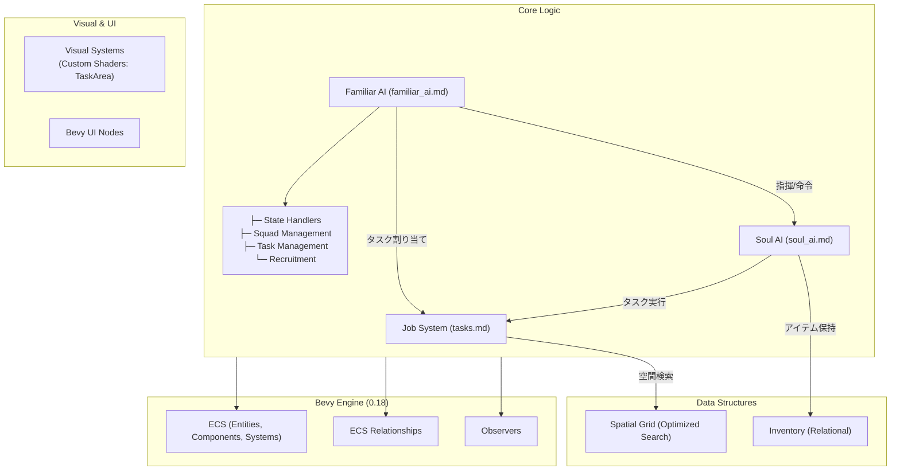

# Architecture

## システム全体俯瞰 (System Overview)

本プロジェクトは Bevy 0.18 のプラグインアーキテクチャに基づき、関心事ごとに分離されています。



## 主要なデータフロー: タスク割り当て
1.  **Designation / Request**: 手動指定、または Auto-Haul システムが **request エンティティ**（アンカー位置）に `Designation` + `TransportRequest` を付与。運搬系は M3〜M7 で request 化済み。
2.  **Spatial Grid**: `DesignationSpatialGrid` と `TransportRequestSpatialGrid` でタスク候補を空間検索（毎フレームフル同期）。
3.  **Assignment**: `Familiar AI` が task_finder で候補を収集し、割り当て時にソース（資材・バケツ等）を遅延解決。配下の `魂` に `WorkingOn` を結ぶ。
4.  **Execution**: `Soul AI` が `WorkingOn` を通じて目的地を特定し、移動・作業を開始。
5.  **Completion**: 資源が尽きると実体が消滅。`Observer` が検知し、`魂` のタスクを解除。

## システムセットの実行順序
`src/main.rs` で定義されている `GameSystemSet` は以下の順序でチェーンされています：
`Input` → `Spatial` → `Logic` → `Actor` → `Visual` → `Interface`

### Global Cycle Framework (Logic Phase)

`Logic` フェーズ内では、**AI** の動作順序を厳密に制御するための4フェーズサブセット (`AiSystemSet`) が定義されています。

```
Perceive → Update → Decide → Execute
  (知覚)    (更新)   (決定)    (実行)
```

1.  **Perceive**: 環境情報の読み取り、変化の検出、キャッシュ再構築（`sync_reservations_system`: 0.2秒間隔, 初回即時）
2.  **Update**: 時間経過による内部状態の変化（バイタル更新、タイマー、メンテナンス）
3.  **Decide**: 次の行動の選択、要求の生成 (`DesignationRequest`, `TaskAssignmentRequest`, `IdleBehaviorRequest`)
4.  **Execute**: 決定された行動の実行、コマンド発行 (`apply_designation_requests_system`, `apply_task_assignment_requests_system`, `task_execution`)

各フェーズ間には `ApplyDeferred` が配置され、変更が次のフェーズで確実に反映されます。

## 定数管理 (`src/constants/`)

ゲームバランスに関わる全てのマジックナンバーは `src/constants/` にドメイン別に分割されて集約されています。

| カテゴリ | 例 |
|:--|:--|
| Z軸レイヤー | `Z_MAP`, `Z_CHARACTER`, `Z_FLOATING_TEXT` |
| AI閾値 | `FATIGUE_GATHERING_THRESHOLD`, `MOTIVATION_THRESHOLD` |
| バイタル増減率 | `FATIGUE_WORK_RATE`, `STRESS_RECOVERY_RATE_GATHERING` |
| 移動・アニメーション | `SOUL_SPEED_BASE`, `ANIM_BOB_SPEED` |

## イベントシステム

本プロジェクトでは、Bevy 0.18 の `Message` と `Observer` を用途に応じて使い分けています。

| 方式 | 用途 | 定義場所 |
|:--|:--|:--|
| `Message` | グローバル通知（タスクキュー更新等） | `src/systems/jobs.rs` |
| `Observer` | エンティティベースの即時反応 | `src/events.rs` |

> [!TIP]
> リソース (`ResMut`) を更新する必要がある場合は `Message` を使用してください。
> エンティティのコンポーネントに即座に反応する場合は `Observer` を使用してください。

---

### 詳細仕様書リンク
- **タスク割り当て/管理**: [tasks.md](tasks.md)
- **ビジュアル/セリフ**: [gather_haul_visual.md](gather_haul_visual.md) / [speech_system.md](speech_system.md)
- **AI挙動**: [soul_ai.md](soul_ai.md) / [familiar_ai.md](familiar_ai.md)

## UIアーキテクチャ補足（2026-02 更新）
- ルート構造:
  - `UiRoot` 配下に `UiMountSlot`（`LeftPanel` / `RightPanel` / `Bottom` / `Overlay` / `TopRight`）を作成
  - 各UIはスロットにマウントしてレイアウト責務を分離
- ノード参照:
  - `UiNodeRegistry` で `UiSlot -> Entity` を保持
  - テキスト/アイコン更新は `Query::get_mut(entity)` で直接更新
- 情報表示:
  - `src/interface/ui/presentation/` が `EntityInspectionModel` を構築
  - `InfoPanel` と `HoverTooltip` は同一モデルを利用して表示差異を抑制
- 入力判定:
  - `UiInputState.pointer_over_ui` を単一の判定値として利用
  - 選択/配置系と PanCamera ガードが同じ値を参照

## キーボードショートカット

### グローバルショートカット（統一管理）

`src/interface/ui/interaction/mod.rs` の `ui_keyboard_shortcuts_system` で一元管理:

| キー | 機能 | 備考 |
|:--|:--|:--|
| `B` | Architectメニュートグル | |
| `Z` | Zonesメニュートグル | |
| `Space` | 一時停止/再開トグル | |
| `1` | 一時停止 | |
| `2` | 通常速度 (x1) | |
| `3` | 高速 (x2) | |
| `4` | 超高速 (x4) | |
| `Escape` | BuildingPlace/ZonePlace/TaskDesignation キャンセル | PlayMode依存 |
| `F12` | デバッグ表示トグル | `plugins/input.rs` |

### コンテキスト依存ショートカット（個別管理）

| キー | 機能 | 条件 | 実装場所 |
|:--|:--|:--|:--|
| `C/M/H/B`, `Digit1-4` | Familiarコマンド | Familiar選択時 | `systems/command/input.rs` |
| `Ctrl+C/V/Z/Y` | エリア編集操作 | AreaSelection時 | `systems/command/area_selection/shortcuts.rs` |
| `Tab/Shift+Tab` | Entity Listフォーカス移動 | 常時 | `list/interaction.rs` |
