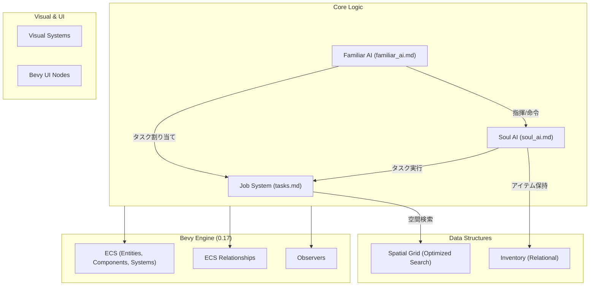

# Architecture

## システム全体俯瞰 (System Overview)

本プロジェクトは Bevy 0.17 のプラグインアーキテクチャに基づき、関心事ごとに分離されています。

## 主要なデータフロー: タスク割り当て
1.  **Designation**: `Player` または `Auto-Haul` システムが `WorkType` を持つ `Designation` を実体に付与。
2.  **Notification**: `OnAdd<Designation>` を検知し、空間グリッド (`DesignationSpatialGrid`) に登録。
3.  **Assignment**: `Familiar AI` が定期的に周辺のタスクをスキャンし、配下の `魂` に `WorkingOn` 関係を結ぶ。
4.  **Execution**: `Soul AI` が `WorkingOn` を通じて目的地を特定し、移動・作業を開始。
5.  **Completion**: 資源が尽きると実体が消滅。`Observer` が検知し、`魂` のタスクを解除。

## システムセットの実行順序
`src/main.rs` で定義されている `GameSystemSet` は以下の順序でチェーンされています：
`Input` → `Spatial` → `Logic` → `Actor` → `Visual` → `Interface`
