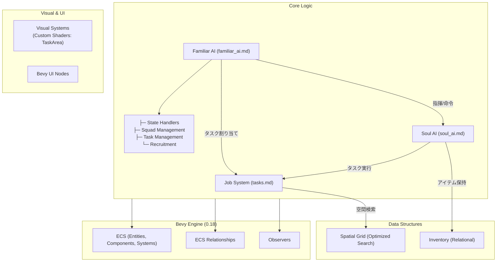

# Architecture

## システム全体俯瞰 (System Overview)

本プロジェクトは Bevy 0.18 のプラグインアーキテクチャに基づき、関心事ごとに分離されています。


```mermaid
graph TD
    subgraph Engine["Bevy Engine (0.18)"]
        ECS["ECS (Entities, Components, Systems)"]
        Rel["ECS Relationships"]
        Obs["Observers"]
    end

    subgraph Core["Core Logic"]
        Jobs["Job System (tasks.md)"]
        F_AI["Familiar AI (familiar_ai.md)"]
        F_AI_Sub["├─ State Handlers<br/>├─ Squad Management<br/>├─ Task Management<br/>└─ Recruitment"]
        S_AI["Soul AI (soul_ai.md)"]
    end
    
    F_AI --> F_AI_Sub

    subgraph Data["Data Structures"]
        Grid["Spatial Grid (Optimized Search)"]
        Inventory["Inventory (Relational)"]
    end

    subgraph View["Visual & UI"]
        Visual["Visual Systems<br/>(Custom Shaders: TaskArea)"]
        UI["Bevy UI Nodes"]
    end

    %% Relationships
    F_AI -->|指揮/命令| S_AI
    F_AI -->|タスク割り当て| Jobs
    S_AI -->|タスク実行| Jobs
    Jobs -->|空間検索| Grid
    S_AI -->|アイテム保持| Inventory
    
    %% Engine Integration
    Core --> ECS
    Core --> Rel
    Core --> Obs
```

## 主要なデータフロー: タスク割り当て
1.  **Designation / Request**: 手動指定、または Auto-Haul システムが **request エンティティ**（アンカー位置）に `Designation` + `TransportRequest` を付与。運搬系は M3〜M7 で request 化済み。
2.  **Spatial Grid**: `DesignationSpatialGrid` と `TransportRequestSpatialGrid` でタスク候補を空間検索（毎フレームフル同期）。
3.  **Assignment**: `Familiar AI` が task_finder で候補を収集し、worker基準で再スコアして同一ティック内に複数 `魂` へ割り当てる。到達判定は `(worker_grid, target_grid)` キャッシュを参照しつつ実行し、割り当て時にソース（資材・バケツ等）を遅延解決する。
4.  **Execution**: `Soul AI` が `WorkingOn` を通じて目的地を特定し、移動・作業を開始。
5.  **Completion**: 資源が尽きると実体が消滅。`Observer` が検知し、`魂` のタスクを解除。

## システムセットの実行順序
`GameSystemSet` は `hw_core::system_sets` で定義され、`src/main.rs` でチェーンされています：
`Input` → `Spatial` → `Logic` → `Actor` → `Visual` → `Interface`

### Global Cycle Framework (Logic Phase)

`Logic` フェーズ内では、**AI** の動作順序を厳密に制御するための4フェーズサブセット（`FamiliarAiSystemSet` / `SoulAiSystemSet`、どちらも `hw_core::system_sets` で定義）が使われています。

```
Perceive → Update → Decide → Execute
  (知覚)    (更新)   (決定)    (実行)
```

1.  **Perceive**: 環境情報の読み取り、変化の検出、キャッシュ再構築（`sync_reservations_system`: 0.2秒間隔, 初回即時）
2.  **Update**: 時間経過による内部状態の変化（バイタル更新、タイマー、メンテナンス）
3.  **Decide**: 次の行動の選択、要求の生成 (`DesignationRequest`, `TaskAssignmentRequest`, `IdleBehaviorRequest`)
4.  **Execute**: 決定された行動の実行、コマンド発行 (`apply_designation_requests_system`, `apply_task_assignment_requests_system`, `task_execution`)

各フェーズ間には `ApplyDeferred` が配置され、変更が次のフェーズで確実に反映されます。

## タスク割り当て・物流・UIの責務境界

- Familiar 側の `TaskAssignmentRequest` 発行は `task_management::builders::submit_assignment_with_source_entities(...)` / `submit_assignment_with_reservation_ops(...)`（または下位の `submit_assignment(...)`）を経由し、`ReservationShadow` による同一フレーム内の予約整合性を維持する。
- 予約オペレーションは `build_source_reservation_ops` / `build_mixer_destination_reservation_ops` / `build_wheelbarrow_reservation_ops` の共通ヘルパーで構築し、割り当てビルダー間の重複を抑制する。
- Familiar 側 Think フェーズでは `TileSiteIndex`（`Resource<HashMap<Entity, Vec<Entity>>`）を `Spatial` サブセットで更新し、建設サイトへの残需要計算時に floor/wall タイルを O(1) で照会できるようにする。
- `IncomingDeliverySnapshot` は Think 開始時に1回構築し、`DemandReadContext` 経由で `policy::haul::*` の残需要計算に再利用する。`IncomingDeliveries` や `ResourceType` の都度ルックアップを集約し、同一フレーム内のCPU負荷を低減する。
- `TaskAssignmentQueries` は `ReservationAccess` / `DesignationAccess` / `StorageAccess` と `TaskAssignmentReadAccess` に分割し、読み取り系と更新系の境界を明確化する。
- `apply_task_assignment_requests_system` は「ワーカー受理判定」「idle正規化」「予約適用」「DeliveringTo付与」「イベント発火」の責務に分けて拡張する。
- `pathfinding_system` は既存パス再利用・再探索・休憩所フォールバック・到達不能時クリーンアップの補助関数群で構成し、挙動差分を局所化する。`world/pathfinding.rs` 側は `find_path_with_policy` を探索共通核として、通常探索・隣接探索・境界探索の差分をポリシー化する。`find_path` は `PathGoalPolicy` でゴール歩行性契約を明示し、`find_path_to_adjacent` は `allow_goal_blocked`（開始点が非歩行のケースを含む）で逆探索の許容条件を制御する。
- `transport_request::producer` の floor/wall 搬入同期は `producer/mod.rs` の共通ヘルパー（`sync_construction_requests`, `sync_construction_delivery`）を利用して重複実装を避ける。全プロデューサーのオーナー解決は `AreaBounds`（`zones.rs` の共通矩形型）に統一し、`collect_all_area_owners` / `find_owner_for_position` で Familiar TaskArea と Yard 境界を同列に処理する。
- UI/Visual の更新責務は `status_display/*` と `dream/ui_particle/*` に分離し、表示更新と演出更新を独立に保守する。UI 入力処理は `MenuAction` の汎用経路（`ui_interaction_system`）と専用経路（`arch_category_action_system` / `door_lock_action_system`）を分離して維持する。

## 建設タスク型の責務分離

- `FloorConstructionPhase` / `WallConstructionPhase` / `FloorTileState` / `WallTileState` は `hw_jobs` の `construction` モジュールへ集約されたデータ型として扱う。
- `AssignedTask` 側の worker オペレーション型（`ReinforceFloorPhase`, `PourFloorPhase`, `FrameWallPhase`, `CoatWallPhase`）は、現時点では「実行者視点の進捗」を表す独立型として維持する。
- `hw_jobs::construction` 側の tile state は「サイト/タイルごとの状態」を表現し、AssignedTask phase は「魂がそのタスク内でどの段階にいるか」を表現する。
- 今回の抽出では型を統合せず、2 系統の enum は役割分離したまま保持し、境界を越えた参照だけを `pub use` レイヤーで標準化する。

## ゲーム内時間 (GameTime)

`src/systems/time.rs` — `GameTime`（Resource）:

- フィールド: `seconds: f32`, `day: u32`, `hour: u32`, `minute: u32`
- **時間倍率**: 1実時間秒 = 1ゲーム内分（60倍速）
- `Time<Virtual>` を使用するためポーズ中は進まない
- 時間経過イベントには `game_time.day` の変化を監視する（例: 木再生は1日1回）

## 空間グリッド一覧 (Spatial Grids)

`crates/hw_spatial` が concrete `SpatialGrid`（7種）を実体として保持し、`src/systems/spatial/` は `hw_spatial` 依存の薄い shell として残存 2 種（`GatheringSpotSpatialGrid`, `FloorConstructionSpatialGrid`）を定義する。
すべてのグリッドで `Added` / `Changed` / `RemovedComponents` の Change Detection に基づく差分更新を実装している。

| グリッド | 用途 |
|:--|:--|
| `DesignationSpatialGrid` | 未割当タスク（伐採/採掘/運搬指定）の近傍検索 |
| `TransportRequestSpatialGrid` | TransportRequest エンティティの近傍検索 |
| `ResourceSpatialGrid` | 地面上の資源アイテムの近傍検索 |
| `StockpileSpatialGrid` | Stockpile の近傍検索 |
| `SoulSpatialGrid` | Soul 位置の近傍検索 |
| `FamiliarSpatialGrid` | Familiar 位置の近傍検索 |
| `BlueprintSpatialGrid` | Blueprint の近傍検索 |
| `GatheringSpatialGrid` | 集会スポットの近傍検索 |
| `FloorConstructionSpatialGrid` | 床建設サイトの近傍検索（root shell） |

新しいグリッドを追加する場合は `SpatialGridOps` を実装し、追加検知（Added）、
変更検知（Changed）、削除検知（RemovedComponents）を使うシステムとして登録する。

## 定数管理 (`src/constants/`)

ゲームバランスに関わる全てのマジックナンバーは `src/constants/` にドメイン別に分割されて集約されています。

| カテゴリ | 例 |
|:--|:--|
| Z軸レイヤー | `Z_MAP`, `Z_CHARACTER`, `Z_FLOATING_TEXT` |
| AI閾値 | `FATIGUE_GATHERING_THRESHOLD`, `MOTIVATION_THRESHOLD` |
| バイタル増減率 | `FATIGUE_WORK_RATE`, `STRESS_RECOVERY_RATE_GATHERING` |
| 移動・アニメーション | `SOUL_SPEED_BASE`, `ANIM_BOB_SPEED` |

## イベントシステム

本プロジェクトでは、Bevy 0.18 の `Message` と `Observer` を用途に応じて使い分けています。

| 方式 | 用途 | 定義場所 |
|:--|:--|:--|
| `Message` | グローバル通知（タスクキュー更新等） | 主に `crates/hw_core/src/events.rs`（登録は `src/plugins/messages.rs`） |
| `Observer` | エンティティベースの即時反応 | 主に `crates/hw_core/src/events.rs`（root 互換面は `src/events.rs`） |

> [!TIP]
> リソース (`ResMut`) を更新する必要がある場合は `Message` を使用してください。
> エンティティのコンポーネントに即座に反応する場合は `Observer` を使用してください。

---

### 詳細仕様書リンク
- **タスク割り当て/管理**: [tasks.md](tasks.md)
- **ビジュアル/セリフ**: [gather_haul_visual.md](gather_haul_visual.md) / [speech_system.md](speech_system.md)
- **AI挙動**: [soul_ai.md](soul_ai.md) / [familiar_ai.md](familiar_ai.md)

## UIアーキテクチャ補足
- `hw_ui` と root shell の境界:
  - `hw_ui` 側は UI ノード生成・表示系システムの本体を担当し、`UiRoot`/`UiMountSlot`、`UiSlot` 予約、ステータス表示、リスト/パネル表示、interaction の可視系を集約する。
  - root 側 (`bevy_app`) は `UiIntent`/メッセージ受信、selection/配置状態変更、WorldMapWrite/TaskContext などゲーム状態を持つ adapter を担当する。
  - `UiRoot` と `UiNodeRegistry` の参照は `src/interface/ui/components.rs` を経由して root と `hw_ui` の API を接続（root は再エクスポートとして薄い shell）。
- plugin 登録:
  - `src/plugins/interface.rs` は thin shell として `plugins::register_ui_plugins(app)` を呼び、UI stack の登録本体は `src/interface/ui/plugins/mod.rs` に集約する。
  - `register_ui_plugins` は `HwUiPlugin`、`UiFoundationPlugin`、root adapter plugin 群をまとめて登録する。
- UIノード管理:
  - `UiNodeRegistry` は `UiSlot -> Entity` を保持し、ノード更新は `Query::get_mut(entity)` で差分反映。
- 情報表示:
  - `src/interface/ui/presentation/` が `EntityInspectionModel`/`ViewModel` を root で構築。
  - `InfoPanel` と `HoverTooltip` は同じモデルを参照して表示差分を抑える。
- 入力判定:
  - `UiInputState.pointer_over_ui` を統一 guard として共有。
  - 選択/配置系（`selection`）と `PanCamera` ガードは root 側で維持。
- UI 実行順序:
  - `ui_keyboard_shortcuts_system -> ui_interaction_system -> handle_ui_intent -> specialized action -> menu_visibility_system -> update_mode_text_system -> update_area_edit_preview_ui_system` を同一 chain で固定する。
  - `context_menu_system`、task summary、time/speed 表示、vignette などの後段更新は、この chain の後に実行する。
- ルート残留（境界維持）:
  - `src/interface/ui/selection/`、`src/interface/ui/vignette.rs`、`src/interface/camera.rs`
  - `src/interface/ui/presentation/`（Model 構築）と `src/interface/ui/list/change_detection.rs`（`EntityListDirty` トリガ生成）
  - `src/interface/ui/interaction/mode.rs` / `intent_handler.rs`（状態変更ハンドラ）

## キーボードショートカット

### グローバルショートカット（統一管理）

`src/interface/ui/interaction/mod.rs` の `ui_keyboard_shortcuts_system` で一元管理:

| キー | 機能 | 備考 |
|:--|:--|:--|
| `B` | Architectメニュートグル | |
| `Z` | Zonesメニュートグル | |
| `Space` | 一時停止/再開トグル | |
| `1` | 一時停止 | |
| `2` | 通常速度 (x1) | |
| `3` | 高速 (x2) | |
| `4` | 超高速 (x4) | |
| `Escape` | BuildingPlace/ZonePlace/TaskDesignation キャンセル | PlayMode依存 |
| `F12` | デバッグ表示トグル + Gizmo 切替 | `plugins/input.rs`。`GizmoConfigStore` の enabled も同期 |

### コンテキスト依存ショートカット（個別管理）

| キー | 機能 | 条件 | 実装場所 |
|:--|:--|:--|:--|
| `C/M/H/B`, `Digit1-4` | Familiarコマンド | Familiar選択時 | `systems/command/input.rs` |
| `Ctrl+C/V/Z/Y` | エリア編集操作 | AreaSelection時 | `systems/command/area_selection/shortcuts.rs` |
| `Tab/Shift+Tab` | Entity Listフォーカス移動 | 常時 | `list/interaction/navigation.rs` |
| `P` | DamnedSoul スポーン（カーソル位置） | **Debug 時のみ** | `plugins/interface.rs` |
| `O` | Familiar スポーン（カーソル位置） | **Debug 時のみ** | `plugins/interface.rs` |
