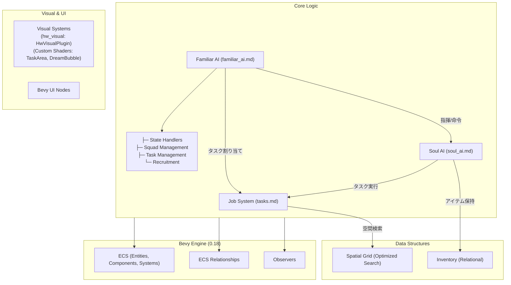

# Architecture

## システム全体俯瞰 (System Overview)

本プロジェクトは Bevy 0.18 のプラグインアーキテクチャに基づき、関心事ごとに分離されています。


```mermaid
graph TD
    subgraph Engine["Bevy Engine (0.18)"]
        ECS["ECS (Entities, Components, Systems)"]
        Rel["ECS Relationships"]
        Obs["Observers"]
    end

    subgraph Core["Core Logic"]
        Jobs["Job System (tasks.md)"]
        F_AI["Familiar AI (familiar_ai.md)"]
        F_AI_Sub["├─ State Handlers<br/>├─ Squad Management<br/>├─ Task Management<br/>└─ Recruitment"]
        S_AI["Soul AI (soul_ai.md)"]
    end
    
    F_AI --> F_AI_Sub

    subgraph Data["Data Structures"]
        Grid["Spatial Grid (Optimized Search)"]
        Inventory["Inventory (Relational)"]
    end

    subgraph View["Visual & UI"]
        Visual["Visual Systems<br/>(hw_visual: HwVisualPlugin)<br/>(Custom Shaders: TaskArea, DreamBubble)"]
        UI["Bevy UI Nodes"]
    end

    %% Relationships
    F_AI -->|指揮/命令| S_AI
    F_AI -->|タスク割り当て| Jobs
    S_AI -->|タスク実行| Jobs
    Jobs -->|空間検索| Grid
    S_AI -->|アイテム保持| Inventory
    
    %% Engine Integration
    Core --> ECS
    Core --> Rel
    Core --> Obs
```

## 主要なデータフロー: タスク割り当て
1.  **Designation / Request**: 手動指定、または Auto-Haul システムが **request エンティティ**（アンカー位置）に `Designation` + `TransportRequest` を付与。運搬系は M3〜M7 で request 化済み。
2.  **Spatial Grid**: `DesignationSpatialGrid` と `TransportRequestSpatialGrid` などでタスク候補を空間検索。`GameSystemSet::Spatial` で毎フレーム実行されるが、グリッド本体は **Change Detection（`Added` / `Changed<Transform>` / `RemovedComponents`）による差分更新**であり、全クリア・全件再挿入（フル同期）は行わない（詳細は下記「空間グリッド一覧」）。
3.  **Assignment**: `Familiar AI` が task_finder で候補を収集し、worker基準で再スコアして同一ティック内に複数 `魂` へ割り当てる。到達判定は `(worker_grid, target_grid)` キャッシュを参照しつつ実行し、割り当て時にソース（資材・バケツ等）を遅延解決する。
4.  **Execution**: `Soul AI` が `WorkingOn` を通じて目的地を特定し、移動・作業を開始。
5.  **Completion**: 資源が尽きると実体が消滅。`Observer` が検知し、`魂` のタスクを解除。

## システムセットの実行順序
`GameSystemSet` は `hw_core::system_sets` で定義され、`crates/bevy_app/src/main.rs` でチェーンされています：
`Input` → `Spatial` → `Logic` → `Actor` → `Visual` → `Interface`

### Global Cycle Framework (Logic Phase)

`Logic` フェーズ内では、**AI** の動作順序を厳密に制御するための4フェーズサブセット（`FamiliarAiSystemSet` / `SoulAiSystemSet`、どちらも `hw_core::system_sets` で定義）が使われています。

```
Perceive → Update → Decide → Execute
  (知覚)    (更新)   (決定)    (実行)
```

1.  **Perceive**: 環境情報の読み取り、変化の検出、キャッシュ再構築（`sync_reservations_system`: 0.2秒間隔, 初回即時）
2.  **Update**: 時間経過による内部状態の変化（バイタル更新、タイマー、メンテナンス）
3.  **Decide**: 次の行動の選択、要求の生成 (`DesignationRequest`, `TaskAssignmentRequest`, `IdleBehaviorRequest`)
4.  **Execute**: 決定された行動の実行、コマンド発行 (`apply_designation_requests_system`, `apply_task_assignment_requests_system`, `task_execution`)

各フェーズ間には `ApplyDeferred` が配置され、変更が次のフェーズで確実に反映されます。

### `LogicPlugin` 内の登録グループ

`crates/bevy_app/src/plugins/logic.rs` の `GameSystemSet::Logic` 登録は、単一の巨大 `.chain()` ではなく、責務ごとに次のグループへ分割されている。

- Group A: command 系 (`assign_task_system`, `familiar_command_input_system`, `task_area_selection_system`, `zone_placement_system`, `zone_removal_system`, `task_area_edit_history_shortcuts_system`) を `.chain()` で直列実行する。`TaskContext` / `AreaEdit*` / `WorldMapWrite` を共有するため、この並びが唯一の ordering 契約である。
- Group B: maintenance / spawn 系 (`familiar_spawning_system`, `tree_regrowth_system`, `obstacle_cleanup_system`, `blueprint_cancel_cleanup_system`, `despawn_expired_items_system`, `dream_tree_planting_system`) は非 chain で登録し、Bevy scheduler に競合解決を委ねる。
- Group C: floor construction 系 (`floor_construction_cancellation_system` → `floor_construction_phase_transition_system` → `floor_construction_completion_system`) はフェーズ順を保つため `.chain()` で登録する。
- Group D: wall construction 系 (`wall_construction_cancellation_system` → `debug_instant_complete_walls_system` → `wall_framed_tile_spawn_system` → `wall_construction_phase_transition_system` → `wall_construction_completion_system`) はフェーズ順とデバッグ割り込み位置を保つため `.chain()` で登録する。
- room detection 系 (`mark_room_dirty_from_building_changes_system` → `validate_rooms_system` → `detect_rooms_system`) は `.chain().after(dream_tree_planting_system)` を維持し、DreamTree 反映後のワールド状態を入力にする。

## タスク割り当て・物流・UIの責務境界

- Familiar 側の `TaskAssignmentRequest` 発行は `task_management::builders::submit_assignment_with_source_entities(...)` / `submit_assignment_with_reservation_ops(...)`（または下位の `submit_assignment(...)`）を経由し、`ReservationShadow` による同一フレーム内の予約整合性を維持する。
- Familiar AI の `state_decision` / `task_delegation` / `blueprint_auto_gather` の system 本体は `hw_familiar_ai` が所有し、`WorldMapRead` / concrete `SpatialGrid` / `MessageWriter` / `Time` / pathfinding context を leaf crate 側で扱う。bevy_app 側は `perceive/resource_sync`、`GameAssets` 依存 visual、`configure_sets` / `init_resource` 配線のみを持つ（互換 import path の thin shell は 2026-03-22 にすべて削除済み）。
- 予約オペレーションは `build_source_reservation_ops` / `build_mixer_destination_reservation_ops` / `build_wheelbarrow_reservation_ops` の共通ヘルパーで構築し、割り当てビルダー間の重複を抑制する。
- Familiar 側 Think フェーズでは `TileSiteIndex`（`Resource<HashMap<Entity, Vec<Entity>>`）を `Spatial` サブセットで更新し、建設サイトへの残需要計算時に floor/wall タイルを O(1) で照会できるようにする。
- `IncomingDeliverySnapshot` は Think 開始時に1回構築し、`DemandReadContext` 経由で `policy::haul::*` の残需要計算に再利用する。`IncomingDeliveries` や `ResourceType` の都度ルックアップを集約し、同一フレーム内のCPU負荷を低減する。
- `TaskAssignmentQueries` は `ReservationAccess` / `DesignationAccess` / `StorageAccess` と `TaskAssignmentReadAccess` に分割し、読み取り系と更新系の境界を明確化する。
- `apply_task_assignment_requests_system` は「ワーカー受理判定」「idle正規化」「予約適用」「DeliveringTo付与」「イベント発火」の責務に分けて拡張する。
- `apply_task_assignment_requests_system` の登録責務は `hw_soul_ai::SoulAiCorePlugin` が持つ。`task_execution_system` / `apply_pending_building_move_system` / `idle_behavior_apply_system` / `escaping_apply_system` / `cleanup_commanded_souls_system` / `gathering_separation_system` / `escaping_decision_system` / `drifting_decision_system` / `gathering_mgmt_*` / `familiar_influence_unified_system` も `SoulAiCorePlugin` に一本化済み（2026-03-17）。root 側の `SoulAiPlugin` は `ApplyDeferred` フェーズ間同期マーカーと `gathering_spawn_system`（`GameAssets` 依存）のみを登録する。
- `hw_familiar_ai` から `hw_soul_ai` への直接依存は排除済み（2026-03-17）。分隊解放（`squad_logic_system`）・使役数超過リリース（`max_soul_logic_system`）でのタスク解除は `SoulTaskUnassignRequest`（`hw_core::events`）イベントで Pub/Sub パターンに移行。`hw_familiar_ai` がイベントを送信し、`hw_soul_ai::execute::task_unassign_apply::handle_soul_task_unassign_system`（`SoulAiSystemSet::Perceive` 登録）が受信・処理する。
- `apply_reservation_requests_system` の登録責務は `hw_logistics::LogisticsPlugin`（`SoulAiSystemSet::Execute`）に移設済み（2026-03-17）。
- `DesignationSpatialGrid` / `TransportRequestSpatialGrid` の `init_resource` は `bevy_app::SpatialPlugin` に移設済み（2026-03-17）。
- Soul 側の集会発生は `hw_soul_ai::soul_ai::execute::gathering_spawn::gathering_spawn_logic_system` が `GatheringSpawnRequest` を emit し、root `execute/gathering_spawn.rs` が `GameAssets` を使う visual spawn を担当する。adapter 側は request 消費時に initiator の task / relationship / idle 状態を再検証し、同一フレームで stale になった要求を破棄する。
- `pathfinding_system` / `soul_stuck_escape_system` は `hw_soul_ai::soul_ai::pathfinding` に移管済み（`GameSystemSet::Actor` で登録）。既存パス再利用・再探索・休憩所フォールバック・到達不能時クリーンアップの補助関数群で構成し、挙動差分を局所化する。`hw_world::pathfinding`（`world/mod.rs` の inline `pub mod pathfinding` として re-export）側は `find_path_with_policy` を探索共通核として、通常探索・隣接探索・境界探索の差分をポリシー化する。`find_path` は `PathGoalPolicy` でゴール歩行性契約を明示し、`find_path_to_adjacent` は `allow_goal_blocked`（開始点が非歩行のケースを含む）で逆探索の許容条件を制御する。
- 建設完了後の WorldMap 更新・ObstaclePosition spawn・Soul 押し出しは `BuildingCompletedEvent`（`hw_jobs::events`）の Pub/Sub パターンに移管済み。root の `building_completion_system` がイベントを `commands.trigger()` で発行し、`hw_soul_ai::soul_ai::building_completed::on_building_completed` Observer（`SoulAiCorePlugin` 登録）が受理・適用する。
- `transport_request::producer` の floor/wall 搬入同期は `producer/mod.rs` の共通ヘルパー（`sync_construction_requests`, `sync_construction_delivery`）を利用して重複実装を避ける。全プロデューサーのオーナー解決は `AreaBounds`（`zones.rs` の共通矩形型）に統一し、`collect_all_area_owners` / `find_owner_for_position` で Familiar TaskArea と Yard 境界を同列に処理する。
- UI/Visual の更新責務は `status_display/*` と `dream/ui_particle/*` に分離し、表示更新と演出更新を独立に保守する。UI 入力処理は `MenuAction` の汎用経路（`ui_interaction_system`）と専用経路（`arch_category_action_system` / `door_lock_action_system`）を分離して維持する。

## 建設タスク型の責務分離

- `FloorConstructionPhase` / `WallConstructionPhase` / `FloorTileState` / `WallTileState` は `hw_jobs` の `construction` モジュールへ集約されたデータ型として扱う。
- `floor_construction_phase_transition_system` / `wall_construction_phase_transition_system` も `hw_jobs::construction` に移設済み。`bevy_app/floor_construction/mod.rs`・`wall_construction/mod.rs` に `pub use` を直接記載。`wall_framed_tile_spawn_system` は `Building3dHandles`（root 固有）依存のため `bevy_app` に残留。
- `AssignedTask` 側の worker オペレーション型（`ReinforceFloorPhase`, `PourFloorPhase`, `FrameWallPhase`, `CoatWallPhase`）は、現時点では「実行者視点の進捗」を表す独立型として維持する。
- `hw_jobs::construction` 側の tile state は「サイト/タイルごとの状態」を表現し、AssignedTask phase は「魂がそのタスク内でどの段階にいるか」を表現する。
- 今回の抽出では型を統合せず、2 系統の enum は役割分離したまま保持し、境界を越えた参照だけを `pub use` レイヤーで標準化する。

## Room Detection の境界

- `crates/hw_world::room_detection` が room detection core の唯一の所有者であり、`RoomDetectionBuildingTile` からの入力分類、flood-fill、妥当性判定、`RoomBounds` を提供する。**加えて ECS 型（`Room`, `RoomOverlayTile`, `RoomTileLookup`, `RoomDetectionState`, `RoomValidationState`）も `hw_world::room_detection` が所有する**。内部は private submodule に分離済み: `core.rs`（純粋アルゴリズム・型）/ `ecs.rs`（ECS Component/Resource）/ `tests.rs`。外部公開パスは変わらない。
- `crates/hw_world/src/room_systems.rs` が ECS adapter 層をすべて担う（`detect_rooms_system` / `validate_rooms_system` / `mark_room_dirty_from_building_changes_system` / `on_building_added` / `on_building_removed` / `on_door_added` / `on_door_removed` / `sync_room_overlay_tiles_system`）。
- `crates/bevy_app/src/systems/room/` ディレクトリは削除済み。`plugins/logic.rs`・`plugins/visual.rs` が `hw_world::` を直接 import する。
- `Room` entity の spawn では `Transform::default()` を必ず付与する。これを外すと overlay child の transform 伝播が壊れる。

## ゲーム内時間 (GameTime)

`crates/hw_core/src/time.rs` — `GameTime`（Resource）:

- フィールド: `seconds: f32`, `day: u32`, `hour: u32`, `minute: u32`
- **時間倍率**: 1実時間秒 = 1ゲーム内分（60倍速）
- `Time<Virtual>` を使用するためポーズ中は進まない
- 時間経過イベントには `game_time.day` の変化を監視する（例: 木再生は1日1回）
- `game_time_system`（時刻計算 + ClockText 更新）は `bevy_app/src/systems/time.rs` に残留。`ClockText`（`hw_ui` 型）への依存があるため Leaf に移動不可。
- `GameTime` の正規 public path は `hw_core::GameTime`。`bevy_app/src/systems/time.rs` は system 実装のみを持ち、型の pass-through re-export は持たない。

## 空間グリッド一覧 (Spatial Grids)

`crates/hw_spatial` が 9 種類の concrete グリッド `Resource`（および `SpatialGridOps` 実装）を実体として保持する（Soul 用の型名は **`SpatialGrid`** — `SoulSpatialGrid` という Rust 型はない）。`ResourceSpatialGrid` / `StockpileSpatialGrid` の更新関数の一部は `hw_logistics` にあり、`plugins/spatial.rs` から登録される。`crates/bevy_app/src/systems/spatial/` は削除済みで、`crates/bevy_app/src/plugins/spatial.rs` が `hw_spatial` / `hw_logistics` から直接 import する。
すべてのグリッドで `Added` / `Changed` / `RemovedComponents` の Change Detection に基づく差分更新を実装している。

| グリッド | 用途 |
|:--|:--|
| `DesignationSpatialGrid` | 未割当タスク（伐採/採掘/運搬指定）の近傍検索 |
| `TransportRequestSpatialGrid` | TransportRequest エンティティの近傍検索 |
| `ResourceSpatialGrid` | 地面上の資源アイテムの近傍検索 |
| `StockpileSpatialGrid` | Stockpile の近傍検索 |
| `SpatialGrid` | Soul 位置の近傍検索（`hw_spatial::soul`） |
| `FamiliarSpatialGrid` | Familiar 位置の近傍検索 |
| `BlueprintSpatialGrid` | Blueprint の近傍検索 |
| `GatheringSpotSpatialGrid` | 集会スポットの近傍検索 |
| `FloorConstructionSpatialGrid` | 床建設サイトの近傍検索 |

新しいグリッドを追加する場合は `SpatialGridOps` を実装し、追加検知（Added）、
変更検知（Changed）、削除検知（RemovedComponents）を使うシステムとして登録する。

## 定数管理 (`crates/hw_core/src/constants/`)

ゲームバランスに関わる全てのマジックナンバーは `crates/hw_core/src/constants/` にドメイン別に分割されて集約されています。

| カテゴリ | 例 |
|:--|:--|
| Z軸レイヤー | `Z_MAP`, `Z_BUILDING_FLOOR`(0.05), `Z_BUILDING_STRUCT`(0.12), `Z_CHARACTER`, `Z_FLOATING_TEXT`, `Z_RTT_COMPOSITE`(20.0) |
| Camera3d 高度 | `VIEW_HEIGHT`(150.0), `Z_OFFSET`(90.0) |
| RenderLayer | `LAYER_2D`(0), `LAYER_3D`(1), `LAYER_OVERLAY`(2) |
| TopDown sun 方向 | `topdown_sun_direction_world()` |
| AI閾値 | `FATIGUE_GATHERING_THRESHOLD`, `MOTIVATION_THRESHOLD` |
| バイタル増減率 | `FATIGUE_WORK_RATE`, `STRESS_RECOVERY_RATE_GATHERING` |
| 移動・アニメーション | `SOUL_SPEED_BASE`, `ANIM_BOB_SPEED` |

> **例外: Soul Energy 定数**
> `OUTPUT_PER_SOUL`, `DREAM_CONSUME_RATE_GENERATING`, `OUTDOOR_LAMP_DEMAND` など Soul Energy 系の定数は
> ドメイン専用 crate `hw_energy::constants` に集約されています（`hw_core` には含まれません）。

## RtT（Render-to-Texture）インフラ

`docs/plans/3d-rtt/` で管理される段階的な 3D 化計画の Phase 1 として実装済み。

### トリプルカメラ構成

| カメラ | マーカー | レイヤー | `order` | レンダー先 | 用途 |
|:--|:--|:--|:--|:--|:--|
| `Camera2d` | `MainCamera` | `LAYER_2D`(0) | 0 | スクリーン | 既存2Dゲーム描画・UI。矢視モード時は `is_active=false` |
| `Camera2d` | OverlayCamera（マーカーなし） | `LAYER_OVERLAY`(2) | 1 | スクリーン | RtT composite sprite 専用。常時アクティブ |
| `Camera3d` | `Camera3dRtt` | `LAYER_3D`(1) | -1 | オフスクリーンテクスチャ (RtT) | 3Dシーンのオフスクリーン描画 |

- Camera3d は `order: -1` で最初に描画され、結果をオフスクリーンテクスチャに書き込む。
- OverlayCamera は MainCamera が無効化される矢視モード時も composite sprite を描画し続ける。

### RtT テクスチャ管理

`RttTextures`（Resource、`crates/bevy_app/src/plugins/startup/rtt_setup.rs`）が `Handle<Image>` を保持する。

テクスチャ生成は `create_rtt_texture(width, height, images)` 関数（`rtt_setup.rs`）に切り出されている。起動時は `PrimaryWindow` の物理解像度で生成し、`sync_rtt_texture_size_to_window` が物理解像度の変化を検知したフレームに再生成する（`Rgba8Unorm` / `Rgba8UnormSrgb`）。

`WgpuFeatures::CLIP_DISTANCES` は `main.rs` の `WgpuSettings` で有効化済み（MS-P3-Pre-A）。`SectionMaterial` のシェーダークリップ平面（`section_material.wgsl`）に必要。

### Camera2d ↔ Camera3d 同期

`sync_camera3d_system`（`systems/visual/camera_sync.rs`、`GameSystemSet::Visual` で毎フレーム実行）：

全モードで `scale` と XZ を同期（パン・ズーム追従）。方向ごとに XZ オフセットを適用:

| `ElevationDirection` | `cam3d.x` | `cam3d.z` | `cam3d.y` |
|:--|:--|:--|:--|
| `TopDown` | `cam2d.x` | `-cam2d.y + Z_OFFSET` | `VIEW_HEIGHT`（固定） |
| `North` | `cam2d.x` | `-cam2d.y + ELEVATION_DISTANCE` | elevation_view が設定した値を維持 |
| `South` | `cam2d.x` | `-cam2d.y - ELEVATION_DISTANCE` | 〃 |
| `East` | `cam2d.x + ELEVATION_DISTANCE` | `-cam2d.y` | 〃 |
| `West` | `cam2d.x - ELEVATION_DISTANCE` | `-cam2d.y` | 〃 |

- `ELEVATION_DISTANCE = 800`（`pub const`、`elevation_view.rs` で定義）
- TopDown の RtT は Camera3d の `OrthographicProjection.scale` を Camera2d 側のズーム量に同期する。
- 矢視時の回転・Y 高度は `elevation_view_input_system`（V キー押下時）が設定し、`sync_camera3d_system` は上書きしない。

### Camera3d の向き

`Transform::from_translation(Vec3::new(0.0, VIEW_HEIGHT, Z_OFFSET))` に `ElevationDirection::TopDown.camera_rotation()` を適用し、ズームは `OrthographicProjection.scale` で同期する

- up=`NEG_Z`（= `Vec3::Z` では画面右が World -X に反転するため不可）
- 画面右 = World +X、画面上 = World -Z
- `OrthographicProjection::default_3d()`（near=0, far=1000, ScalingMode::WindowSize）

### 合成メッシュ（RtT composite）

`plugins/startup/rtt_composite.rs` の `spawn_rtt_composite_sprite` は、ワールド原点 `(0, 0, Z_RTT_COMPOSITE)` に `Mesh2d(Rectangle)` と `RttCompositeMaterial` を固定スポーンする。

- `RenderLayers::layer(LAYER_OVERLAY)` を付与し、OverlayCamera（固定位置）が描画する。
- Camera2d の子エンティティではないため、MainCamera のパン・ズームの影響を受けない。
- 3D コンテンツのパンは Camera3d の Transform、ズームは `OrthographicProjection.scale` を `sync_camera3d_system` が毎フレーム更新することで実現する。
- `RttCompositeSprite` マーカーコンポーネントが付与されており、`apply_render3d_visibility_system` が `Visibility` を制御する。
- `RttCompositeMaterial` は通常の 3D RtT (`RttTextures.texture_3d`) と Soul 専用 mask RtT (`RttTextures.texture_soul_mask`) を同時に受け取り、最終合成時に Soul の輪郭を画面上で少し丸める。
- 建築物 3D ビジュアルは `RenderLayers::from_layers(&[LAYER_3D, LAYER_3D_SHADOW_RECEIVER])` を使い、RtT Camera3d には見せつつ、影確認用 `DirectionalLight` からも shadow receiver として扱えるようにしている。
- 表示用 Soul GLB は `LAYER_3D`、Soul shadow proxy は `LAYER_3D` と `LAYER_3D_SOUL_SHADOW` の両方に所属する。Bevy 0.18 の shadow queue は `camera_layers ∩ mesh_layers` を満たさない caster を落とすため、camera 非表示用の専用 layer だけでは shadow map に参加できない。shadow proxy は main view 側にも残しつつ、`SoulShadowMaterial` で通常描画だけ `discard` し、prepass / shadow pass では depth を書く。
- TopDown の太陽方向は `hw_core::constants::topdown_sun_direction_world()` を単一の真実とし、検証用 `DirectionalLight` と `CharacterMaterial` の body shader の両方が同じ方向を使う。現在は画面手前側の壁面が完全な日陰にならないよう、真上寄りではなく前方寄りの斜光を採用している。
- Bevy 0.18 の directional light は `light.render_layers` と camera の view layers が交差しないと、その view では一切使われない。RtT 用 `DirectionalLight` は caster/receiver 専用 layer に加えて `LAYER_3D` も持ち、`Camera3dRtt` 視点で light 自体が有効になるようにしている。

`sync_rtt_output_bindings`（同ファイル、`Update` スケジュール）は `RttTextures` の変化を検知し、`Camera3dRtt.target` / `Camera3dSoulMaskRtt.target` と `RttCompositeMaterial` の参照テクスチャを同時に更新する。RtT テクスチャ自体は物理解像度で生成するが、合成メッシュのスケールは `PrimaryWindow` の logical size を基準にしつつ、斜め TopDown オーソ投影で圧縮される Y 方向を `topdown_rtt_vertical_compensation()` で補正する。`sync_rtt_texture_size_to_window` と `chain` で登録されているため、ウィンドウサイズ変更フレーム内で再生成後のテクスチャへ差し替わる。

### キャラクター表示（Soul GLB + Familiar 2D 前面表示）

`SoulProxy3d` は `SceneRoot` で `assets/models/characters/soul.glb#Scene0` を読み込む 3D ルートとして使う。Familiar は Phase 3 の表示方針として 2D 前面表示・影なしを採用し、建築物 RtT より手前の Camera2d レイヤーで扱う。

- `GameAssets.soul_scene` に `GltfAssetLabel::Scene(0).from_asset("models/characters/soul.glb")` を保持し、Soul spawn 時に `SceneRoot` として 3D シーンへ追加する。
- Soul 本体エンティティは 2D `Sprite` を持たず、通常表示は GLB 側へ一本化している。従来の `animation_system` / `idle_visual_system` は `Sprite` を optional にして、Soul の状態更新を維持したまま 3D 表示へ移行している。
- Soul の通常描画ルートとは別に、`SoulMaskProxy3d` が同じ `soul.glb` を `LAYER_3D_SOUL_MASK` へ複製スポーンする。`sync_soul_mask_proxy_3d_system` が本体と同じ 2D 位置へ同期し、Soul 専用 mask RtT の入力に使う。
- `SoulShadowProxy3d` は shadow caster 専用の複製 root で、通常の Soul 表示とは分離して同期する。表示側 `mesh_body` / `mesh_face` には `NotShadowCaster` を付ける。
- shadow proxy 側は `RenderLayers::from_layers(&[LAYER_3D, LAYER_3D_SOUL_SHADOW])` に所属し、`SoulShadowMaterial` を使って main pass では `discard`、prepass / shadow pass では depth のみを書く。Bevy 0.18 の shadow queue は `camera_layers ∩ mesh_layers` を満たさない caster を落とすため、shadow 専用 layer だけでは参加できない。main pass 側の不可視化は layer 分離ではなく material 側で行う。
- shadow proxy root には表示用 Soul より前に起こした回転を入れ、影だけをより自然な upright silhouette に寄せる。face mesh も shadow proxy 側では不可視・非寄与にしている。
- 仮 wall / floor / door / equipment 用 `StandardMaterial` は shadow receiver として働くように `unlit = false` の lit material にしている。見た目の破綻を避けるため、roughness を高く、reflectance を 0 に寄せている。
- `hw_visual::CharacterMaterial` と `assets/shaders/character_material.wgsl` が Soul 用 custom material 経路を提供し、`AlphaMode::Blend` の透過付き描画を行う。現段階では section 連動や表情状態切り替えはまだ入れていない。
- `apply_soul_gltf_render_layers_on_ready` が `SceneInstanceReady` を受けて Soul GLB の子孫へ `RenderLayers::layer(LAYER_3D)` を付与し、`mesh_body` / `mesh_face` の両方を `CharacterMaterial` へ差し替える。
- `apply_soul_mask_gltf_render_layers_on_ready` が `SoulMaskProxy3d` の子孫へ `RenderLayers::layer(LAYER_3D_SOUL_MASK)` を付与し、すべてのメッシュを `SoulMaskMaterial` に差し替える。mask ルートは最終色を描かず、輪郭抽出専用の白単色 RtT だけを生成する。
- `CharacterHandles` は Soul body/face 用の `Handle<CharacterMaterial>` と、Soul mask 用の `Handle<SoulMaskMaterial>` を保持する。`mesh_body` はリポジトリ内で生成する 1x1 白テクスチャを使い、shader 側で青白い base/shadow 色、簡易ポスタライズ、rim 強調で 2D の幽体感へ寄せる。body 自体は不透明描画にして、腕や胴体の重なりでポリゴン内部が透けないようにしている。
- `mesh_face` は atlas の先頭セル（通常表情）から、Idle 表情の可視領域計測を元にした crop を `uv_scale` / `uv_offset` で切り出し、中心固定で 1.4 倍拡大している。
- `prepare_soul_animation_library_system` は `GameAssets.soul_gltf` から `Gltf.named_animations` を読み、`Idle / Walk / Work / Carry / Fear / Exhausted / WalkLeft / WalkRight` の clip handle を名前解決して `SoulAnimationLibrary` に保持する。
- `apply_soul_gltf_render_layers_on_ready` は `mesh_face` に共有 material を直接挿さず、Soul ごとに face material を複製して `SoulFaceMaterial3d` を付与する。これにより face atlas の `uv_offset` を Soul 単位で更新できる。
- `sync_soul_anim_visual_state_system` が Soul 本体の `AssignedTask` ミラー、`AnimationState.is_moving`、`IdleState`、疲労、会話表情イベントから `SoulAnimVisualState { body, face }` を算出し、`sync_soul_body_animation_system` と `sync_soul_face_expression_system` がそれぞれ body clip と face atlas を更新する。
- body / face の写像は同一ではない。body `Fear` は `StressBreakdown` にのみ結び付き、`is_frozen = true` の短時間は body を `Idle` のまま維持し、freeze 明けで `Fear` clip へ入る。negative 会話表情は face `Fear` のみを更新する。
- body `Exhausted` は `IdleBehavior::ExhaustedGathering` にのみ結び付き、通常の fatigue 上昇や `ConversationExpressionKind::Exhausted` は face `Exhausted` 側だけで扱う。
- `initialize_soul_animation_players_system` は GLB 内で自動生成された `AnimationPlayer` を `SoulAnimationPlayer3d` と関連付け、`AnimationGraphHandle` と `AnimationTransitions` を挿入して `Idle` から再生を開始する。
- `sync_soul_body_animation_system` は Soul 本体のフレーム間移動量から実移動ベクトルを算出し、横成分比率が十分高いときだけ `WalkLeft / WalkRight` を使う。判定には enter / exit の 2 段階閾値を使って揺れを抑え、縦移動寄りでは `Walk` または `Carry` を維持する。現行 GLB に `CarryLeft / CarryRight` は無いため、運搬移動で横成分が強いときも `WalkLeft / WalkRight` を優先する。clip 向きは現行 Soul GLB に合わせて `+X => WalkLeft`、`-X => WalkRight` としている。
- `sync_soul_body_animation_system` はさらに directional variant 更新に短い lock を持ち、微小な軌道ぶれで `Walk / Carry <-> WalkLeft/WalkRight` が毎フレーム往復しないようにしている。Idle / Work / Fear / Exhausted など別 body state への遷移は lock で止めない。
- `mesh_face` には `SOUL_FACE_SCALE_MULTIPLIER` を掛け、PoC 目視で顔が読み取りづらい問題を asset 非破壊で補正する。
- `mesh_face` のローカル回転は GLB 側の初期姿勢をそのまま使い、PoC 段階では追加の billboard 回転を行わない。
- `Camera3dRtt` には `AmbientLight` を付与し、GLB 付属の lit material が RtT 上で暗転しないようにする。
- `startup_systems::setup` では `LAYER_3D` と `LAYER_3D_SOUL_SHADOW` の両方に作用する shadow-enabled `DirectionalLight` を 1 本追加し、`DirectionalLightShadowMap { size: 4096 }` と `CascadeShadowConfigBuilder` で shadow map 範囲を明示している。これにより Soul の shadow proxy だけを camera 非表示のまま shadow pass に参加させられる。
- `Camera3dSoulMaskRtt` は Soul mask 専用 Camera3d で、通常の `Camera3dRtt` と同じ Transform / Projection を共有する。最終合成では `RttCompositeMaterial` が `texture_soul_mask` を近傍サンプリングし、Soul シルエットだけを画面上で少し膨らませて角を丸める。
- Familiar は 2D `Sprite` の 4 フレーム差し替え・左右反転・hover/wobble を本表示として維持する。Command radius オーラ・hover/selection・吹き出しも同じ 2D world transform を参照する。
- Familiar は建築物 RtT 合成より手前に出す前提とし、Soul のような shadow proxy や shadow caster は持たない。
- `FamiliarProxy3d` は移行期の検証用経路として残っているが、Phase 3 の恒久方針ではない。多層階導入時は `FloorLevel` 等の所属階 state を導入し、「現在表示中の階に属する Familiar だけを 2D 前面表示する」ルールを別マイルストーンで定義する。

### 3D 表示トグル（開発機能）

`Render3dVisible` Resource（`main.rs`）が 3D 表示の有効・無効を管理する。

| 操作 | 方法 |
|:---|:---|
| F3 キー | `render3d_toggle_system`（`plugins/input.rs`）が `Render3dVisible.0` を反転 |
| Dev ボタン | TopLeft パネルの「3D ON / 3D OFF」ボタン（`interface/ui/dev_panel.rs`）|

`apply_render3d_visibility_system`（`plugins/visual.rs`、`GameSystemSet::Visual`）が `Render3dVisible` 変更を検知し、
`Camera3dRtt.is_active`・`Camera3dSoulMaskRtt.is_active` と `RttCompositeSprite` の `Visibility` を同期する。
両方を制御することで「カメラ無効化 → 前フレームのテクスチャが残る」問題を防ぐ。

## イベントシステム

本プロジェクトでは、Bevy 0.18 の `Message` と `Observer` を用途に応じて使い分けています。

| 方式 | 用途 | 定義場所 |
|:--|:--|:--|
| `Message` | グローバル通知（タスクキュー更新等） | 主に `crates/hw_core/src/events.rs`（`TaskAssignmentRequest` のみ `crates/hw_jobs/src/events.rs`）（登録は `crates/bevy_app/src/plugins/messages.rs`） |
| `Observer` | エンティティベースの即時反応 | 主に `crates/hw_core/src/events.rs`（root 互換面は `crates/bevy_app/src/main.rs` に直接 `pub use`） |

> [!TIP]
> リソース (`ResMut`) を更新する必要がある場合は `Message` を使用してください。
> エンティティのコンポーネントに即座に反応する場合は `Observer` を使用してください。

---

### 詳細仕様書リンク
- **タスク割り当て/管理**: [tasks.md](tasks.md)
- **ビジュアル/セリフ**: [gather_haul_visual.md](gather_haul_visual.md) / [speech_system.md](speech_system.md)
- **AI挙動**: [soul_ai.md](soul_ai.md) / [familiar_ai.md](familiar_ai.md)

## UIアーキテクチャ補足

### hw_ui と root の境界

- `hw_ui` 側はUIノード生成・表示系システムの本体を集約する。具体的にはステータス表示、tooltip_builder、info_panel、task_list の render/interaction、エンティティリストの汎用メカニクス（resize/minimize/visual）を保持する。`UiRoot` / `UiMountSlot` / `UiSlot` / `UiNodeRegistry` のような**共有 UI 契約型**は `hw_core::ui_nodes` が所有し、`hw_ui` は re-export する。
- root 側 (`bevy_app`) は `UiIntent` メッセージ受信、PlayMode 遷移、ゲームエンティティ ECS Query、WorldMapWrite/TaskContext など**ゲーム状態を持つ adapter** を担当する。
- `crates/bevy_app/src/interface/ui/mod.rs` は app shell の正規入口として機能し、外部から使われるシンボルのみを明示的に re-export する（wildcard `*` は使用しない）。

### アセット抽象化

- `hw_ui::setup::UiAssets` トレイトがフォント・アイコンハンドルを抽象化する（`font_ui`, `font_familiar`, `icon_stress`, `icon_fatigue`, `icon_male`, `icon_female`, `icon_arrow_down`, `glow_circle`）。
- `crates/bevy_app/src/interface/ui/setup/mod.rs` が `GameAssets` → `&dyn UiAssets` のアダプタとして機能する。
- `Res<GameAssets>` をシステム引数に取るシステム（task_list/update.rs 等）は Bevy の制約上 hw_ui に移動できないため root に残留する。

### plugin 登録

- `crates/bevy_app/src/plugins/interface.rs` → `plugins::register_ui_plugins(app)` → `crates/bevy_app/src/interface/ui/plugins/mod.rs` に UI stack 登録を集約する。
- `register_ui_plugins` は `HwUiPlugin`、`UiFoundationPlugin`、root adapter plugin 群をまとめて登録する。

### 開発用 Dev パネル

`interface/ui/dev_panel.rs` が `UiMountSlot::TopLeft` に開発専用 UI をスポーンする（`PostStartup` チェーン末尾の `spawn_dev_panel_system`）。

| ウィジェット | 機能 | 対応キー |
|:---|:---|:---|
| 「3D ON / 3D OFF」ボタン | 3D 表示（`Render3dVisible`）トグル | F3 |

### UIノード管理

- `UiNodeRegistry`（`hw_core::ui_nodes`）は `UiSlot -> Entity` を保持し、ノード更新は `Query::get_mut(entity)` で差分反映する。

### 情報表示

- `crates/bevy_app/src/interface/ui/presentation/` が `EntityInspectionModel`/`ViewModel` を root で構築（ゲームエンティティ 10+ 型の Query を集約）。
- `InfoPanel` と `HoverTooltip` は同じモデルを参照して表示差分を抑える。

### 入力判定

- `UiInputState.pointer_over_ui` を統一 guard として共有。
- 選択/配置系（`selection`）と `PanCamera` ガードは root 側で維持。

### UI 実行順序

`ui_keyboard_shortcuts_system → ui_interaction_system → handle_ui_intent → specialized action → menu_visibility_system → update_mode_text_system → update_area_edit_preview_ui_system` を同一 chain で固定する。`context_menu_system`、task summary、time/speed 表示、vignette などの後段更新は、この chain の後に実行する。

### root 残留（境界維持）

| ファイル | 理由 |
|:---|:---|
| `interaction/intent_context.rs`, `interaction/handlers/`, `interaction/intent_handler.rs`, `mode.rs` | PlayMode 遷移、app_contexts、`FamiliarOperation` などのゲーム依存 state / handler |
| `list/change_detection.rs` | ゲームコンポーネントの Changed 監視 |
| `list/view_model.rs`, `spawn/`, `sync/` | ゲームエンティティ → UI ノード変換 |
| `list/drag_drop.rs`, `list/interaction.rs`, `navigation.rs` | FamiliarOperation, TaskContext 等 |
| `panels/context_menu.rs` | Familiar, DamnedSoul, Building, Door 分類 |
| `panels/task_list/view_model.rs`, `presenter.rs`, `update.rs` | ゲームクエリ、`Res<GameAssets>` |
| `presentation/` | EntityInspectionQuery（ゲームエンティティ集約）|
| `vignette.rs` | TaskContext（DreamPlanting モード判定）|

## selection 境界補足

`crates/bevy_app/src/interface/selection/` と `hw_ui::selection` の責務分担（selection 分離完了時点）:

| 区分 | 置き場所 | 内容 |
| --- | --- | --- |
| state resource | `hw_core::selection` + `hw_ui::selection` | `SelectedEntity`, `HoveredEntity`, `SelectionIndicator` は `hw_core` 所有、`cleanup_selection_references_system` は `hw_ui::selection` |
| shared 型・validation | `hw_ui::selection::placement` | `PlacementRejectReason`（`NotStraightLine` 含む）, `PlacementValidation`, `PlacementGeometry`, `WorldReadApi`, `BuildingPlacementContext` |
| placement geometry API | `hw_ui::selection::placement` | `building_geometry`, `building_occupied_grids`, `building_spawn_pos`, `building_size`, `bucket_storage_geometry`, `validate_building_placement`, `validate_bucket_storage_placement` |
| move geometry API | `hw_ui::selection::placement` | `move_anchor_grid`, `move_occupied_grids`, `move_spawn_pos`, `can_place_moved_building`, `validate_moved_bucket_storage_placement` |
| floor / wall validation | `hw_ui::selection::placement` | `validate_area_size`, `validate_wall_area`, `validate_floor_tile`, `validate_wall_tile` |
| selection intent | `hw_ui::selection::intent` | `SelectionIntent` |
| root adapter | `crates/bevy_app/src/interface/selection/*` | Query/Res から intent 生成、ECS 状態・WorldMap 変更の適用 |

- `SelectedEntity` / `HoveredEntity` / `SelectionIndicator` は cross-crate で共有される interaction state として `hw_core::selection` に置き、`hw_ui::selection` は cleanup と placement validation の公開面を担う。`Commands`/`WorldMapWrite`/`NextState<PlayMode>` は使わない。
- `update_selection_indicator` の実装本体は `hw_visual` にあるが、選択更新と同フレームで反映するため root `Interface` フェーズで登録する。
- `hw_ui::selection::placement` は building placement/move の geometry, validation 共通ロジックを保持する。`crates/bevy_app/src/interface/selection/building_place/placement.rs`・`building_move/preview.rs`・`building_move/click_handlers.rs`・`crates/bevy_app/src/systems/visual/placement_ghost.rs` が共有する。内部は private submodule に分離済み: `geometry.rs`（座標変換・形状計算）/ `validation.rs`（配置可否判定）/ `tests.rs`。`placement.rs` root はファサード + 共有型定義のみ。
- `building_move/geometry.rs` は hw_ui 移動に伴い削除済み。`building_move/placement.rs` は bucket storage 所有グリッド解決だけを持つ薄い adapter で、判定本体は `validate_moved_bucket_storage_placement` を使う。
- floor/wall の tile reject reason と tile validation は `hw_ui::selection::placement` に共通化済み。`WorldMap` → `WorldReadApi` の adapter は `crates/bevy_app/src/world/map/mod.rs` の `WorldMapRef<'a>` 一箇所に集約済み（旧来の各ファイルのローカルラッパーは削除済み）。
- `handle_mouse_input` の selection 判定は `SelectionIntent` を返す helper へ分離済み（`apply_selection_intent` が ECS 変更を適用）。
- `building_move/mod.rs` は root shell として `preview.rs` / `system.rs` / `context.rs` / `click_handlers.rs` / `finalization.rs` を束ねる。`system.rs` は entrypoint に縮小され、`MoveStateCtx` / `MoveOpCtx` は `context.rs`、クリック別分岐は `click_handlers.rs`、`finalize_move_request` / `cancel_tasks_and_requests_for_moved_building` は `finalization.rs` に分離済み。`TransportRequest`・`unassign_task` 依存を持つため crate 境界としては root adapter に残留する。


## キーボードショートカット

### グローバルショートカット（統一管理）

`crates/bevy_app/src/interface/ui/interaction/systems.rs` の `ui_keyboard_shortcuts_system` で一元管理する。`interaction/mod.rs` は re-export shell として公開面を束ねる。

| キー | 機能 | 備考 |
|:--|:--|:--|
| `B` | Architectメニュートグル | |
| `Z` | Zonesメニュートグル | |
| `Space` | 一時停止/再開トグル | |
| `1` | 一時停止 | |
| `2` | 通常速度 (x1) | |
| `3` | 高速 (x2) | |
| `4` | 超高速 (x4) | |
| `Escape` | BuildingPlace/ZonePlace/TaskDesignation キャンセル | PlayMode依存 |
| `F12` | デバッグ表示トグル + Gizmo 切替 | `plugins/input.rs`。`GizmoConfigStore` の enabled も同期 |
| `F3` | 3D 表示トグル | `plugins/input.rs`。`Render3dVisible` を反転し、Camera3dRtt と RttCompositeSprite を制御（**Dev 専用**） |

### コンテキスト依存ショートカット（個別管理）

| キー | 機能 | 条件 | 実装場所 |
|:--|:--|:--|:--|
| `C/M/H/B`, `Digit1-4` | Familiarコマンド | Familiar選択時 | `systems/command/input.rs` |
| `Ctrl+C/V/Z/Y` | エリア編集操作 | AreaSelection時 | `systems/command/area_selection/shortcuts.rs` |
| `Tab/Shift+Tab` | Entity Listフォーカス移動 | 常時 | `list/interaction/navigation.rs` |
| `P` | DamnedSoul スポーン（カーソル位置） | **Debug 時のみ** | `plugins/interface.rs` |
| `O` | Familiar スポーン（カーソル位置） | **Debug 時のみ** | `plugins/interface.rs` |
