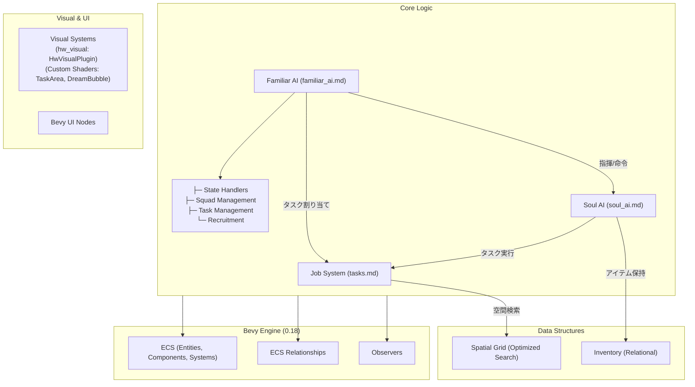

# Architecture

## システム全体俯瞰 (System Overview)

本プロジェクトは Bevy 0.18 のプラグインアーキテクチャに基づき、関心事ごとに分離されています。


```mermaid
graph TD
    subgraph Engine["Bevy Engine (0.18)"]
        ECS["ECS (Entities, Components, Systems)"]
        Rel["ECS Relationships"]
        Obs["Observers"]
    end

    subgraph Core["Core Logic"]
        Jobs["Job System (tasks.md)"]
        F_AI["Familiar AI (familiar_ai.md)"]
        F_AI_Sub["├─ State Handlers<br/>├─ Squad Management<br/>├─ Task Management<br/>└─ Recruitment"]
        S_AI["Soul AI (soul_ai.md)"]
    end
    
    F_AI --> F_AI_Sub

    subgraph Data["Data Structures"]
        Grid["Spatial Grid (Optimized Search)"]
        Inventory["Inventory (Relational)"]
    end

    subgraph View["Visual & UI"]
        Visual["Visual Systems<br/>(hw_visual: HwVisualPlugin)<br/>(Custom Shaders: TaskArea, DreamBubble)"]
        UI["Bevy UI Nodes"]
    end

    %% Relationships
    F_AI -->|指揮/命令| S_AI
    F_AI -->|タスク割り当て| Jobs
    S_AI -->|タスク実行| Jobs
    Jobs -->|空間検索| Grid
    S_AI -->|アイテム保持| Inventory
    
    %% Engine Integration
    Core --> ECS
    Core --> Rel
    Core --> Obs
```

## 主要なデータフロー: タスク割り当て
1.  **Designation / Request**: 手動指定、または Auto-Haul システムが **request エンティティ**（アンカー位置）に `Designation` + `TransportRequest` を付与。運搬系は M3〜M7 で request 化済み。
2.  **Spatial Grid**: `DesignationSpatialGrid` と `TransportRequestSpatialGrid` でタスク候補を空間検索（毎フレームフル同期）。
3.  **Assignment**: `Familiar AI` が task_finder で候補を収集し、worker基準で再スコアして同一ティック内に複数 `魂` へ割り当てる。到達判定は `(worker_grid, target_grid)` キャッシュを参照しつつ実行し、割り当て時にソース（資材・バケツ等）を遅延解決する。
4.  **Execution**: `Soul AI` が `WorkingOn` を通じて目的地を特定し、移動・作業を開始。
5.  **Completion**: 資源が尽きると実体が消滅。`Observer` が検知し、`魂` のタスクを解除。

## システムセットの実行順序
`GameSystemSet` は `hw_core::system_sets` で定義され、`crates/bevy_app/src/main.rs` でチェーンされています：
`Input` → `Spatial` → `Logic` → `Actor` → `Visual` → `Interface`

### Global Cycle Framework (Logic Phase)

`Logic` フェーズ内では、**AI** の動作順序を厳密に制御するための4フェーズサブセット（`FamiliarAiSystemSet` / `SoulAiSystemSet`、どちらも `hw_core::system_sets` で定義）が使われています。

```
Perceive → Update → Decide → Execute
  (知覚)    (更新)   (決定)    (実行)
```

1.  **Perceive**: 環境情報の読み取り、変化の検出、キャッシュ再構築（`sync_reservations_system`: 0.2秒間隔, 初回即時）
2.  **Update**: 時間経過による内部状態の変化（バイタル更新、タイマー、メンテナンス）
3.  **Decide**: 次の行動の選択、要求の生成 (`DesignationRequest`, `TaskAssignmentRequest`, `IdleBehaviorRequest`)
4.  **Execute**: 決定された行動の実行、コマンド発行 (`apply_designation_requests_system`, `apply_task_assignment_requests_system`, `task_execution`)

各フェーズ間には `ApplyDeferred` が配置され、変更が次のフェーズで確実に反映されます。

## タスク割り当て・物流・UIの責務境界

- Familiar 側の `TaskAssignmentRequest` 発行は `task_management::builders::submit_assignment_with_source_entities(...)` / `submit_assignment_with_reservation_ops(...)`（または下位の `submit_assignment(...)`）を経由し、`ReservationShadow` による同一フレーム内の予約整合性を維持する。
- Familiar AI の `state_decision` / `task_delegation` / `blueprint_auto_gather` の system 本体は `hw_familiar_ai` が所有し、`WorldMapRead` / concrete `SpatialGrid` / `MessageWriter` / `Time` / pathfinding context を leaf crate 側で扱う。bevy_app 側は `perceive/resource_sync`、`GameAssets` 依存 visual、`configure_sets` / `init_resource` 配線、互換 import path の thin shell のみを持つ。
- 予約オペレーションは `build_source_reservation_ops` / `build_mixer_destination_reservation_ops` / `build_wheelbarrow_reservation_ops` の共通ヘルパーで構築し、割り当てビルダー間の重複を抑制する。
- Familiar 側 Think フェーズでは `TileSiteIndex`（`Resource<HashMap<Entity, Vec<Entity>>`）を `Spatial` サブセットで更新し、建設サイトへの残需要計算時に floor/wall タイルを O(1) で照会できるようにする。
- `IncomingDeliverySnapshot` は Think 開始時に1回構築し、`DemandReadContext` 経由で `policy::haul::*` の残需要計算に再利用する。`IncomingDeliveries` や `ResourceType` の都度ルックアップを集約し、同一フレーム内のCPU負荷を低減する。
- `TaskAssignmentQueries` は `ReservationAccess` / `DesignationAccess` / `StorageAccess` と `TaskAssignmentReadAccess` に分割し、読み取り系と更新系の境界を明確化する。
- `apply_task_assignment_requests_system` は「ワーカー受理判定」「idle正規化」「予約適用」「DeliveringTo付与」「イベント発火」の責務に分けて拡張する。
- `apply_task_assignment_requests_system` の登録責務は `hw_soul_ai::SoulAiCorePlugin` が持つ。`task_execution_system` / `apply_pending_building_move_system` / `idle_behavior_apply_system` / `escaping_apply_system` / `cleanup_commanded_souls_system` / `gathering_separation_system` / `escaping_decision_system` / `drifting_decision_system` / `gathering_mgmt_*` / `familiar_influence_unified_system` も `SoulAiCorePlugin` に一本化済み（2026-03-17）。root 側の `SoulAiPlugin` は `ApplyDeferred` フェーズ間同期マーカーと `gathering_spawn_system`（`GameAssets` 依存）のみを登録する。
- `apply_reservation_requests_system` の登録責務は `hw_logistics::LogisticsPlugin`（`SoulAiSystemSet::Execute`）に移設済み（2026-03-17）。
- `DesignationSpatialGrid` / `TransportRequestSpatialGrid` の `init_resource` は `bevy_app::SpatialPlugin` に移設済み（2026-03-17）。
- Soul 側の集会発生は `hw_soul_ai::soul_ai::execute::gathering_spawn::gathering_spawn_logic_system` が `GatheringSpawnRequest` を emit し、root `execute/gathering_spawn.rs` が `GameAssets` を使う visual spawn を担当する。adapter 側は request 消費時に initiator の task / relationship / idle 状態を再検証し、同一フレームで stale になった要求を破棄する。
- `pathfinding_system` / `soul_stuck_escape_system` は `hw_soul_ai::soul_ai::pathfinding` に移管済み（`GameSystemSet::Actor` で登録）。既存パス再利用・再探索・休憩所フォールバック・到達不能時クリーンアップの補助関数群で構成し、挙動差分を局所化する。`hw_world::pathfinding`（`world/mod.rs` の inline `pub mod pathfinding` として re-export）側は `find_path_with_policy` を探索共通核として、通常探索・隣接探索・境界探索の差分をポリシー化する。`find_path` は `PathGoalPolicy` でゴール歩行性契約を明示し、`find_path_to_adjacent` は `allow_goal_blocked`（開始点が非歩行のケースを含む）で逆探索の許容条件を制御する。
- 建設完了後の WorldMap 更新・ObstaclePosition spawn・Soul 押し出しは `BuildingCompletedEvent`（`hw_jobs::events`）の Pub/Sub パターンに移管済み。root の `building_completion_system` がイベントを `commands.trigger()` で発行し、`hw_soul_ai::soul_ai::building_completed::on_building_completed` Observer（`SoulAiCorePlugin` 登録）が受理・適用する。
- `transport_request::producer` の floor/wall 搬入同期は `producer/mod.rs` の共通ヘルパー（`sync_construction_requests`, `sync_construction_delivery`）を利用して重複実装を避ける。全プロデューサーのオーナー解決は `AreaBounds`（`zones.rs` の共通矩形型）に統一し、`collect_all_area_owners` / `find_owner_for_position` で Familiar TaskArea と Yard 境界を同列に処理する。
- UI/Visual の更新責務は `status_display/*` と `dream/ui_particle/*` に分離し、表示更新と演出更新を独立に保守する。UI 入力処理は `MenuAction` の汎用経路（`ui_interaction_system`）と専用経路（`arch_category_action_system` / `door_lock_action_system`）を分離して維持する。

## 建設タスク型の責務分離

- `FloorConstructionPhase` / `WallConstructionPhase` / `FloorTileState` / `WallTileState` は `hw_jobs` の `construction` モジュールへ集約されたデータ型として扱う。
- `AssignedTask` 側の worker オペレーション型（`ReinforceFloorPhase`, `PourFloorPhase`, `FrameWallPhase`, `CoatWallPhase`）は、現時点では「実行者視点の進捗」を表す独立型として維持する。
- `hw_jobs::construction` 側の tile state は「サイト/タイルごとの状態」を表現し、AssignedTask phase は「魂がそのタスク内でどの段階にいるか」を表現する。
- 今回の抽出では型を統合せず、2 系統の enum は役割分離したまま保持し、境界を越えた参照だけを `pub use` レイヤーで標準化する。

## Room Detection の境界

- `crates/hw_world::room_detection` が room detection core の唯一の所有者であり、`RoomDetectionBuildingTile` からの入力分類、flood-fill、妥当性判定、`RoomBounds` を提供する。**加えて ECS 型（`Room`, `RoomOverlayTile`, `RoomTileLookup`, `RoomDetectionState`, `RoomValidationState`）も `hw_world::room_detection` が所有する**。
- `crates/hw_world/src/room_systems.rs` が ECS adapter 層を担う（`detect_rooms_system` / `validate_rooms_system`）。`Building + Transform` クエリから `RoomDetectionBuildingTile` を収集し、`DetectedRoom` を `Room` entity と `RoomTileLookup` へ反映する。
- `crates/bevy_app/src/systems/room/detection.rs` と `validation.rs` は `hw_world` への re-export shell のみ。登録は `bevy_app/plugins/logic.rs` が維持する。
- `bevy_app/src/systems/room/components.rs` と `resources.rs` は `hw_world` からの re-export のみ。型の所有権は `hw_world` にある。
- `Room` entity の spawn では `Transform::default()` を必ず付与する。これを外すと overlay child の transform 伝播が壊れる。

## ゲーム内時間 (GameTime)

`crates/hw_core/src/time.rs` — `GameTime`（Resource）:

- フィールド: `seconds: f32`, `day: u32`, `hour: u32`, `minute: u32`
- **時間倍率**: 1実時間秒 = 1ゲーム内分（60倍速）
- `Time<Virtual>` を使用するためポーズ中は進まない
- 時間経過イベントには `game_time.day` の変化を監視する（例: 木再生は1日1回）
- `game_time_system`（時刻計算 + ClockText 更新）は `bevy_app/src/systems/time.rs` に残留。`ClockText`（`hw_ui` 型）への依存があるため Leaf に移動不可。
- `GameTime` の正規 public path は `hw_core::GameTime`。`bevy_app/src/systems/time.rs` は system 実装のみを持ち、型の pass-through re-export は持たない。

## 空間グリッド一覧 (Spatial Grids)

`crates/hw_spatial` が concrete `SpatialGrid`（9種）を実体として保持し、`crates/bevy_app/src/systems/spatial/` は `hw_spatial` への薄い re-export shell に縮退している。
すべてのグリッドで `Added` / `Changed` / `RemovedComponents` の Change Detection に基づく差分更新を実装している。

| グリッド | 用途 |
|:--|:--|
| `DesignationSpatialGrid` | 未割当タスク（伐採/採掘/運搬指定）の近傍検索 |
| `TransportRequestSpatialGrid` | TransportRequest エンティティの近傍検索 |
| `ResourceSpatialGrid` | 地面上の資源アイテムの近傍検索 |
| `StockpileSpatialGrid` | Stockpile の近傍検索 |
| `SoulSpatialGrid` | Soul 位置の近傍検索 |
| `FamiliarSpatialGrid` | Familiar 位置の近傍検索 |
| `BlueprintSpatialGrid` | Blueprint の近傍検索 |
| `GatheringSpotSpatialGrid` | 集会スポットの近傍検索 |
| `FloorConstructionSpatialGrid` | 床建設サイトの近傍検索 |

新しいグリッドを追加する場合は `SpatialGridOps` を実装し、追加検知（Added）、
変更検知（Changed）、削除検知（RemovedComponents）を使うシステムとして登録する。

## 定数管理 (`crates/hw_core/src/constants/`)

ゲームバランスに関わる全てのマジックナンバーは `crates/hw_core/src/constants/` にドメイン別に分割されて集約されています。

| カテゴリ | 例 |
|:--|:--|
| Z軸レイヤー | `Z_MAP`, `Z_BUILDING_FLOOR`(0.05), `Z_BUILDING_STRUCT`(0.12), `Z_CHARACTER`, `Z_FLOATING_TEXT`, `Z_RTT_COMPOSITE`(20.0) |
| RenderLayer | `LAYER_2D`(0), `LAYER_3D`(1), `LAYER_OVERLAY`(2) |
| AI閾値 | `FATIGUE_GATHERING_THRESHOLD`, `MOTIVATION_THRESHOLD` |
| バイタル増減率 | `FATIGUE_WORK_RATE`, `STRESS_RECOVERY_RATE_GATHERING` |
| 移動・アニメーション | `SOUL_SPEED_BASE`, `ANIM_BOB_SPEED` |

## RtT（Render-to-Texture）インフラ

`docs/plans/3d-rtt/` で管理される段階的な 3D 化計画の Phase 1 として実装済み。

### トリプルカメラ構成

| カメラ | マーカー | レイヤー | `order` | レンダー先 | 用途 |
|:--|:--|:--|:--|:--|:--|
| `Camera2d` | `MainCamera` | `LAYER_2D`(0) | 0 | スクリーン | 既存2Dゲーム描画・UI。矢視モード時は `is_active=false` |
| `Camera2d` | OverlayCamera（マーカーなし） | `LAYER_OVERLAY`(2) | 1 | スクリーン | RtT composite sprite 専用。常時アクティブ |
| `Camera3d` | `Camera3dRtt` | `LAYER_3D`(1) | -1 | オフスクリーンテクスチャ (RtT) | 3Dシーンのオフスクリーン描画 |

- Camera3d は `order: -1` で最初に描画され、結果をオフスクリーンテクスチャに書き込む。
- OverlayCamera は MainCamera が無効化される矢視モード時も composite sprite を描画し続ける。

### RtT テクスチャ管理

`RttTextures`（Resource、`crates/bevy_app/src/plugins/startup/rtt_setup.rs`）が `Handle<Image>` を保持する。

テクスチャ生成は `create_rtt_texture(width, height, images)` 関数（`rtt_setup.rs`）に切り出されており、ウィンドウリサイズ時に呼び直すことで全参照箇所が自動追従する。起動時は `1280×720` 固定で生成（`Rgba8Unorm` / `Rgba8UnormSrgb`）。

`WgpuFeatures::CLIP_DISTANCES` は `main.rs` の `WgpuSettings` で有効化済み（MS-P3-Pre-A）。`SectionMaterial` のシェーダークリップ平面（`section_material.wgsl`）に必要。

### Camera2d ↔ Camera3d 同期

`sync_camera3d_system`（`systems/visual/camera_sync.rs`、`GameSystemSet::Visual` で毎フレーム実行）：

全モードで `scale` と XZ を同期（パン・ズーム追従）。方向ごとに XZ オフセットを適用:

| `ElevationDirection` | `cam3d.x` | `cam3d.z` | `cam3d.y` |
|:--|:--|:--|:--|
| `TopDown` | `cam2d.x` | `-cam2d.y` | `100.0`（固定） |
| `North` | `cam2d.x` | `-cam2d.y + ELEVATION_DISTANCE` | elevation_view が設定した値を維持 |
| `South` | `cam2d.x` | `-cam2d.y - ELEVATION_DISTANCE` | 〃 |
| `East` | `cam2d.x + ELEVATION_DISTANCE` | `-cam2d.y` | 〃 |
| `West` | `cam2d.x - ELEVATION_DISTANCE` | `-cam2d.y` | 〃 |

- `ELEVATION_DISTANCE = 800`（`pub const`、`elevation_view.rs` で定義）
- 矢視時の回転・Y 高度は `elevation_view_input_system`（V キー押下時）が設定し、`sync_camera3d_system` は上書きしない。

### Camera3d の向き

`Transform::from_translation(Vec3::Y * 100.0).looking_at(Vec3::ZERO, Vec3::NEG_Z)`

- up=`NEG_Z`（= `Vec3::Z` では画面右が World -X に反転するため不可）
- 画面右 = World +X、画面上 = World -Z
- `OrthographicProjection::default_3d()`（near=0, far=1000, ScalingMode::WindowSize）

### 合成スプライト（RtT composite sprite）

`plugins/startup/rtt_composite.rs` の `spawn_rtt_composite_sprite` がワールド原点 `(0, 0, Z_RTT_COMPOSITE)` に固定スポーン。

- `RenderLayers::layer(LAYER_OVERLAY)` を付与し、OverlayCamera（固定位置）が描画する。
- Camera2d の子エンティティではないため、MainCamera のパン・ズームの影響を受けない。
- 3D コンテンツのパン・ズーム追従は Camera3d の Transform を `sync_camera3d_system` が毎フレーム更新することで実現する。
- `RttCompositeSprite` マーカーコンポーネントが付与されており、`apply_render3d_visibility_system` が `Visibility` を制御する。

`sync_rtt_composite_sprite`（同ファイル、`Update` スケジュール）が `RttTextures` の変化を検知し、`Sprite.custom_size` とスプライトの Z 座標を自動更新する。ウィンドウリサイズ後のテクスチャ差し替え（MS-P3-Pre-B 本実装）で使用する。

### 3D 表示トグル（開発機能）

`Render3dVisible` Resource（`main.rs`）が 3D 表示の有効・無効を管理する。

| 操作 | 方法 |
|:---|:---|
| F3 キー | `render3d_toggle_system`（`plugins/input.rs`）が `Render3dVisible.0` を反転 |
| Dev ボタン | TopLeft パネルの「3D ON / 3D OFF」ボタン（`interface/ui/dev_panel.rs`）|

`apply_render3d_visibility_system`（`plugins/visual.rs`、`GameSystemSet::Visual`）が `Render3dVisible` 変更を検知し、
`Camera3dRtt.is_active` と `RttCompositeSprite` の `Visibility` を同期する。
両方を制御することで「カメラ無効化 → 前フレームのテクスチャが残る」問題を防ぐ。

## イベントシステム

本プロジェクトでは、Bevy 0.18 の `Message` と `Observer` を用途に応じて使い分けています。

| 方式 | 用途 | 定義場所 |
|:--|:--|:--|
| `Message` | グローバル通知（タスクキュー更新等） | 主に `crates/hw_core/src/events.rs`（`TaskAssignmentRequest` のみ `crates/hw_jobs/src/events.rs`）（登録は `crates/bevy_app/src/plugins/messages.rs`） |
| `Observer` | エンティティベースの即時反応 | 主に `crates/hw_core/src/events.rs`（root 互換面は `crates/bevy_app/src/events.rs`） |

> [!TIP]
> リソース (`ResMut`) を更新する必要がある場合は `Message` を使用してください。
> エンティティのコンポーネントに即座に反応する場合は `Observer` を使用してください。

---

### 詳細仕様書リンク
- **タスク割り当て/管理**: [tasks.md](tasks.md)
- **ビジュアル/セリフ**: [gather_haul_visual.md](gather_haul_visual.md) / [speech_system.md](speech_system.md)
- **AI挙動**: [soul_ai.md](soul_ai.md) / [familiar_ai.md](familiar_ai.md)

## UIアーキテクチャ補足

### hw_ui と root の境界

- `hw_ui` 側はUIノード生成・表示系システムの本体を集約する。具体的には `UiRoot`/`UiMountSlot`、`UiSlot` 予約、ステータス表示、tooltip_builder、info_panel、task_list の render/interaction、エンティティリストの汎用メカニクス（resize/minimize/visual）を保持する。
- root 側 (`bevy_app`) は `UiIntent` メッセージ受信、PlayMode 遷移、ゲームエンティティ ECS Query、WorldMapWrite/TaskContext など**ゲーム状態を持つ adapter** を担当する。
- `crates/bevy_app/src/interface/ui/mod.rs` は app shell の正規入口として機能し、外部から使われるシンボルのみを明示的に re-export する（wildcard `*` は使用しない）。

### アセット抽象化

- `hw_ui::setup::UiAssets` トレイトがフォント・アイコンハンドルを抽象化する（`font_ui`, `font_familiar`, `icon_stress`, `icon_fatigue`, `icon_male`, `icon_female`, `icon_arrow_down`, `glow_circle`）。
- `crates/bevy_app/src/interface/ui/setup/mod.rs` が `GameAssets` → `&dyn UiAssets` のアダプタとして機能する。
- `Res<GameAssets>` をシステム引数に取るシステム（task_list/update.rs 等）は Bevy の制約上 hw_ui に移動できないため root に残留する。

### plugin 登録

- `crates/bevy_app/src/plugins/interface.rs` → `plugins::register_ui_plugins(app)` → `crates/bevy_app/src/interface/ui/plugins/mod.rs` に UI stack 登録を集約する。
- `register_ui_plugins` は `HwUiPlugin`、`UiFoundationPlugin`、root adapter plugin 群をまとめて登録する。

### 開発用 Dev パネル

`interface/ui/dev_panel.rs` が `UiMountSlot::TopLeft` に開発専用 UI をスポーンする（`PostStartup` チェーン末尾の `spawn_dev_panel_system`）。

| ウィジェット | 機能 | 対応キー |
|:---|:---|:---|
| 「3D ON / 3D OFF」ボタン | 3D 表示（`Render3dVisible`）トグル | F3 |

### UIノード管理

- `UiNodeRegistry` は `UiSlot -> Entity` を保持し、ノード更新は `Query::get_mut(entity)` で差分反映。

### 情報表示

- `crates/bevy_app/src/interface/ui/presentation/` が `EntityInspectionModel`/`ViewModel` を root で構築（ゲームエンティティ 10+ 型の Query を集約）。
- `InfoPanel` と `HoverTooltip` は同じモデルを参照して表示差分を抑える。

### 入力判定

- `UiInputState.pointer_over_ui` を統一 guard として共有。
- 選択/配置系（`selection`）と `PanCamera` ガードは root 側で維持。

### UI 実行順序

`ui_keyboard_shortcuts_system → ui_interaction_system → handle_ui_intent → specialized action → menu_visibility_system → update_mode_text_system → update_area_edit_preview_ui_system` を同一 chain で固定する。`context_menu_system`、task summary、time/speed 表示、vignette などの後段更新は、この chain の後に実行する。

### root 残留（境界維持）

| ファイル | 理由 |
|:---|:---|
| `interaction/intent_handler.rs`, `mode.rs` | PlayMode 遷移、app_contexts 依存 |
| `list/change_detection.rs` | ゲームコンポーネントの Changed 監視 |
| `list/view_model.rs`, `spawn/`, `sync/` | ゲームエンティティ → UI ノード変換 |
| `list/drag_drop.rs`, `list/interaction.rs`, `navigation.rs` | FamiliarOperation, TaskContext 等 |
| `panels/context_menu.rs` | Familiar, DamnedSoul, Building, Door 分類 |
| `panels/task_list/view_model.rs`, `presenter.rs`, `update.rs` | ゲームクエリ、`Res<GameAssets>` |
| `presentation/` | EntityInspectionQuery（ゲームエンティティ集約）|
| `vignette.rs` | TaskContext（DreamPlanting モード判定）|

## selection 境界補足

`crates/bevy_app/src/interface/selection/` と `hw_ui::selection` の責務分担（selection 分離完了時点）:

| 区分 | 置き場所 | 内容 |
| --- | --- | --- |
| state resource | `hw_ui::selection` | `SelectedEntity`, `HoveredEntity`, `SelectionIndicator`, `cleanup_selection_references_system` |
| shared 型・validation | `hw_ui::selection::placement` | `PlacementRejectReason`（`NotStraightLine` 含む）, `PlacementValidation`, `PlacementGeometry`, `WorldReadApi`, `BuildingPlacementContext` |
| placement geometry API | `hw_ui::selection::placement` | `building_geometry`, `building_occupied_grids`, `building_spawn_pos`, `building_size`, `bucket_storage_geometry`, `validate_building_placement`, `validate_bucket_storage_placement` |
| move geometry API | `hw_ui::selection::placement` | `move_anchor_grid`, `move_occupied_grids`, `move_spawn_pos`, `can_place_moved_building`, `validate_moved_bucket_storage_placement` |
| floor / wall validation | `hw_ui::selection::placement` | `validate_area_size`, `validate_wall_area`, `validate_floor_tile`, `validate_wall_tile` |
| selection intent | `hw_ui::selection::intent` | `SelectionIntent` |
| root adapter | `crates/bevy_app/src/interface/selection/*` | Query/Res から intent 生成、ECS 状態・WorldMap 変更の適用 |

- `hw_ui::selection` は state resource と shared outcome 型・trait のみ。`Commands`/`WorldMapWrite`/`NextState<PlayMode>` は使わない。
- `update_selection_indicator` の実装本体は `hw_visual` にあるが、選択更新と同フレームで反映するため root `Interface` フェーズで登録する。
- `hw_ui::selection::placement` は building placement/move の geometry, validation 共通ロジックを保持する。`crates/bevy_app/src/interface/selection/building_place/placement.rs`・`building_move/preview.rs`・`building_move/mod.rs`・`crates/bevy_app/src/systems/visual/placement_ghost.rs` が共有する。
- `building_move/geometry.rs` は hw_ui 移動に伴い削除済み。`building_move/placement.rs` は bucket storage 所有グリッド解決だけを持つ薄い adapter で、判定本体は `validate_moved_bucket_storage_placement` を使う。
- floor/wall の tile reject reason と tile validation は `hw_ui::selection::placement` に共通化済み。`WorldMap` → `WorldReadApi` の adapter は `crates/bevy_app/src/world/map/mod.rs` の `WorldMapRef<'a>` 一箇所に集約済み（旧来の各ファイルのローカルラッパーは削除済み）。
- `handle_mouse_input` の selection 判定は `SelectionIntent` を返す helper へ分離済み（`apply_selection_intent` が ECS 変更を適用）。
- `building_move/mod.rs` の `finalize_move_request` / `cancel_tasks_and_requests_for_moved_building` は `TransportRequest`・`unassign_task` 依存が重く root adapter として残留する。


## キーボードショートカット

### グローバルショートカット（統一管理）

`crates/bevy_app/src/interface/ui/interaction/mod.rs` の `ui_keyboard_shortcuts_system` で一元管理:

| キー | 機能 | 備考 |
|:--|:--|:--|
| `B` | Architectメニュートグル | |
| `Z` | Zonesメニュートグル | |
| `Space` | 一時停止/再開トグル | |
| `1` | 一時停止 | |
| `2` | 通常速度 (x1) | |
| `3` | 高速 (x2) | |
| `4` | 超高速 (x4) | |
| `Escape` | BuildingPlace/ZonePlace/TaskDesignation キャンセル | PlayMode依存 |
| `F12` | デバッグ表示トグル + Gizmo 切替 | `plugins/input.rs`。`GizmoConfigStore` の enabled も同期 |
| `F3` | 3D 表示トグル | `plugins/input.rs`。`Render3dVisible` を反転し、Camera3dRtt と RttCompositeSprite を制御（**Dev 専用**） |

### コンテキスト依存ショートカット（個別管理）

| キー | 機能 | 条件 | 実装場所 |
|:--|:--|:--|:--|
| `C/M/H/B`, `Digit1-4` | Familiarコマンド | Familiar選択時 | `systems/command/input.rs` |
| `Ctrl+C/V/Z/Y` | エリア編集操作 | AreaSelection時 | `systems/command/area_selection/shortcuts.rs` |
| `Tab/Shift+Tab` | Entity Listフォーカス移動 | 常時 | `list/interaction/navigation.rs` |
| `P` | DamnedSoul スポーン（カーソル位置） | **Debug 時のみ** | `plugins/interface.rs` |
| `O` | Familiar スポーン（カーソル位置） | **Debug 時のみ** | `plugins/interface.rs` |
