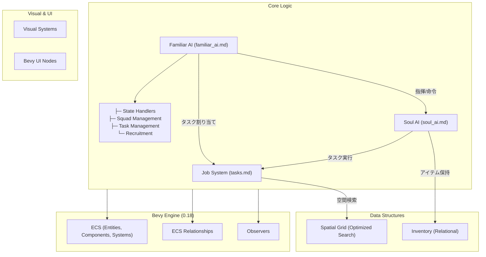

# Architecture

## システム全体俯瞰 (System Overview)

本プロジェクトは Bevy 0.18 のプラグインアーキテクチャに基づき、関心事ごとに分離されています。

## 主要なデータフロー: タスク割り当て
1.  **Designation**: `Player` または `Auto-Haul` システムが `WorkType` を持つ `Designation` を実体に付与。
2.  **Notification**: `OnAdd<Designation>` を検知し、空間グリッド (`DesignationSpatialGrid`) に登録。
3.  **Assignment**: `Familiar AI` が定期的に周辺のタスクをスキャンし、配下の `魂` に `WorkingOn` 関係を結ぶ。
4.  **Execution**: `Soul AI` が `WorkingOn` を通じて目的地を特定し、移動・作業を開始。
5.  **Completion**: 資源が尽きると実体が消滅。`Observer` が検知し、`魂` のタスクを解除。

## システムセットの実行順序
`src/main.rs` で定義されている `GameSystemSet` は以下の順序でチェーンされています：
`Input` → `Spatial` → `Logic` → `Actor` → `Visual` → `Interface`

## 定数管理 (`src/constants.rs`)

ゲームバランスに関わる全てのマジックナンバーは `constants.rs` に集約されています。

| カテゴリ | 例 |
|:--|:--|
| Z軸レイヤー | `Z_MAP`, `Z_CHARACTER`, `Z_FLOATING_TEXT` |
| AI閾値 | `FATIGUE_GATHERING_THRESHOLD`, `MOTIVATION_THRESHOLD` |
| バイタル増減率 | `FATIGUE_WORK_RATE`, `STRESS_RECOVERY_RATE_GATHERING` |
| 移動・アニメーション | `SOUL_SPEED_BASE`, `ANIM_BOB_SPEED` |

## イベントシステム

本プロジェクトでは、Bevy 0.18 の `Message` と `Observer` を用途に応じて使い分けています。

| 方式 | 用途 | 定義場所 |
|:--|:--|:--|
| `Message` | グローバル通知（タスクキュー更新等） | `src/systems/jobs.rs` |
| `Observer` | エンティティベースの即時反応 | `src/events.rs` |

> [!TIP]
> リソース (`ResMut`) を更新する必要がある場合は `Message` を使用してください。
> エンティティのコンポーネントに即座に反応する場合は `Observer` を使用してください。

---

### 詳細仕様書リンク
- **タスク割り当て/管理**: [tasks.md](tasks.md)
- **ビジュアル/セリフ**: [gather_haul_visual.md](gather_haul_visual.md) / [speech_system.md](speech_system.md)
- **AI挙動**: [soul_ai.md](soul_ai.md) / [familiar_ai.md](familiar_ai.md)
