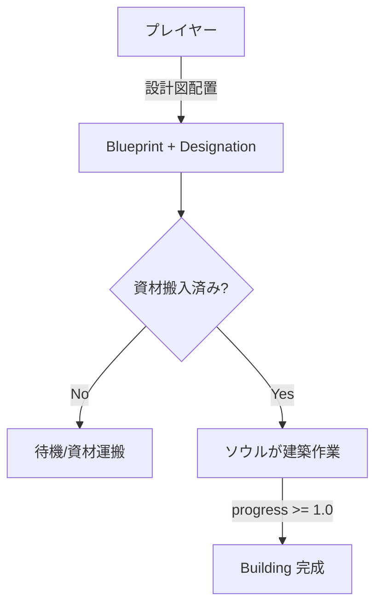

# 建築システム (Building System)

Hell-Workers における建築システムの基礎実装について説明します。

## 1. 概要

プレイヤーが設計図（Blueprint）を配置し、労働者が資材を運んで建設を完了させるシステムです。

## 2. コンポーネント

| コンポーネント | 役割 |
|:---|:---|
| `Blueprint` | 建設中の建物。`kind`, `progress`, `required_materials`, `delivered_materials` フィールドを持つ |
| `Building` | 完成した建物 |
| `BuildingType` | 建物の種類（`Wall`, `Floor`） |

### Blueprint フィールド

| フィールド | 型 | 説明 |
|:---|:---|:---|
| `kind` | `BuildingType` | 建物の種類 |
| `progress` | `f32` | 建築進捗 (0.0~1.0) |
| `required_materials` | `HashMap<ResourceType, u32>` | 必要資材量 |
| `delivered_materials` | `HashMap<ResourceType, u32>` | 搬入済み資材量 |

### 資材要件

| BuildingType | 必要資材 |
|:---|:---|
| Wall | 木材 × 2 |
| Floor | 石材 × 1 |

## 3. ワークフロー

## 4. タスク実行フェーズ

`AssignedTask::Build` は以下の `BuildPhase` を持ちます：

1. **GoingToBlueprint**: 設計図の位置へ移動
2. **Building { progress }**: 建築作業中（約3秒で完了）
3. **Done**: 完了

## 5. 制限事項

- **TaskSlots**: 建築作業は1人ずつ（`TaskSlots::new(1)`）。※資材運搬は複数人同時並行可能。

## 6. 自動資材運搬 (Auto-Haul Logic)

`blueprint_auto_haul_system` によって、最も効率的な資材運搬が行われます。

1.  **優先度**: 建築現場への資材運搬は、**他の全てのタスク（資源採取や通常の備蓄運搬）よりも高い優先度（Priority 10）** が設定されています。
2.  **資材選定**:
    - 地上のアイテムだけでなく、**使い魔の担当エリア内にあるストックパイル（備蓄）** からも資材を調達可能です。
    - 検索範囲内の全ての有効な資材の中から、**数学的に最も近い（最短距離にある）もの** を厳密に選択します。
    - これにより、近くにストックパイルがある場合は、遠くの資源を無視して備蓄から効率的に運び出します。
3.  **過剰運搬の防止**: 「配達済み + 運搬中 + 予約済み」の合計が必要数を超えないよう、厳密に管理されます。
4.  **搬入**: Blueprint に到着すると `deliver_material()` で資材が搬入され、進捗が進みます。

## 7. 関連ファイル

- [jobs.rs](file:///f:/DevData/projects/hell-workers/src/systems/jobs.rs): `Blueprint`, `Building`, `WorkType::Build`
- [build.rs](file:///f:/DevData/projects/hell-workers/src/systems/soul_ai/task_execution/build.rs): `handle_build_task`
- [selection.rs](file:///f:/DevData/projects/hell-workers/src/interface/selection.rs): `blueprint_placement`
- [helpers.rs](file:///f:/DevData/projects/hell-workers/src/systems/familiar_ai/helpers.rs): `assign_task_to_worker`
