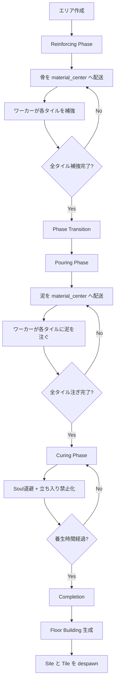

# 建築システム (Building System)

Hell-Workers における建築システムの基礎実装について説明します。

## 1. 概要

プレイヤーが設計図（Blueprint）を配置し、労働者が資材を運んで建設を完了させるシステムです。

## 2. コンポーネント

| コンポーネント | 役割 |
|:---|:---|
| `Blueprint` | 建設中の建物。`kind`, `progress`, `required_materials`, `delivered_materials` フィールドを持つ |
| `Building` | 完成した建物。`is_provisional` (仮設) フラグを持つ |
| `ProvisionalWall` | 仮設壁のアップグレード状態（`mud_delivered`）を保持 |
| `WallConstructionSite` | 壁の建設サイト（`Framing -> Coating` フェーズ、`material_center`、進捗カウンタを保持） |
| `WallTileBlueprint` | 壁1タイルの建設状態（`wood_delivered` / `mud_delivered` / `spawned_wall`）を保持 |
| `BuildingType` | 建物の種類（`Wall`, `Floor`, `Tank`, `MudMixer`, `SandPile`, `BonePile`） |

### Blueprint フィールド

| フィールド | 型 | 説明 |
|:---|:---|:---|
| `kind` | `BuildingType` | 建物の種類 |
| `progress` | `f32` | 建築進捗 (0.0~1.0) |
| `required_materials` | `HashMap<ResourceType, u32>` | 必要資材量 |
| `delivered_materials` | `HashMap<ResourceType, u32>` | 搬入済み資材量 |
| `is_provisional` | `bool` | 仮設状態かどうか（`Building` コンポーネントにも保持）|

### 資材要件

| BuildingType | 必要資材 |
|:---|:---|
| Wall | 木材 × 1 + StasisMud × 1（建築開始は木材のみで可能） |
| Floor | 石材 × 1 |
| Tank | 木材 × 2 |
| MudMixer | 木材 × 4 |
| SandPile | 砂 × 10 |
| BonePile | 骨 × 10 |

## 3. ワークフロー

```mermaid
flowchart TD
    A[プレイヤー] -->|設計図配置| B[Blueprint + Designation]
    B --> C{資材搬入済み?}
    C -->|No| D[待機/資材運搬]
    C -->|Yes| E[ソウルが建築作業]
    E -->|progress >= 1.0| F{完全な資材が揃っている?}
    F -->|Yes| G[Building 完成 (本設)]
    F -->|No| H[Building 完成 (仮設)]
    H --> I[追加資材搬入]
    I --> J[CoatWall 作業]
    J --> G
```

## 4. 仮設建築 (Provisional Building)

一部の建物（例: `Wall`）は、必要最低限の資材があれば「仮設状態」として建設を完了できます。
これにより、高コストな資材（例: Stasis Mud）が不足していても、基本的な構造物としての機能（壁による通行区分など）を先行して提供できます。

### 仕組
1.  **最低要件**: `Wall` は木材1つで建設開始・完了可能です。
2.  **仮設フラグ**: `Building` コンポーネントの `is_provisional` が `true` になります。
3.  **資材搬入**: 新仕様の壁サイトでは `TransportRequestKind::DeliverToWallConstruction` がフェーズに応じて `Wood` / `StasisMud` を自動搬入します（`DeliverToProvisionalWall` は legacy 壁のみ）。
4.  **作業タスク**: `WorkType::FrameWallTile`（木材フレーミング）と `WorkType::CoatWall`（タイル塗布）で段階実行します。
5.  **視覚表現**: 仮設状態の壁は警告色オーバーレイで表示され、`CoatWall` 完了で通常見た目へ戻ります。
6.  **本設化完了**: `CoatWall` 完了時に `Building.is_provisional = false` となり、`ProvisionalWall` が削除されます。

`AssignedTask::Build` は以下の `BuildPhase` を持ちます：

1. **GoingToBlueprint**: 設計図の位置へ移動
2. **Building { progress }**: 建築作業中（約3秒で完了）
3. **Done**: 完了

## 5. 制限事項

- **TaskSlots**: 建築作業は1人ずつ（`TaskSlots::new(1)`）。※資材運搬は複数人同時並行可能。

## 6. 自動資材運搬 (Auto-Haul Logic)

`blueprint_auto_haul_system` によって、最も効率的な資材運搬が行われます。

1.  **優先度**: 建築現場への資材運搬は、**他の全てのタスク（資源採取や通常の備蓄運搬）よりも高い優先度（Priority 10）** が設定されています。
2.  **資材選定**:
    - 地上のアイテムだけでなく、**使い魔の担当エリア内にあるストックパイル（備蓄）** からも資材を調達可能です。
    - 検索範囲内の全ての有効な資材の中から、**数学的に最も近い（最短距離にある）もの** を厳密に選択します。
    - これにより、近くにストックパイルがある場合は、遠くの資源を無視して備蓄から効率的に運び出します。
3.  **過剰運搬の防止**: 「配達済み + 運搬中 + 予約済み」の合計が必要数を超えないよう、厳密に管理されます。
4.  **搬入**: Blueprint に到着すると `deliver_material()` で資材が搬入され、進捗が進みます。
5.  **不足資材の自動採取（Wood / Rock）**:
    - 地面に資材が無い場合は、`familiar_ai` の `blueprint_auto_gather_system` が `DeliverToBlueprint` request を需要起点に `Tree` / `Rock` へ `Chop` / `Mine` を自動発行します。
    - 探索は `TaskArea` 内から外側へ段階的（10 / 30 / 60 タイル -> 到達可能全域）に拡大し、近い候補から決定されます。
    - これにより、建築開始時に木や岩の手動指定を都度打たなくても、搬入チェーンを継続できます。

## 7. グリッド配置とエリア選択 (Grid Alignment & Area Selection)

すべての配置操作は、ワールドのタイルグリッドに厳密に整合するように設計されています。

### グリッドスナップ
- **エリア選択**: `Stockpile` や `TaskArea` の指定時、ドラッグ中の矩形は常にグリッドの境界線（タイルの端）にスナップします。中途半端な座標での指定はできません。
- **建築配置**: 建築物の配置位置はグリッドの中心にスナップします。

### 建築ゴースト (Placement Ghost)
建築モード（`PlayMode::BuildingPlace`）中、マウスカーソルに追従する半透明の建物（ゴースト）が表示されます。

- **視覚フィードバック**:
    - **緑色（半透明）**: 配置可能。
    - **赤色（半透明）**: 配置不可（障害物や他の建物と重複、または通行不可地形）。
- **サイズ対応**: 1x1（壁など）だけでなく、2x2（タンクなど）の建物も適切なオフセットで表示されます。

### Companion 配置（Tank / MudMixer）
一部の建物は、親Blueprint配置直後に companion 配置フローへ遷移します。

- **Tank**:
  - `BucketStorage`（1x2）を即時配置するまで companion モードを継続します。
  - 親の `Tank` Blueprint は companion 配置が完了するまで確定しません（未確定状態では建築予約しない）。
  - `Esc` でキャンセルした場合は、親Blueprintと未確定 companion をまとめて取り消します。
- **MudMixer**:
  - 近傍（グリッド3タイル以内）に `SandPile`（完成済み or Blueprint）がない場合、`SandPile` Blueprint 配置の companion モードに遷移します。
  - 親の `MudMixer` Blueprint は companion 配置が完了するまで確定しません。
  - 近傍外ではゴーストが赤表示になり、配置不可が明示されます。

## 8. ビジュアルフィードバック (Visual Feedback)

`visual/blueprint/` モジュールによって、設計図の状態をプレイヤーに視覚的に伝えます。

このモジュールは、汎用的なビジュアルユーティリティ（`systems/utils/`）を使用して実装されています：
- **`utils/progress_bar.rs`**: プログレスバーの生成・更新・位置同期
- **`utils/animations.rs`**: パルス・バウンスアニメーション
- **`utils/floating_text.rs`**: フローティングテキスト（ポップアップ）の表示・アニメーション

### コンポーネント

| コンポーネント | 役割 |
|:---|:---|
| `BlueprintVisual` | 設計図の視覚状態（`BlueprintState`、パルスタイマー、前回の搬入数等）を管理 |
| `ProgressBar` | 設計図下部の進捗バー |
| `MaterialIcon / Counter` | 必要資材のアイコンと「現在の搬入数/必要数」のテキスト表示 |
| `DeliveryPopup` | 資材搬入時に表示される「+1」のフローティングテキスト |
| `CompletionText` | 建築完了時に表示される「Construction Complete!」のテキスト |
| `WorkerHammerIcon` | 建築中のワーカー頭上に表示されるアニメーション付きハンマー |
| `WorkLine` | 建築中のワーカーと設計図を結ぶ視覚的な作業線 |

### 状態別表示

設計図は「青写真」をイメージした青みがかった配色になります。

| 状態 | 透明度 | オーバーレイ色(RGBA) |
|:---|:---|:---|
| `NeedsMaterials` | 25% | (0.8, 0.4, 0.4, 0.4) - 警告赤 |
| `Preparing` | 25~50% | (0.8, 0.8, 0.4, 0.4) - 準備中黄 |
| `ReadyToBuild` | 50% | (0.4, 0.8, 0.6, 0.4) - 待機緑 |
| `Building` | 50~100% + パルス | (0.4, 0.6, 1.0, 0.5) - 建築中青 |

### アニメーション・エフェクト

- **透明度**: `opacity = 0.25 + 0.25 * material_ratio + 0.5 * build_progress`
- **パルス**: 建築作業中、設計図の透明度とスケールが脈動します。
- **バウンス**: 建物が完成した瞬間、実体化した建物が一度ピョンと跳ねる（スケールアップ・ダウン）演出が入ります。
- **フローティングテキスト**:
  - 資材搬入時: 「+1」のテキストがふわっと浮き上がりながらフェードアウトします。
  - 建設完了時: 「Construction Complete!」のテキストが強調表示されます。
- **ワーカー表示**:
  - 建築に従事している間、ワーカーの頭上でハンマーが上下に動きます。
  - ワーカーの位置と建設箇所が半透明の線（作業線）で結ばれます。

### プログレスバー

- 設計図の下部に幅24px、高さ4pxのバーを表示。
- 左詰め（Left-aligned）で増加し、視覚的な直感性を高めています。
- 資材搬入中は橙色（Haul/Prepare）、建築中は緑色（Building）に変化します。

### 壁の自動接続 (Wall Connections)

壁（`BuildingType::Wall`）は、隣接する他の壁や壁の設計図を検知して自動的に形状を変更します。

- **4方向接続**: 上下左右の隣接状況に応じてスプライトを切り替えます。
- **バリエーション**: 直線、コーナー、T字、十字など全15種類（+孤立状態）。
- **設計図連携**: 完成した壁だけでなく、建設中の壁（設計図）とも視覚的に接続します。

### MudMixer と Stasis Mud
- **MudMixer**: 2x2 の生産施設。
    - **建設**: 木材 × 4 で建設。
    - **機能**: 砂(1) + 水(1) + 岩(1) = Stasis Mud(5) を精製。
    - **要件**: 稼働には `Tank` からの水供給（`HaulWaterToMixer`）が必要です。
    - **SandPile**: 建設完了時の自動生成は行いません。必要時は companion フローで `SandPile` Blueprint を配置します。
    - **運搬制約**: `Sand` 搬入は猫車運搬のみ（徒歩運搬なし）。

- **Stasis Mud**: 高度な建築（完全な壁など）に必要な強化建材。
    - **運搬制約**: `StasisMud` の運搬ルールは [logistics.md](logistics.md) に準拠（原則猫車必須、近接ピックドロップ完結時は徒歩許可）。

- **SandPile**:
    - 建物として配置された砂置き場は、砂タイルと同様に**無限の砂ソース**として扱われます。
    - 砂回収は即時で、採取・猫車直採取のどちらでもソース自体は消費されません。

- **WheelbarrowParking（初期配布）**:
    - ゲーム開始時に1棟が初期配置され、猫車不足による初期停滞を防止します。


### 9. 実装状況

**※ 実装状況: 実装完了（主要フェーズ + 運用修正反映済み）**

従来の Blueprint システム（単一タイル配置）とは異なる、**エリア指定型の床建設システム**です。ドラッグ操作で矩形エリアを指定し、複数タイルを一括で建設します。

### 9.1 基本仕様

- **配置方法**: ドラッグ&ドロップで矩形エリアを指定（最大 10×10 タイル）
- **建設フェーズ**: 3段階の建設プロセス
  1. **Reinforcing Phase**: 骨（2個/タイル）を使って補強
  2. **Pouring Phase**: 泥（1個/タイル）を注ぐ
  3. **Curing Phase**: 打設後に一定時間養生（立ち入り禁止）
- **資材コスト**: 骨 × 2 + Stasis Mud × 1 per tile
- **通行性**: 建築中の `FloorTileBlueprint` は通行可能（障害物として扱わない）。ただし `Curing` 中は立ち入り禁止（障害物扱い）
- **キャンセル**: エリア全体を一括キャンセル（部分キャンセル不可）

### 9.2 エンティティ構造

```
FloorConstructionSite (親エンティティ)
  ├─ phase: FloorConstructionPhase (Reinforcing | Pouring)
  ├─ area_bounds: TaskArea (エリア範囲)
  ├─ material_center: Vec2 (資材配送の集約地点)
  ├─ tiles_total, tiles_reinforced, tiles_poured
  └─ children: Vec<FloorTileBlueprint>

FloorTileBlueprint (子エンティティ、タイルごと)
  ├─ parent_site: Entity
  ├─ grid_pos: (i32, i32)
  ├─ state: FloorTileState
  └─ bones_delivered, mud_delivered
```

### 9.3 フェーズフロー



### 9.4 タイル状態 (FloorTileState)

| 状態 | 説明 |
|:---|:---|
| `WaitingBones` | 骨の配送待ち |
| `ReinforcingReady` | 骨が届き、補強作業可能 |
| `Reinforcing { progress }` | ワーカーが補強作業中 |
| `ReinforcedComplete` | 補強完了、phase transition 待ち |
| `WaitingMud` | 泥の配送待ち（Pouring phase 移行後） |
| `PouringReady` | 泥が届き、注ぎ作業可能 |
| `Pouring { progress }` | ワーカーが注ぎ作業中 |
| `Complete` | 建設完了 |

### 9.5 資材配送システム

**TransportRequest による自動配送**:
- `floor_construction_auto_haul_system` が Site ごとに必要資材を計算
- TransportRequest エンティティを生成（`TransportRequestKind::DeliverToFloorConstruction`）
- 資材は `material_center` 位置に集約配送される
- Priority: 10 (Blueprint と同等の高優先度)

**Phase に応じた資材**:
- **Reinforcing Phase**: 骨（Bone）を配送
  - 地面Boneがあれば通常 `Haul` で搬送
  - 地面Boneが無い場合は `BonePile` / River からの猫車直採取にフォールバック
- **Pouring Phase**: 泥（StasisMud）を配送（猫車必須）

### 9.6 タスク割り当て

**Designation の自動付与**:
- `floor_tile_designation_system` が各タイルの state を監視
- `ReinforcingReady` → `WorkType::ReinforceFloorTile` の Designation を付与
- `PouringReady` → `WorkType::PourFloorTile` の Designation を付与
- TaskSlots: 1（1タイルに1ワーカー）

**タスク実行**:
- **ReinforceFloorTile**: `reinforce_floor.rs`
  1. `GoingToMaterialCenter`: Site の material_center へ移動
  2. `PickingUpBones`: タイルが `ReinforcingReady` であることを確認
  3. `GoingToTile`: タイル位置へ移動
  4. `Reinforcing`: 作業実行（約3秒）
  5. `Done`: タスク完了、Designation 解放

- **PourFloorTile**: `pour_floor.rs`
  1. `GoingToMaterialCenter`: Site の material_center へ移動
  2. `PickingUpMud`: タイルが `PouringReady` であることを確認
  3. `GoingToTile`: タイル位置へ移動
  4. `Pouring`: 作業実行（約2秒）
  5. `Done`: タスク完了、Designation 解放

### 9.7 Phase Transition System

**Reinforcing → Pouring の移行**:
- `floor_construction_phase_transition_system` が実行
- 条件: `site.tiles_reinforced == site.tiles_total` かつ全タイルが `ReinforcedComplete`
- 処理:
  1. `site.phase` を `Pouring` に更新
  2. 全タイルの state を `WaitingMud` に更新
  3. 既存の Designation を削除（泥配送後に再付与される）

### 9.8 Completion System

**建設完了処理**:
- `floor_construction_completion_system` が実行
- 条件: 全タイルが `Complete` 状態
- 処理:
  1. （初回）`Curing` フェーズへ移行
  2. 対象タイルを障害物化し、範囲内の Soul を退避
  3. 一定時間（`FLOOR_CURING_DURATION_SECS`）待機
  4. 養生完了後、各タイルに `Floor` Building をスパウン
  5. 養生中は Site 中央に進捗バーを表示し、残り時間を可視化
  6. 完成床生成時にバウンスアニメーションを再生
  7. 建築中タイルを完成床へ置換（床として通行可能）
  8. FloorTileBlueprint エンティティを despawn
  9. FloorConstructionSite エンティティを despawn


### 9.10 関連ファイル (Floor Construction)

- `src/systems/jobs/floor_construction/components.rs`: コンポーネント定義
- `src/systems/jobs/floor_construction/phase_transition.rs`: Phase 移行システム
- `src/systems/jobs/floor_construction/completion.rs`: 完了処理
- `src/systems/jobs/floor_construction/cancellation.rs`: サイト単位キャンセル・資材返却
- `src/systems/logistics/transport_request/producer/floor_construction.rs`: 資材配送・搬入資材同期
- `src/systems/logistics/transport_request/producer/floor_construction/designation.rs`: Floor tile への Designation 付与
- `src/systems/soul_ai/execute/task_execution/reinforce_floor.rs`: 補強タスク実行
- `src/systems/soul_ai/execute/task_execution/pour_floor.rs`: 打設タスク実行
- `src/systems/soul_ai/execute/task_execution/haul.rs`, `src/systems/soul_ai/execute/task_execution/haul/dropping.rs`: floor site への徒歩搬送
- `src/systems/soul_ai/execute/task_execution/haul_with_wheelbarrow/`: floor site への猫車搬送
- `src/systems/familiar_ai/decide/task_management/policy/floor.rs`: タスク割り当てポリシー
- `src/systems/familiar_ai/decide/task_management/policy/haul/`: floor request の搬送元解決・割り当て
- `src/systems/visual/floor_construction.rs`: タイル色・配筋マーカーの可視化
- `src/interface/selection/floor_place.rs`: ドラッグ配置と重複防止
- `src/systems/spatial/floor_construction.rs`: Spatial grid
- `src/plugins/logic.rs`: システム登録

### 9.11 壁建設フェーズ分割（Framing -> Coating, 養生なし）

- 壁のドラッグ配置は `Blueprint` 直建てではなく `WallConstructionSite` + `WallTileBlueprint` を生成する。
- フェーズは 2 段階のみ:
  1. `Framing`: 木材搬入 (`WALL_WOOD_PER_TILE`) -> `FrameWallTile` 実行
  2. `Coating`: 泥搬入 (`WALL_MUD_PER_TILE`) -> `CoatWall` 実行
- `Framing` 完了タイルは即時に `Building { kind: Wall, is_provisional: true }` を生成し、通路分離・壁接続判定に参加する。
- `Coating` 完了時に `Building.is_provisional = false` へ更新し、`ProvisionalWall` を除去する。
- `Curing` 相当フェーズは持たず、全タイル `Complete` 到達で site / tile / request を即時 cleanup する。
- キャンセルは site 単位で処理され、搬入済み `Wood` / `StasisMud` を返却し、関連 request / 作業割り当てを解除する。

## 10. 関連ファイル (Blueprint System)

- `src/systems/jobs.rs`: `Blueprint`, `Building`, 建設完了ロジック
- `src/systems/visual/blueprint/mod.rs`: ビジュアルフィードバック（統括モジュール）
- `src/systems/visual/blueprint/components.rs`: コンポーネント定義
- `src/systems/visual/blueprint/progress_bar.rs`: プログレスバー
- `src/systems/visual/blueprint/material_display.rs`: 資材表示
- `src/systems/visual/blueprint/effects.rs`: エフェクト
- `src/systems/visual/blueprint/worker_indicator.rs`: ワーカーインジケータ
- `src/systems/utils/progress_bar.rs`: 汎用プログレスバー実装
- `src/systems/utils/animations.rs`: パルス・バウンスアニメーション実装
- `src/systems/utils/floating_text.rs`: フローティングテキスト実装
- `src/plugins/visual.rs`: システム登録
- `src/systems/visual/wall_connection.rs`: 壁の自動接続ロジック
- `src/systems/soul_ai/execute/task_execution/build.rs`: `handle_build_task`（進捗更新）
- `src/systems/jobs/wall_construction/`: 壁建設 site/tile コンポーネント・遷移・完了・キャンセル
- `src/systems/logistics/transport_request/producer/wall_construction.rs`: 壁サイト向け搬送 request / 搬入同期 / Designation
- `src/systems/logistics/transport_request/producer/provisional_wall.rs`: legacy 仮設壁向け泥搬送（wall site 管理対象は除外）
- `src/systems/soul_ai/execute/task_execution/frame_wall.rs`: `FrameWallTile` 実行ロジック
- `src/systems/soul_ai/execute/task_execution/coat_wall.rs`: tile ベース `CoatWall`（legacy 壁互換を含む）
- `src/interface/selection/`: `blueprint_placement`（input, building_place, hit_test, state に分割）
- `src/systems/visual/placement_ghost.rs`: 建築ゴースト表示システム
- `src/assets.rs`: 各種アイコンアセット
