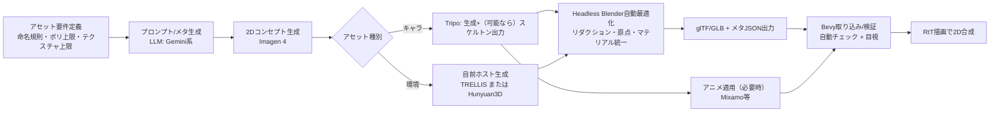

# 提案書妥当性評価報告書

## エグゼクティブサマリ

本評価は、ユーザー提供の提案書「2.5Dゲームアセット作成ワークフロー提案」（以下「本提案」）と、指定リポジトリ（`iaammssssstupiddddd-commits/hell-workers`）内の提案書関連ファイル（README、技術ドキュメント、提案テンプレート、ビジュアル更新プロンプト集 等）を対象に、標準的な技術・管理レビューとして妥当性を評価した。fileciteturn0file0 fileciteturn6file0 fileciteturn9file0

結論として、本提案は「Bevy上でのRtT（Render-to-Texture）により 2D+3D を合成する」という中核アーキテクチャは、既にリポジトリ側でPhase 1相当の実装が存在するため、技術的に成立している（=実現性は高い）。fileciteturn11file0 fileciteturn18file0  
一方で、**アセット生成ワークフロー（AI生成→最適化→運用）**については、(1) 要件（アート方針・配布形態・ライセンス）との整合、(2) コスト見積もりの根拠、(3) スケジュール・品質ゲート・ロールバックの欠落、(4) ライセンス（特にHunyuan3D-2.1）とSaaS（Tripo）依存の運用/法務リスクが未解消であり、現状の記述のまま**フルスケール導入に進むのは危険**である。fileciteturn0file0 citeturn7view0turn12search2turn15search0turn0search1

推奨は「小さなPoC（数アセット）→測定→提案書をテンプレ準拠に補強→段階導入」であり、PoCの合格条件（品質・コスト・速度・法務可否）を満たした場合にのみ本格運用へ移行すべきである。fileciteturn19file0

妥当性スコアカード（現状の提案書記載に基づく）：

| 観点 | 評価 | 根拠（要点） | 主な懸念 |
|---|---:|---|---|
| 技術的実現性（RtT実装） | 高 | 既にデュアルカメラ+RenderLayers+RenderTarget設定が実装済み | 3D描画負荷・描画品質の基準未定義 fileciteturn18file0 |
| 技術的実現性（AI→Blender最適化） | 中 | Headless Blender実行は可能、glTF出力も標準機能 | 生成品質のばらつき/破綻時の手当て・自動検証不足 citeturn11search1turn10search0 |
| 要件整合性（アート/仕様） | 中〜低 | リポジトリは2D/正投影/手描き感の指針が強い | PBRベース3D生成が「ラフなベクタースケッチ」へ収束する保証が弱い fileciteturn10file0turn14file0 |
| リスク（法務/依存） | 低 | Hunyuan3D-2.1は独自ライセンスで地域制限が明記 | 配布地域・利用形態により将来の阻害要因になり得る citeturn7view0 |
| コスト見積もり | 低 | GPU/Spotの単価前提が不確実、Vertex/Imagen費も式が未整備 | 「$500で2200-2600h」等が検証不足、上限管理が弱い fileciteturn0file0 citeturn19search1turn15search0 |
| スケジュール | 低 | 工程は列挙されるがマイルストーン/検証計画が未定義 | 失敗時の切り戻し、段階導入が書かれていない fileciteturn0file0turn19file0 |

## 提案書の要約

本提案が目指すものは、Rust/Bevyの2.5D表現において、**3DメッシュをRtTでリアルタイム描画し、2D UI/スプライトと合成する方式**を前提に、**大量の3DアセットをAIで生成→自動最適化→運用投入**する一連のワークフローを定義することである。fileciteturn0file0

本提案に明示された前提・制約（主要要件）は以下である。fileciteturn0file0

- 方式：Camera3d（正射影）で3Dをオフスクリーン描画→テクスチャを2D側で合成（RtT）。
- アセット：従来の2Dスプライトではなく、**3Dモデル（.glb/.gltf）**が中心。
- 予算：GCPクレジット $500、SaaSは月$20以下。
- 生成基盤（案）  
  - キャラクター：Tripo AI（四角ポリゴン指向・自動リグ等を想定）
  - 環境：オープンソース3D生成モデル（TRELLIS / Hunyuan3D-2.1）をGPU Spotで自前ホスト
  - メタ情報/プロンプト：Vertex AIのGemini系
  - 2Dコンセプト：Imagen 4
- 最適化：Headless Blenderで自動（リダクション、原点合わせ、PBR整備など）。
- アニメーション：Adobe Mixamoの流用を示唆。citeturn14view0

リポジトリ側の現状（提案周辺の一次情報）として、プロジェクトはBevy 0.18 / Rust 2024で構成され、ドキュメント体系に「docs/proposals」が存在し、提案テンプレートも用意されている。fileciteturn6file0turn9file0turn19file0  
また、設計ドキュメントにはRtTインフラが明示され、実装も`StartupPlugin`でRenderTarget用テクスチャ生成とCamera3d/2dのセットアップが行われている。fileciteturn11file0turn18file0

## 要件と目的の整合性チェック

本提案の妥当性は、「技術としてできる」だけでなく「プロジェクトの要件・世界観・アート方針に合う」ことが必要である。リポジトリ側には、世界観・視覚指針として **「ラフなベクタースケッチ」「正投影」「3/4 view禁止」「水平/垂直配置」**等が強く定義されている。fileciteturn10file0  
さらに、ビジュアル更新用のプロンプト集が、正投影・手描き感を前提として2D画像生成を想定している点も示唆的である。fileciteturn14file0

一方で、アーキテクチャには「RtT（Render-to-Texture）インフラ」「3D化計画のPhase 1が実装済み」と明記されており、3Dの導入自体は技術ロードマップに合致する。fileciteturn11file0turn18file0

整合性の差分を、レビュー観点で整理する。

| 主要論点 | 本提案の立場 | リポジトリ側の一次情報 | 差分/リスク | 補強すべき決定事項 |
|---|---|---|---|---|
| RtT採用 | 2.5Dの中核 | RtT用Camera3d/2d・RenderLayers・RenderTargetが実装済み | 方式は概ね整合 | RtTの“対象範囲”（全アセットか一部か）を定義 fileciteturn18file0 |
| アートスタイル | PBRも視野（生成モデル起点） | ラフな手描き感/正投影、スプライトサイズ例も明記 | PBRそのままだと乖離しやすい | 「最終画作り」をシェーダ/後処理で統一する方針を明文化 fileciteturn10file0 |
| アセット供給戦略 | AI大量生成（SaaS+自前） | 既存は2D寄り。2D生成プロンプト集あり | 組織的に“3D中心”へ舵を切る意思決定が必要 | 3D化の対象（キャラ/建築/地形/UI）を分割し、段階導入 fileciteturn14file0 |
| 予算上限 | $500クレジット+月$20 | リポジトリ側に予算記載なし | 予算制約が強いのに単価検証が弱い | 予算管理（上限アラート、費目別上限）と課金責任者の明確化 fileciteturn0file0 |
| ライセンス許諾 | OSSモデル活用を前提 | Hunyuan3D-2.1は独自ライセンスで地域制限あり | 将来の配布地域/契約で詰まる可能性 | “配布想定地域”と“利用規約レビュー”を必須ゲート化 citeturn7view0 |

現状の記述だけだと、「RtTの技術導入」は整合するが、「どの品質の3Dを、どのスタイルで、どの法務条件で、どの範囲まで置き換えるか」が決め切れていないため、**要件整合性は中〜低**と判定する。fileciteturn0file0turn10file0turn11file0

## 技術的実現性評価

リポジトリ側の一次情報により、RtTの基盤が「設計として存在する」だけでなく「コードとして動く状態」にあることが確認できる。具体的には、`StartupPlugin`で 1280x720 のターゲットテクスチャを生成し、Camera2dとCamera3d（正射影）を分離レイヤーで運用し、Camera3dは`RenderTarget::Image`に描画、Camera2d側でスプライトとして合成している。fileciteturn18file0turn17file0  
この方式はBevy公式例でも「render to texture」として一般的にサポートされており、RenderTarget・RenderLayersを用いた構成が提示されている。citeturn1search2turn1search0turn9search2

本提案の技術要素を、実現性の観点で分解する。

**RtT（2D+3D合成）**  
- 既存実装では、Camera3dを`order: -1`で先に描画し、透過クリアカラーでRtTテクスチャを生成、Camera2d子のスプライトに貼ってビューポートを覆う方式が取られている。fileciteturn18file0turn17file0  
- 正射影は`OrthographicProjection::default_3d()`を利用しており、Bevy側にも3D正射影のAPIが存在する。fileciteturn18file0 citeturn9search1  
- このため「RtTそのもの」の実現性は高いが、**本提案が狙う“大量の3DアセットをRtTで回す”**場合、描画負荷（ポリゴン数、テクスチャ解像度、ライト/影、ポストエフェクト）に応じた性能管理（LOD、バッチング、アトラス、unlit化等）が必須となる。fileciteturn0file0turn18file0

**アセット形式（glTF/GLB）とPBR/Unlit**  
- BevyはglTF 2.0用のAssetLoaderと型定義を提供し、シーンとしてロードする仕組みがある。citeturn18search0  
- BlenderのglTFエクスポータは、金属・粗さ（Metal/Rough PBR）に加えて、Shadeless（`KHR_materials_unlit`）にも対応する。これは「手描き風（陰影を固定）」へ寄せる際の重要な逃げ道になる。citeturn10search0  
- また、glTF 2.0のPBR要素（base color / metallic / roughness等）はKhronosが解説しており、生成モデルがPBRマップを出力する設計自体は標準仕様に乗る。citeturn4search0turn4search3

**3D生成（自前ホスト：Hunyuan3D-2.1 / TRELLIS）**  
- Hunyuan3D-2.1は、形状生成10GB、テクスチャ生成21GB、両方で29GB VRAMを要すると明記している。citeturn6view1  
  - 本提案が想定するL4（24GB）では、**フル機能（形状+テクスチャ）を“素直に”回すとVRAM不足の可能性がある**。ただし`--low_vram_mode`のような低VRAM運用が示されており、条件付きで成立し得る。citeturn6view4  
- TRELLISは少なくとも16GB VRAMのNVIDIA GPUを必要とし、Linux上で検証されている。L4（24GB）が前提を満たす可能性は高い。citeturn8view0  
- よって「技術としての実行」は可能だが、**生成品質が“ゲームに入る品質”か**（トポロジ、UV、破綻、スタイル統一）と、**再現性（seed固定、プロンプト、モデルバージョン固定）**をどう担保するかは提案書上の未解決事項である。fileciteturn0file0 citeturn5view0turn8view0

**SaaS生成（Tripo）とリグ/スケルトン**  
- Tripoの有料プランでは「スケルトン付きでエクスポート」等が明記され、キャラクター制作に必要な機能が揃う可能性はある。citeturn12search4  
- ただし本提案が述べる「クワッドトポロジ指定」「T-pose固定」等、制作パイプラインの品質を左右する仕様は、提案書内の引用が一次情報ではなく、現状このレビューでは裏取りが十分でない（=仕様変更リスク）。fileciteturn0file0 citeturn12search4

**最適化（Headless Blender）**  
- Blenderはコマンドラインで背景レンダリング（`-b/--background`）やスクリプト実行（`-P/--python`）ができ、ヘッドレス自動処理の基盤として成立する。citeturn10search5turn11search1  
- その上でglTFエクスポートの制約（例：画像テクスチャはPNG/JPEG等）や、どこまでが自動変換されるかを踏まえた実装が必要になる。citeturn10search0

以上から、**「RtT+glTF+Blender自動処理」の骨格は実現性が高い**一方、**「AI生成の品質保証」と「必要VRAM/ライセンス/仕様変動」**が主要な技術的不確実性になる。

参考として、提案内容を運用パイプラインに落としたフローを示す。

（上図の根拠：本提案が示す構成要素と、リポジトリ側に存在するRtT実装の整合による。）fileciteturn0file0 fileciteturn18file0 citeturn16search0turn15search0

## リスク評価

本提案は「生成系AI・Spot・外部SaaS」を強く活用するため、技術リスクだけでなく運用・法務・セキュリティの比重が大きい。特にHunyuan3D-2.1のライセンス条項は、将来の市場展開（配布地域）に直接影響し得る。citeturn7view0

主要リスクをレジスタとして整理する（重要度は高/中/低）。

| リスク | 種別 | 重要度 | 根拠（一次/公式） | 想定影響 | 対策案（現実的な順） |
|---|---|---:|---|---|---|
| 生成モデルの品質ばらつき（破綻/UV/トポロジ/一貫性） | 技術 | 高 | 生成モデルはVRAM要件や実行条件が明記される一方、ゲーム品質保証手段は別途必要 citeturn6view1turn8view0 | 手戻り増、品質崩壊、納期遅延 | PoCで“合格基準”を定義→自動検証（ポリ数/テクスチャ/ボーン等）→落ちたら手修正か再生成 fileciteturn19file0 |
| Hunyuan3D-2.1の独自ライセンス（地域制限・AUP等） | 法務 | 高 | EU/UK/韓国では本ライセンスが適用外と明記 citeturn7view0 | 配布地域・顧客条件で利用不可となる可能性 | ①配布想定地域の確定 ②法務レビュー ③代替（TRELLIS等MIT）を常に用意 citeturn8view0 |
| Tripoの利用規約・出力利用制限（競合サービス禁止等） | 法務/運用 | 中 | 出力（Outputs）や競合利用の制限、第三者提供の制限等が規約に含まれる citeturn12search2turn12search4 | 商用利用範囲の誤解、後出し制限、利用停止リスク | ①利用規約の条項を提案書に転記し前提固定 ②重要なら自前ホスト/OSS寄りへ移行 |
| Spot VMの中断（最大30秒の通知、best-effort） | 運用/スケジュール | 中 | Compute EngineのSpot VMは最大30秒の猶予で停止し得る citeturn0search1 | ジョブ中断、再実行、コスト増、納期遅れ | ジョブを小粒化（1アセット=独立）・中間成果を永続化・再開設計 |
| 24GB GPU前提のVRAM不足（モデルによっては29GB必要） | 技術/コスト | 中 | Hunyuan3Dは形状+テクスチャで29GBを明記 citeturn6view1turn6view4 | 生成できない/低VRAMで品質低下 | ①低VRAMモード検証 ②モデル選択（TRELLIS等）③必要ならより大きいGPUへ（予算再計算） |
| アート方針との不一致（ラフスケッチ風 vs PBR生成） | 品質/要件 | 中〜高 | 世界観ドキュメントでラフベクター・正投影等が明記 fileciteturn10file0 | 統一感喪失、ブランド毀損 | Unlit材・線画/ハッチング風シェーダ・後処理で統一、標準パレット/輪郭線規約を定義 citeturn10search0turn9search2 |
| データ漏洩（外部SaaSへ未公開デザイン画像等を投入） | セキュリティ/運用 | 中 | 規約上「データ抽出禁止」等、サービス提供者側の統制はあるが、送信自体がリスク citeturn12search2 | IP流出、契約違反 | 入力データ分類（公開/非公開）と“外部投入可否”ルール化、秘匿は自前ホストへ |

結論として、技術的課題の多くはPoCで潰せるが、**法務（ライセンス/規約）とアート整合性は、失敗時のダメージが大きい**ため、提案書上で先に“合意済み前提”として固定すべきである。fileciteturn19file0 citeturn7view0turn12search2

## コストとスケジュール妥当性の検証

### コスト妥当性

本提案は「GCPクレジット$500」「SaaS月$20以下」を制約として掲げるが、重要な費目について“式”と“単価の引用元（一次情報）”が不足している。fileciteturn0file0  
特にGPU Spotの時間単価を固定値で置いている点は、Spotが需給で変動し、停止も起こり得るという公式説明と整合しないため、見積もりはレンジで扱う必要がある。citeturn0search1

一次情報（公式）として確認できた前提：

- Compute EngineのG2（L4搭載）系列として `g2-standard-4` は **vCPU4 / RAM16GB / L4(24GB)** である。citeturn19search0  
- Compute Engineの公式価格表（VMsのall-pricing）では、少なくとも **オンデマンドの基準単価（例：$0.70683228/h）** が提示されている（※リージョン依存・表示条件あり）。citeturn19search1  
- Vertex AI（生成AI）はトークン課金を基本とし、モデルごとに $/1M tokens が提示される。さらに「4文字≒1トークン」等の換算も明記される。citeturn15search0  
- Imagen 4はVertex AI上のモデルとして仕様が公開され、別途Google Developers Blogでは「Imagen 4は1枚あたり$0.04」と明記されている（※適用条件は運用で要確認）。citeturn16search0turn16search4  
- Tripoは無料/有料プランでライセンス（例：無料はCC BY 4.0、上位は商用利用可等）が明示されている。citeturn12search4

以上を踏まえ、**提案書のコスト見積もりは「費目別の上限」「単価の一次情報」「変動費のレンジ」を追加しない限り、妥当性確認ができない**。現状の提案書は“方向性とアイデア”としては良いが、稟議・合意用の見積書としては未完成である。fileciteturn0file0

参考として、妥当性検証に必要な“見積もりテンプレ（式）”を提示する（不明点は変数化する）。

| 費目 | 式（例） | 一次情報の参照点 | 本提案の不足点 |
|---|---|---|---|
| GPU計算（自前ホスト） | `GPU単価($/h) × 実稼働h × (再試行係数)` | G2構成は公式、単価は公式価格表/請求SKUsで確定すべき citeturn19search0turn19search1 | Spot単価と再試行（中断/失敗）をどう織り込むか未記載 citeturn0search1 |
| LLM（メタ生成） | `入力token×単価 + 出力token×単価` | Vertex AI pricing citeturn15search0 | “1アセット当たりtoken数”の前提なし |
| 画像生成（コンセプト） | `画像枚数 × $0.04`（例） | Imagen 4公開情報 citeturn16search4turn16search0 | 何枚/アセット、採用率、リジェクト率が未記載 |
| SaaS（Tripo） | `月額 + 追加credits` | Tripo pricing / blog citeturn12search4turn12search3 | 無料CC BY利用の可否（クレジット表記義務等）を未判断 |
| Blender自動処理 | 自前PC/CIなら`運用工数`、クラウドなら`CPU単価×h` | Blender CLI+Pythonは可能 citeturn11search1turn10search5 | 実行環境（CI/ローカル/クラウド）と所要時間が未測定 |

### スケジュール妥当性

本提案は工程を列挙するが、**マイルストーン、受入基準、検証計画、ロールアウト/ロールバック**が提案テンプレート水準で整備されていない。fileciteturn0file0turn19file0  
特に、リポジトリの提案テンプレートでは「検証計画」「ロールアウト/ロールバック」「Open Questions」が必須になっているため、提案書体系に載せるには追記が必要である。fileciteturn19file0

スケジュール妥当化のための最小構成（例）：

| フェーズ | 期間（目安） | 成果物 | 受入条件（例） |
|---|---:|---|---|
| PoC（技術） | 3〜5日 | RtT上での3Dアセット表示、Blender自動最適化スクリプト最小版 | ①所定FPS下限 ②glTF取込成功 ③再現可能（seed/設定記録） fileciteturn18file0turn19file0 |
| PoC（生成品質） | 1〜2週 | 環境×5、キャラ×2程度の試作 | ①アート方針に合う ②破綻率/手直し時間が許容内 fileciteturn10file0turn14file0 |
| 運用設計 | 3〜5日 | ライセンス/規約メモ、資産分類、コスト上限、監査ログ方針 | ①法務OK ②配布地域OK ③費目別上限が実装可能 citeturn7view0turn12search2turn15search0 |
| 段階導入 | 1〜2週 | 対象カテゴリ限定で運用開始 | ①自動検証で不良をブロック ②ロールバック可能 fileciteturn19file0 |

（期間は標準的な“検証込み”の目安であり、実際はチーム体制と品質目標で変動する。）

## 代替案と改善提案

### 代替案（比較）

本提案は「3D生成→RtT」を主軸に置くが、要件整合や法務リスクを踏まえると、代替案を提案書に正式に書き下ろす価値が高い（リポジトリの提案テンプレも比較表を想定）。fileciteturn19file0

| 案 | 概要 | 長所 | 短所/リスク | 適用が向く状況 |
|---|---|---|---|---|
| A（現提案） | 3D生成（SaaS+自前）→Blender→glTF→RtT | 量産性、3D表現の拡張 | 品質保証と法務が重い | 3D中心に舵を切る意思決定がある場合 fileciteturn0file0 |
| B（2D生成中心） | 2D画像生成（ラフスケッチ）+最小限RtT | アート整合性が高い、法務面が軽い可能性 | 3Dの恩恵（Z/ライト等）が限定 | 既存アート指針を優先する場合 fileciteturn10file0turn14file0 |
| C（3Dは“特殊用途”） | RtTは一部（演出/特定建物）に限定 | リスク局所化、性能管理が容易 | パイプライン二重化 | まずRtTの価値検証をしたい場合 fileciteturn11file0turn18file0 |
| D（OSS優先） | 生成はOSSのみ（例：TRELLIS）、SaaS最小化 | 規約変動・ベンダーロック低減 | セットアップ/運用が重い | 長期運用・配布地域が広い場合 citeturn8view0 |

### 改善提案（優先度付き）

本提案を「稟議可能な提案書」へ引き上げるために、改善項目を優先度で提示する。

| 優先度 | 改善提案 | ねらい | 追加すべき内容（提案書へ） |
|---:|---|---|---|
| P0 | 提案テンプレ準拠に再構成 | 合意形成に必要な欠落（検証/ロールバック等）を埋める | Goals/Non-goals、影響範囲、検証計画、ロールアウト/ロールバック、Open Questions fileciteturn19file0 |
| P0 | ライセンス/規約ゲート新設 | 後戻り不能な法務事故の防止 | Hunyuan3D-2.1の地域制限、Tripo出力利用制限、Mixamo用途条件の整理 citeturn7view0turn12search2turn14view0 |
| P0 | 画作り仕様（“最終見え”）を先に固定 | アート整合性の担保 | PBRかUnlitか、輪郭線/陰影、パレット、正投影ルールを“受入基準”に落とす fileciteturn10file0 citeturn10search0turn9search2 |
| P1 | 自動品質検証（CI/ローカル） | 量産時の破綻率を抑える | ポリ数・材質数・テクスチャ上限・ボーン有無・原点/スケール整合の自動チェック（落ちたらReject） |
| P1 | コストモデルの数式化と上限制御 | “$500枠”を守りつつ予測可能にする | 費目別上限、単価根拠（公式）、中断/再試行率を含むレンジ見積 citeturn15search0turn19search1turn0search1 |
| P2 | RtT対象の段階導入（カテゴリ分割） | リスク局所化・性能確保 | “まず環境小物のみ”等、対象を絞ったロードマップ（Phase/Exit criteria） fileciteturn11file0turn18file0 |

## 結論と推奨アクション

本提案は、**RtTを中核に2.5Dを成立させる技術方針**という点では、リポジトリが既に実装・ドキュメント化しており、方向性として妥当である。fileciteturn11file0turn18file0  
しかし、提案書としての妥当性（実行計画・見積・リスク統制）という観点では、**“生成AIを量産パイプラインにする”部分が未確定要素を多く含むため、現状のままの採択は推奨しない**。fileciteturn0file0

推奨アクションは以下の順である。

1. **PoCを最小スコープで実施**：環境小物5点＋キャラ2体程度で、生成→Blender最適化→Bevy取込→RtT表示まで通し、破綻率・手直し時間・FPS影響・費用を計測する。fileciteturn18file0turn0file0  
2. **法務ゲートを通す**：Hunyuan3D-2.1ライセンスの地域制限、Tripo規約の出力利用条件、Mixamoの利用条件（商用可否・制約）を、配布想定地域と照合してYes/No判断する。citeturn7view0turn12search2turn14view0  
3. **提案書をテンプレート準拠に補強**：検証計画・ロールバック・代替案比較・未解決事項を埋め、稟議・合意形成に耐える形へ更新する。fileciteturn19file0  
4. **アート整合を仕様として固定**：PBRをそのまま採用するのか、Unlit/線画風へ寄せるのかを先に決め、受入基準（見た目）を明文化する。fileciteturn10file0 citeturn10search0  

この順序で進めれば、技術的に強い部分（既に成立しているRtT）を活かしつつ、不確実性の高い部分（生成品質・法務・コスト変動）を“実測と合意”で潰し込めるため、提案の妥当性を実運用レベルへ引き上げられる。fileciteturn18file0turn19file0