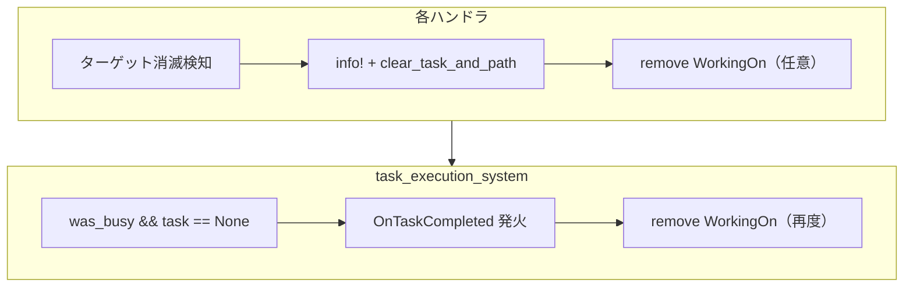
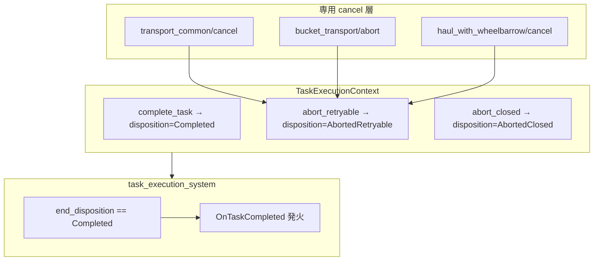

# task_execution リファクタリング計画（コンテキスト集約・完了/中断区別・ログ降格・boundary.rs 分割）

## メタ情報

| 項目 | 値 |
| --- | --- |
| 計画ID | `task-execution-refactor-plan-2026-07-07` |
| ステータス | `Completed` |
| 作成日 | `2026-07-07` |
| 最終更新日 | `2026-07-07` |
| 作成者 | Claude (Fable 5) → Codex（具体化ブラッシュアップ） |
| 関連提案 | N/A（2026-07-07 の全体実装レビューに基づく） |
| 関連Issue/PR | N/A |
| ベースライン計測日 | `2026-07-07`（実装前、`cargo check` / `clippy --workspace` 0警告確認済み） |

---

## 0. ベースライン計測（2026-07-07 時点）

| 指標 | 値 | 計測コマンド |
| --- | --- | --- |
| `task_execution/` ファイル数 | 58 | `find ... -name '*.rs' \| wc -l` |
| `task_execution/` 総行数 | 8,253 | `wc -l` |
| `clear_task_and_path` 呼び出し | **72**（22ファイル） | `rg -c clear_task_and_path crates/hw_soul_ai` |
| `remove::<WorkingOn>` 呼び出し | **37**（11ファイル） | `rg -c 'remove::<WorkingOn>' crates/hw_soul_ai/.../task_execution` |
| `info!`（task_execution 内） | **88** | `rg -c 'info!' .../task_execution` |
| `handler/impls.rs` 行数 | 258（フォワードのみ） | `wc -l` |
| `boundary.rs` 行数 | 1,252 | `wc -l` |
| `AssignedTask` バリアント数 | 16（`None` 除く） | `handler/dispatch.rs` match 腕 |
| task_execution 内 `unassign_task` 呼び出し | **0** | `rg unassign_task .../task_execution` |

### 0.1 `clear_task_and_path` ホットスポット（置換優先度順）

| ファイル | 回数 | M2 での主な置換先（暫定） |
| --- | --- | --- |
| `reinforce_floor.rs` | 6 | 中断5 / 完了1 |
| `pour_floor.rs` | 6 | 中断5 / 完了1 |
| `frame_wall.rs` | 6 | 中断5 / 完了1 |
| `refine.rs` | 5 | 中断4 / 完了1 |
| `common.rs` | 5 | 定義1 + `cancel_task_if_designation_missing` → `abort_closed` |
| `build.rs` | 5 | 中断4 / 完了1 |
| `transport_common/cancel.rs` | 4 | 専用 cancel 維持 → 末尾を `abort_retryable` |
| `haul_to_mixer.rs` | 4 | 中断3 / 完了1 |
| `generate_power.rs` | 4 | 中断3 / 完了1 |
| `gather.rs` | 4 | 中断3 / 完了1 |
| `bucket_transport/abort.rs` | 4 | 専用 abort 維持 → 末尾を `abort_*` |
| その他11ファイル | 1〜3 | 個別分類（§5.2 テンプレート参照） |

### 0.2 `WorkingOn` 手動削除ホットスポット

| ファイル | 回数 | 備考 |
| --- | --- | --- |
| `build.rs` | 7 | 完了・中断両方で手書き |
| `reinforce_floor.rs` / `pour_floor.rs` / `frame_wall.rs` | 各6 | 建設系3点セットの典型 |
| `coat_wall.rs` | 3 | |
| `generate_power.rs` | 2 | |
| `chain.rs` | 1 | **例外**: `AssignedTask::None` にせず付け替え |
| `task_execution_system.rs` | 1 | 完了時に `OnTaskCompleted` 直後に再度 remove（二重削除） |

---

## 1. 目的

### 1.1 解決したい課題

1. **終了経路の二重化と不変条件違反**  
   task_execution ハンドラは `unassign_task` を**一度も呼ばず**（§0 ベースライン）、代わりに `clear_task_and_path`（72箇所）と `remove::<WorkingOn>`（37箇所）を手書きしている。予約解放は `transport_common/cancel.rs` 等の一部経路のみ正しく行われ、それ以外は「予約なし前提」または「別途解放済み前提」に依存している。`hw_soul_ai/CLAUDE.md` の「`unassign_task` を呼ばずに `AssignedTask` を直接 `None` にしない」と実態が乖離。

2. **完了イベントの誤発火**  
   `task_execution_system.rs:98-106` は `was_busy && AssignedTask::None` だけで `OnTaskCompleted` を発火する。中断経路も `clear_task_and_path` で `None` になるため、**再試行可能な中断でも motivation bonus / 完了 speech が発火する**。

3. **ハンドラ追加コスト**  
   `TaskHandler::execute` が7引数。`impls.rs`（258行）は free 関数への単純フォワードのみ。`dispatch.rs` の match 14腕が同一引数列を機械転送。

4. **ログ I/O 負荷**  
   task_execution 内 `info!` 88箇所。Soul 数増加でフェーズ遷移ログが CPU 負荷になる（pathfinding デバッグログ削除の前例: commit 7585bc87）。

5. **`boundary.rs` 肥大**  
   1,252行の単一ファイルに4関心事（エッジ抽出 / ポリライン / 幾何 / ラスタライズ・spawn）が同居。

### 1.2 到達したい状態

- タスク終了が `TaskExecutionContext` の明示 API に集約: `complete_task` / `abort_retryable` / `abort_closed`
- `OnTaskCompleted` は `complete_task` 経由（`TaskEndDisposition::Completed`）でのみ発火
- 再試行可能中断では Soul 側割り当てのみ解除し、`Designation` / `TransportRequest` / construction state は再アサイン可能な形で残す
- `clear_task_and_path` はモジュール外に露出せず、終了 API と専用 cancel 実装の低レベル部分に限定
- ハンドラシグネチャは原則 `(ctx, data, commands)`（+ タスク固有 Query のみ例外）
- フェーズ遷移ログは `debug!`、実害のある異常系のみ `warn!`
- `boundary.rs` を責務別サブモジュールに分割し、幾何関数を単体テスト可能に

### 1.3 成功指標

- `cargo check --workspace` / `cargo clippy --workspace` 0警告維持
- task_execution 配下の総行数が純減（`impls.rs` 削除 + 重複終了処理の集約）
- `rg -n "clear_task_and_path" crates/hw_soul_ai --glob '*.rs'` のヒットが **≤10**（定義 + 終了 API 内部 + 専用 cancel 低レベル部分のみ）
- §7 手動確認シナリオ 6件パス

---

## 2. 現状アーキテクチャと目標アーキテクチャ

### 2.1 現状（問題の流れ）



**問題**: 中断も完了も同じ `None` 遷移。`unassign_task` / `cleanup_task_assignment` の予約 lifecycle が task_execution 内で使われない。

### 2.2 目標（終了 API 集約）



### 2.3 終了経路の責務分界

| 経路 | 呼び出し元 | 予約解放 | WorkingOn | OnTaskCompleted | OnTaskAbandoned | タスク本体 |
| --- | --- | --- | --- | --- | --- | --- |
| **正常完了** | `complete_task` | 呼び出し元が完了処理済み | API 内で remove | **発火** | なし | 呼び出し元が閉じる |
| **再試行可能中断** | `abort_retryable` | `cleanup_task_assignment` 相当 | API 内で remove | **発火しない** | **発火しない** | **残す** |
| **再試行不能中断** | `abort_closed` | 必要に応じて | API 内で remove | **発火しない** | **発火しない** | 呼び出し元が閉じ済み |
| **外部放棄** | `unassign_task`（既存） | `cleanup_task_assignment` | API 内で remove | disposition 未設定なら従来通り要確認※ | `emit=true` なら発火 | 通常残す（I-L1） |
| **インベントリ不整合** | `task_execution_system` 先頭の `unassign_task` | あり | あり | ※M2 後は要整理 | `emit=true` | — |
| **chain 付け替え** | `chain::execute_chain` | 呼び出し元 | remove→insert | なし（None にしない） | なし | 新タスクへ移行 |

※ M2 実装時: `task_execution_system` 先頭の `unassign_task` 経路は `AbortedRetryable` 相当として扱い、`OnTaskCompleted` を発火させない（`was_busy` チェックを disposition ベースに統一）。

---

## 3. スコープ

### 3.1 対象（In Scope）

- `crates/hw_soul_ai/src/soul_ai/execute/task_execution/` 全体
- `crates/hw_soul_ai/src/soul_ai/execute/task_execution_system.rs`
- `crates/bevy_app/src/world/map/boundary.rs` の分割（M4、独立実施可）
- `docs/soul_ai.md` / `docs/tasks.md` / `docs/invariants.md` / `docs/events.md`（I-S3 変更時）の更新
- `crates/hw_soul_ai/CLAUDE.md`（I-S3 記述の同期）

### 3.2 非対象（Out of Scope）

- `unassign_task`（`helpers/work.rs`）自体の**公開シグネチャ**変更 — 内部実装の共通化は可
- floor/wall construction 系ハンドラの統合（178行中101行が実質差分のため見送り済み）
- `AssignedTask` phase enum と `hw_jobs` tile state enum の統合
- `hw_spatial` のジェネリクス化
- UI 2層構造のリネーム — M5 は docs 追記のみ

---

## 4. 目標 API 設計（具体シグネチャ）

### 4.1 `TaskExecEnv`（M1）

```rust
// context/execution.rs に追加
pub struct TaskExecEnv<'a> {
    pub soul_handles: &'a SoulTaskHandles,
    pub time: &'a Time,
    pub world_map: &'a WorldMap,
    pub breakdown: Option<&'a StressBreakdown>,
}

pub struct TaskExecutionContext<'a, 'w, 's> {
    // 既存フィールド ...
    pub env: TaskExecEnv<'a>,
    // M2 で追加:
    // end_disposition: TaskEndDisposition,
}
```

**構築箇所**（`task_execution_system.rs`）:

```rust
let mut ctx = TaskExecutionContext {
    // ...
    env: TaskExecEnv {
        soul_handles: &res.soul_handles,
        time: &res.time,
        world_map: res.world_map.as_ref(),
        breakdown: breakdown_opt.as_deref(),
    },
    end_disposition: TaskEndDisposition::Running, // M2
};
```

### 4.2 `TaskEndDisposition`（M2）

```rust
#[derive(Default, Clone, Copy, PartialEq, Eq)]
pub enum TaskEndDisposition {
    #[default]
    Running,
    Completed,
    AbortedRetryable,
    AbortedClosed,
}
```

### 4.3 終了 API（M2）

```rust
impl TaskExecutionContext {
    /// 正常完了。成果物生成・需要消費・construction state 遷移は呼び出し元が済ませた後に呼ぶ。
    pub fn complete_task(&mut self, commands: &mut Commands, reason: &str) { /* ... */ }

    /// 再アサイン可能な中断。Designation / TransportRequest / construction state は残す。
    pub fn abort_retryable(&mut self, commands: &mut Commands, reason: &str) { /* ... */ }

    /// 対象消滅・designation 削除など、タスク本体が再試行不能な中断。
    pub fn abort_closed(&mut self, commands: &mut Commands, reason: &str) { /* ... */ }
}
```

**内部実装方針**:

| API | 予約解放 | インベントリ | WorkingOn | AssignedTask | disposition | ログ |
| --- | --- | --- | --- | --- | --- | --- |
| `complete_task` | 呼び出し元済み | 呼び出し元済み | remove | None | Completed | `debug!` |
| `abort_retryable` | `cleanup_task_assignment(emit=false)` 相当 | drop 必要なら実施 | remove | None | AbortedRetryable | `debug!` |
| `abort_closed` | 同上 | 同上 | remove | None | AbortedClosed | `debug!` |

- `clear_task_and_path` → `pub(super)` に降格し、上記3 API と `cancel_task_if_designation_missing` の内部からのみ呼ぶ
- `abort_*` は `SoulDropCtx` を組み立てて `cleanup_task_assignment` を呼ぶ（`unassign_task` 全体ではなく、**OnTaskAbandoned を発火させない**点が外部 `unassign_task` との差）
- `complete_task` は予約解放を**行わない**（正常完了フローでは既に消費/確定済み）

### 4.4 `task_execution_system` 完了検出（M2 変更後）

```rust
// 変更前（98-106行）:
if was_busy && matches!(*task, AssignedTask::None) { ... OnTaskCompleted ... }

// 過渡形（M2 コミット1〜2 の間）:
// ハンドラ未置換の間も完了イベントを止めないため、旧判定を OR で残す。
// disposition == Running のまま None になった経路は旧判定でカバーされる。
if ctx.end_disposition == TaskEndDisposition::Completed
    || (was_busy
        && matches!(*task, AssignedTask::None)
        && ctx.end_disposition == TaskEndDisposition::Running)
{
    commands.trigger(OnTaskCompleted { ... });
}

// 最終形（M2 コミット3 で旧判定を削除）:
if ctx.end_disposition == TaskEndDisposition::Completed {
    commands.trigger(OnTaskCompleted { ... });
    // WorkingOn 削除は complete_task 内で済ませ、ここでは二重 remove しない
}
```

> **注**: 過渡形を挟まず一気に disposition 判定へ切り替えると、コミット1〜2 の間は全ハンドラが disposition 未設定（Running のまま `None` 遷移）のため完了イベントが一切発火しなくなり、bisect 不能なコミットができる。必ず過渡形 → 最終形の2段階で切り替えること。

---

## 5. マイルストーン

## M1: フレーム不変参照の TaskExecutionContext 集約と dispatch 簡素化

**推定工数**: 1コミット / 23ファイル / 挙動変更なし

### 5.1 ハンドラシグネチャ一覧（現状 → 目標）

| ハンドラ | 現状シグネチャ | M1 目標 | dispatch 側の data 分解 |
| --- | --- | --- | --- |
| `handle_gather_task` | `(ctx, GatherTaskArgs, commands, soul_handles, time, world_map)` | `(ctx, GatherData, commands)` ※Args を廃止し Data 直接 | 不要 |
| `handle_haul_task` | `(ctx, item, stockpile, phase, commands, world_map)` | `(ctx, HaulData, commands)` | 不要 |
| `handle_build_task` | `(ctx, blueprint, phase, commands, time, world_map)` | `(ctx, BuildData, commands)` | 不要 |
| `handle_move_plant_task` | `(ctx, ..., soul_handles, time, world_map)` | `(ctx, MovePlantData, commands)` | 不要 |
| `handle_haul_to_blueprint_task` | フィールド分解引数 | `(ctx, HaulToBlueprintData, commands)` | 不要 |
| `handle_collect_bone_task` | 同上 | `(ctx, CollectBoneData, commands)` | 不要 |
| `handle_refine_task` | 同上 | `(ctx, RefineData, commands)` | 不要 |
| `handle_haul_to_mixer_task` | 同上 | `(ctx, HaulToMixerData, commands)` | 不要 |
| `handle_reinforce_floor_task` | 同上 | `(ctx, ReinforceFloorTileData, commands)` | 不要 |
| `handle_pour_floor_task` | 同上 | `(ctx, PourFloorTileData, commands)` | 不要 |
| `handle_coat_wall_task` | 同上 | `(ctx, CoatWallData, commands)` | 不要 |
| `handle_frame_wall_task` | 同上 | `(ctx, FrameWallTileData, commands)` | 不要 |
| `handle_generate_power_task` | `(ctx, data, commands, time, world_map)` | `(ctx, GeneratePowerData, commands)` | 不要 |
| `handle_bucket_transport_task` | `(ctx, data, commands, soul_handles, time, world_map)` | `(ctx, BucketTransportData, commands)` | 不要 |
| `handle_haul_with_wheelbarrow_task` | `(ctx, data, commands, world_map, q_wheelbarrows)` | **例外維持**: wheelbarrow Query は dispatch から渡す | dispatch 側で `execute_haul_with_wheelbarrow` 継続 |

### 5.2 M1 実装手順（推奨順序）

1. **`context/execution.rs`**: `TaskExecEnv` 追加、`TaskExecutionContext` に `env` フィールド追加
2. **`task_execution_system.rs`**: ctx 構築時に `TaskExecEnv` を注入
3. **`handler/dispatch.rs`**: 各腕を直接 `handle_*_task(ctx, data.clone(), commands)` 呼び出しに書き換え（`TaskHandler::execute` 削除）
4. **各ハンドラファイル**: 引数から `soul_handles` / `time` / `world_map` / `breakdown` を除去 → `ctx.env.*` に置換
5. **`handler/impls.rs` / `handler/task_handler.rs` 削除**、`handler/mod.rs` 更新
6. **`common.rs` / `path_cache.rs`**: `world_map` 引数を `ctx.env.world_map` 経由に統一（機械的置換、ロジック不変）
7. **`cargo check --workspace`** → **`cargo clippy --workspace`**

### 5.3 M1 完了条件

- [ ] `TaskHandler` trait / `impls.rs` が存在しない
- [ ] `handle_*_task` の引数が原則 `(ctx, data, commands)`（wheelbarrow Query のみ例外）
- [ ] `dispatch.rs` から `TaskHandler::execute` 経由の呼び出しが消えている
- [ ] 挙動変更ゼロ（純粋な引数移送のみ）
- [ ] `cargo check` / `clippy --workspace` 0警告

---

## M2: 完了/中断区別と終了経路の一本化

**推定工数**: 2〜3コミット / 22ファイル / **挙動変更あり**（バグ修正含む）

### 5.4 終了 API 選択ルール（判断フローチャート）

```
タスクを終了する必要がある？
├─ 成果物生成・需要消費・construction 最終フェーズが完了した
│   └─ complete_task
├─ 一時的失敗（経路不可・受入不可・ソース枯渇だが Designation/Request は残る）
│   └─ abort_retryable
├─ 対象 despawn / Designation 削除 / blueprint 消滅（再試行不能）
│   └─ abort_closed
└─ AssignedTask を None にせず別タスクへ付け替え（chain）
    └─ execute_chain（既存維持、終了 API は呼ばない）
```

> **注（chain の意図的な現状維持）**: chain 経由で完了したタスク（例: gather 完了 → haul へ chain）は現状も `None` を経由しないため `OnTaskCompleted` / motivation bonus が発火しない。M2 でもこの挙動を**意図的に維持**する（chain 時の完了報酬付与は本計画のスコープ外。必要なら別計画で扱う）。

### 5.5 M2 置換分類表（実装前にコピーして各行を埋める）

> **使い方**: 各 `clear_task_and_path` 呼び出し行について、文脈（フェーズ・条件）を読み `C` / `R` / `X` を記入。`WorkingOn` 手書きは終了 API に吸収されるため削除対象。

| ファイル | 行付近の条件（要確認） | C | R | X | 備考 |
| --- | --- | --- | --- | --- | --- |
| `gather.rs` | ターゲット Entity 不存在 | | | ✓ | designation も消滅 |
| `gather.rs` | designation なし（`cancel_task_if_designation_missing` 経由） | | | ✓ | designation 削除＝タスク本体消滅。リソース実体が残ることと再試行可能性は別（common.rs 行と同一分類） |
| `gather.rs` | 収集完了 | ✓ | | | |
| `haul.rs` / `dropping.rs` | cancel 経由 | | ✓ | | `transport_common/cancel` 経由 |
| `build.rs` | blueprint 不存在 | | | ✓ | |
| `build.rs` | 建設完了 | ✓ | | | |
| `reinforce_floor.rs` | 各フェーズ中断/完了 | 要分類 | 要分類 | 要分類 | 6箇所 |
| `pour_floor.rs` | 同上 | 要分類 | 要分類 | 要分類 | 6箇所 |
| `frame_wall.rs` | 同上 | 要分類 | 要分類 | 要分類 | 6箇所 |
| `coat_wall.rs` | 同上 | 要分類 | 要分類 | 要分類 | 3箇所 |
| `refine.rs` | 同上 | 要分類 | 要分類 | 要分類 | 5箇所 |
| `generate_power.rs` | 同上 | 要分類 | 要分類 | 要分類 | 4箇所 |
| `haul_to_mixer.rs` | 同上 | 要分類 | 要分類 | 要分類 | 4箇所 |
| `haul_to_blueprint.rs` | 同上 | 要分類 | 要分類 | 要分類 | 1箇所 |
| `move_plant.rs` | 同上 | 要分類 | 要分類 | 要分類 | 2箇所 |
| `transport_common/cancel.rs` | 運搬中断 | | ✓ | | 予約解放→`abort_retryable` |
| `bucket_transport/abort.rs` | バケツ中断 | | ✓ | | バケツ返却→`abort_retryable` |
| `haul_with_wheelbarrow/cancel.rs` | 猫車中断 | | ✓ | | 猫車返却→`abort_retryable` |
| `common.rs` | `cancel_task_if_designation_missing` | | | ✓ | designation 消失 |
| `chain.rs` | `execute_chain` | — | — | — | **例外**: 終了 API 不使用 |

### 5.6 M2 実装手順（推奨順序）

**コミット1 — 基盤**:

1. `TaskEndDisposition` enum 追加（`context/execution.rs` または `context/mod.rs`）
2. 終了 API 3つ + `clear_task_and_path` の visibility 降格
3. `task_execution_system.rs` の完了検出を**過渡形**（§4.4: disposition 判定 OR 旧 `was_busy && None` 判定）に変更。旧判定の単独削除はコミット3まで行わない
4. `cargo check` 通過（ハンドラ未置換でも完了イベントが発火し続ける状態を維持）

**コミット2 — 専用 cancel 層**:

1. `transport_common/cancel.rs`: 各関数末尾の `clear_task_and_path` → `abort_retryable`
2. `bucket_transport/abort.rs`: 同上
3. `haul_with_wheelbarrow/cancel.rs`: 同上
4. 運搬中断シナリオ（§7 シナリオ2, 5）で手動確認

**コミット3 — 一般ハンドラ**:

1. 建設系（`reinforce_floor` / `pour_floor` / `frame_wall` / `coat_wall` / `build`）— パターンが同一のため一括
2. 資源系（`gather` / `refine` / `collect_bone` / `move_plant` / `generate_power`）
3. 運搬系（`haul` / `haul_to_blueprint` / `haul_to_mixer` / `dropping`）
4. `common.rs` の `cancel_task_if_designation_missing` → `abort_closed` ラッパー化
5. 全ファイルから生の `remove::<WorkingOn>()` + clear 組を除去（`chain.rs` 除く）
6. **完了検出の過渡形から旧 `was_busy && None` 判定を削除し、最終形（§4.4）に切り替え**
7. docs 更新（§5.8 参照）

### 5.7 M2 完了条件

- [ ] `OnTaskCompleted` は `TaskEndDisposition::Completed` のときだけ発火
- [ ] 再試行可能中断で motivation bonus / 完了 speech が発火しない
- [ ] 再試行可能中断後、`Designation` / `TransportRequest` / construction state が再アサイン可能
- [ ] `clear_task_and_path` 直接呼び出し ≤10 箇所
- [ ] ハンドラ内に生の `remove::<WorkingOn>()` + task clear の組が残っていない（`chain.rs` 例外）
- [ ] `task_execution_system` で `WorkingOn` の二重 remove が解消
- [ ] `cargo check` / `clippy --workspace` 0警告

### 5.8 ドキュメント更新（M2 必須）

| ファイル | 更新内容 |
| --- | --- |
| `docs/invariants.md` §I-S3 | 「`Some→None` で発火」→「`TaskEndDisposition::Completed` 経由で発火」に改訂 |
| `docs/tasks.md` §4 イベント表 | `OnTaskCompleted` 発火条件を disposition ベースに |
| `docs/tasks.md` §5 | `unassign_task` のパスを `crates/hw_soul_ai/src/soul_ai/helpers/work.rs` に修正（現行 doc は bevy_app パスが古い） |
| `docs/soul_ai.md` | task_execution 終了 API の説明追加 |
| `docs/events.md` | `OnTaskCompleted` 発火条件変更を反映 |
| `crates/hw_soul_ai/CLAUDE.md` | I-S3 同期 |

---

## M3: フェーズ遷移ログの降格

**推定工数**: 1〜2コミット

### 5.9 ログ分類ルール

| 現状 | 変更後 | 例 |
| --- | --- | --- |
| フェーズ遷移・到着・ピックアップ | `debug!` | `"REINFORCE: GoingToTile → ..."` |
| 正常完了 / 中断（M2 後は終了 API 内） | `debug!` | `"complete_task: gather finished"` |
| 予約不整合・想定外状態 | `warn!` | reservation release 失敗、phase と inventory 不整合 |
| イベント発火確認 | `debug!` | `"EVENT: OnTaskCompleted ..."`（system 内） |

### 5.10 優先降格ファイル（info! 多い順）

| ファイル | info! 数 | 備考 |
| --- | --- | --- |
| `reinforce_floor.rs` / `pour_floor.rs` | 各11 | 建設ログの大半 |
| `haul_to_blueprint.rs` | 9 | |
| `haul_to_mixer.rs` | 8 | |
| `gather.rs` | 6 | |
| `chain.rs` | 5 | chain 成功ログ |
| `generate_power.rs` | 5 | |
| wheelbarrow phases | 計17 | 分散 |

**別コミット（同基準）**: `hw_familiar_ai/decide/**`, `hw_logistics/transport_request/**`

### 5.11 M3 完了条件

- [ ] task_execution 内 `info!` が 0（またはイベント登録等、本当に info 級のみ ≤3）
- [ ] 通常プレイ1分間、info レベルでフェーズ遷移が流れない
- [ ] `RUST_LOG=hw_soul_ai=debug` で従来同等の情報が取得可能

---

## M4: boundary.rs のサブモジュール分割（独立実施可）

**推定工数**: 1コミット / ロジック変更なし

### 5.12 関数→モジュール対応表

| モジュール | 行目目安 | 移動対象 |
| --- | --- | --- |
| `extract.rs` | L69–537 | `BoundaryKind`, `BoundaryEdge`, `extract_boundary_edges`, zone/terrain 分類ヘルパー |
| `polyline.rs` | L539–723 | `chain_edges_to_polylines`, `follow_chain`, junction 検出, `parameterize_arc_length` |
| `geometry.rs` | L725–991 | ノイズ（`value_noise_1d`, hash 系）, `displace_polyline`, chamfer, Catmull-Rom |
| `raster.rs` | L237–439, L993–1062 | `rasterize_*`, `bake_boundary_proximity_mask`, `downsample_*` |
| `spawn.rs` | L1064–1252 | `spawn_boundary_meshes`, PostStartup システム, メッシュ/テクスチャ生成 |
| `mod.rs` | — | `pub use` で既存公開 API を維持。型定義（`BoundaryPolyline`, `BoundarySliceSpatialIndex`）は extract または mod |

**外部参照**: `bevy_app/src/world/map/mod.rs` は `pub(crate) use boundary::spawn_boundary_meshes` のみ。分割後も同パスを維持。

### 5.13 単体テスト（geometry.rs）

```rust
#[test]
fn value_noise_is_deterministic_for_seed() { /* 同一 seed → 同一出力 */ }

#[test]
fn displace_polyline_zero_at_junction() { /* junction corner で変位 0 */ }
```

### 5.14 M4 完了条件

- [ ] 各ファイル ≤400行
- [ ] `cargo test -p bevy_app` パス（追加テスト含む）
- [ ] 起動時の境界メッシュ見た目が変化しない

---

## M5: UI 2層構造の境界ドキュメント化（docs のみ）

- `docs/crate-boundaries.md` に規範を短く追記（root = ViewModel/Presenter + intent、`hw_ui` = Widget/描画）
- ファイル対応表は `docs/cargo_workspace.md` の既存表を更新（重複表を増やさない）
- 完了条件: 両 doc の記述が重複せず実コードと一致

---

## 6. リスクと対策

| リスク | 影響 | 対策 |
| --- | --- | --- |
| M2: 再試行可能中断が `OnTaskCompleted` 誤発火 | motivation bonus / 完了 speech | `TaskEndDisposition` + §7 シナリオ6 |
| M2: 再試行可能中断でタスク本体まで閉じる | 引き継ぎ不可 | §5.4 ルール + §5.5 分類表を先に埋める |
| M2: `WorkingOn` 削除タイミング変化 | `TaskWorkers` 不整合 | 終了 API に集約。`chain.rs` は例外として維持 |
| M2: 専用 cancel を generic abort に吸収 | アイテム/猫車/バケツ返却漏れ | 専用 cleanup 維持 → 末尾のみ終了 API |
| M2: `abort_retryable` が予約を解放しすぎ/不足 | リーク or 再割当不可 | `cleanup_task_assignment` の `collect_release_reservation_ops` を再利用 |
| M1: 23+ ファイル機械置換 | コンフリクト・置換漏れ | シグネ変更のみ厳守、ファイル単位で check |
| M3: 障害調査情報減少 | デバッグ性低下 | `RUST_LOG=debug` 手順を §5.9 に明記 |
| M4: `pub` 境界変更 | ビルド断 | `mod.rs` の `pub use` で完全互換 |
| I-S3 改訂の波及 | Observer 誤設計 | `docs/events.md` / `hw_soul_ai/CLAUDE.md` 同期 |

---

## 7. 検証計画

### 7.1 自動検証（各マイルストーン共通）

```bash
CARGO_HOME=/home/satotakumi/.cargo CARGO_TARGET_DIR=target cargo check --workspace
CARGO_HOME=/home/satotakumi/.cargo CARGO_TARGET_DIR=target cargo clippy --workspace 2>&1 | grep "^warning:" | grep -v generated
# M2 完了後 — clear_task_and_path 残存確認
rg -n "clear_task_and_path" crates/hw_soul_ai/src --glob '*.rs'
# M2 完了後 — WorkingOn 手書き残存確認（chain 例外）
rg -n "remove::<WorkingOn>" crates/hw_soul_ai/src/soul_ai/execute/task_execution --glob '*.rs'
```

### 7.2 手動確認シナリオ（M2 完了後）

| # | シナリオ | 期待結果 | 確認ポイント |
| --- | --- | --- | --- |
| 1 | 床建設: 資材搬入 → Pour → Reinforce 完走 | 正常完了 | 各フェーズ遷移、完了報酬 |
| 2 | ストックパイル運搬中断（受入不可/経路不可） | `abort_retryable` | アイテム drop、request 再割当可、予約リークなし |
| 3 | 採取対象を作業中 despawn | `abort_closed` | idle 復帰、`WorkingOn` 残留なし、**完了報酬なし** |
| 4 | 壁建設: Frame → Coat 完走 | 正常完了 | |
| 5 | 手押し車運搬中断 | 専用 cancel | 猫車返却、`abort_retryable` |
| 6 | 完了/中断イベント区別 | disposition 分岐 | 正常完了のみ motivation bonus / speech |

### 7.3 パフォーマンス確認（M3）

- Soul 多数配置（20+）で1分間プレイ
- info レベルのコンソール出力が M3 前比で激減
- `RUST_LOG=hw_soul_ai=debug` でフェーズログが復元されること

---

## 8. コミット / PR 分割方針

| PR | 内容 | 依存 | 推奨ブランチ名 |
| --- | --- | --- | --- |
| PR-1 | M1: コンテキスト集約 + impls 削除 | なし | `refactor/task-exec-m1-context` |
| PR-2 | M2: 終了 API + 完了/中断区別 | PR-1 | `refactor/task-exec-m2-disposition` |
| PR-3 | M3: ログ降格 | PR-2 | `refactor/task-exec-m3-logging` |
| PR-4 | M4: boundary 分割 | なし（独立） | `refactor/boundary-split` |
| PR-5 | M5: UI docs | なし（独立） | `docs/ui-crate-boundaries` |

**ロールバック**: マイルストーン=コミット単位で `git revert`。M2 revert 時は docs 追記も同コミットに含める。

---

## 9. AI引継ぎメモ

### 9.1 現在地

- 進捗: **100%**
- 完了済みマイルストーン: M1〜M5 すべて
- 未着手: なし
- 実装検証（2026-07-07）: `cargo check --workspace` pass / `cargo clippy --workspace` 0警告 / boundary 単体テスト 9件パス（`--bin bevy_app`）/ `clear_task_and_path` 参照 3（定義+終了API内部のみ）/ task_execution 内 `info!` 0

### 9.2 次のAIが最初にやること

1. 本計画 + `crates/hw_soul_ai/CLAUDE.md` + `docs/invariants.md`（I-L1 / I-S3 / I-T2）を読む
2. **M1 着手**: §5.2 の手順1→7を順に実行
3. **M2 着手前**: §5.5 分類表の「要分類」行を全て埋める（`rg -n clear_task_and_path` で行番号特定）
4. 各コミット後に §7.1 のコマンドを実行

### 9.3 ブロッカー/注意点

- **`AssignedTask` を `None` にする経路は必ず `TaskEndDisposition` を同時設定**（M2 以降）
- **再試行可能中断はタスク本体を残す** — `Designation` / `TransportRequest` / construction state を消さない
- **予約解放**: `abort_*` は `cleanup_task_assignment` の lifecycle を再利用。手書き `release_*` を増やさない
- **`WorkingOn` Target 側（`TaskWorkers`）は手動操作禁止**（I-T2）
- **`chain.rs::execute_chain` は例外** — `None` にせず `WorkingOn` 付け替え。終了 API を呼ばない
- **task_execution 内に `unassign_task` 呼び出しは現状0** — 新規追加しない。内部中断は終了 API を使う
- **`#[allow(clippy::...)]` 禁止** — コンテキスト集約で `too_many_arguments` を解消

### 9.4 参照必須ファイル

| ファイル | 理由 |
| --- | --- |
| `context/execution.rs` | ctx / 終了 API 定義 |
| `task_execution_system.rs:72-114` | 完了イベント発火条件 |
| `handler/dispatch.rs` | 16 variant ディスパッチ |
| `transport_common/cancel.rs` | 正しい中断実装（予約解放あり） |
| `helpers/work.rs:57-181` | `cleanup_task_assignment` / `unassign_task` 契約 |
| `common.rs:22-40` | `clear_task_and_path` 定義 |
| `chain.rs:334-360` | chain 例外パターン |
| `docs/invariants.md` | I-L1 / I-S3 / I-T2 |

### 9.5 Definition of Done

- [ ] M1〜M3 完了（M4 / M5 は任意だが推奨）
- [ ] §5.8 ドキュメント更新済み
- [ ] `cargo check` / `clippy --workspace` 0警告
- [ ] §7.2 手動シナリオ 6件パス
- [ ] §0 ベースライン指標が改善方向に変化（行数純減、`clear_task_and_path` ≤10）

### 9.6 最終確認ログ

- 計画作成時 `cargo check --workspace`: **pass**（2026-07-07）
- 計画作成時 `clippy --workspace`: **0 warnings**（2026-07-07）
- 未解決エラー: なし

---

## 10. 更新履歴

| 日付 | 変更者 | 内容 |
| --- | --- | --- |
| `2026-07-07` | Claude (Fable 5) | 初版作成（2026-07-07 全体レビューの提案 #1〜#5 を計画化） |
| `2026-07-07` | Codex | レビュー指摘反映。M2 を `TaskEndDisposition` 区別へ修正 |
| `2026-07-07` | Codex | **具体化ブラッシュアップ**: §0 ベースライン計測、§2 アーキテクチャ図、§4 目標 API シグネチャ、§5 ハンドラ一覧/実装手順/分類表テンプレート、§7 検証コマンド具体化、§8 PR 分割、終了経路責務表、docs パス修正 |
| `2026-07-07` | Claude (Fable 5) | レビュー反映: §4.4/§5.6 完了検出の過渡形（旧判定 OR）を追加しコミット間の完了イベント空白を防止、§5.5 gather.rs designation-なし行を X（abort_closed）に統一、§5.4 chain の報酬なし現状維持を明記、§1.3 `rg` フラグ誤記修正 |
