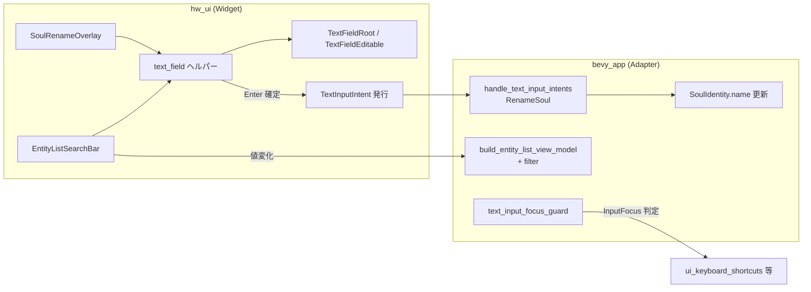

# テキスト入力 UI — EditableText + clipboard 実装計画

## メタ情報

| 項目 | 値 |
| --- | --- |
| 計画ID | `text-input-ui-plan-2026-07-05` |
| ステータス | `Completed / Archived` |
| 作成日 | `2026-07-05` |
| 最終更新日 | `2026-07-12` |
| 作成者 | Claude (調査ベース) |
| 関連提案 | N/A |
| 関連Issue/PR | 方針の根拠: `crates/hw_ui/_rules.md`「テキスト入力・スクロール UI の方針」 |

## アーカイブ結果

- M1〜M4 を実装し、恒久仕様は `docs/entity_list_ui.md` / `docs/info_panel_ui.md` / `docs/cargo_workspace.md` / `crates/hw_ui/_rules.md` に移管済み。
- `system_clipboard` は workspace `bevy` feature として追加済み。
- 検証ログは会話・PR 側で扱い、この計画書は設計履歴として `docs/plans/archive/` に保持する。

## 1. 目的

- **解決したい課題**: テキスト入力 UI が未実装のため、Soul を個体識別できるのはランダム生成された初期名のみ。エンティティリストが増えると目的の Soul を探せない
- **到達したい状態**: Soul のリネームとエンティティリストのインクリメンタル検索が使える。テキスト入力基盤は Bevy 0.19 標準（`EditableText`）で、自前キー処理は書かない
- **成功指標**: 日本語（IME）でリネーム・検索ができる。リネーム後にエンティティリスト・Info Panel・ツールチップ/ドラッグゴースト・セーブ/ロード後の表示が追従する。`cargo check --workspace` / `cargo clippy --workspace`（警告 0）成功

## 2. スコープ

### 対象（In Scope）

| ID | 内容 | 依存 |
| --- | --- | --- |
| **M1** | `EditableText` 入力フィールドの再利用可能ヘルパー + フォーカス/IME/確定/キャンセル + ゲームショートカットガード | — |
| **M2** | Info Panel から Soul リネーム（`SoulIdentity.name` 更新） | M1 |
| **M3** | エンティティリスト上部の検索バー（名前部分一致フィルタ） | M1 |
| **M4** | `system_clipboard` feature 追加と OS クリップボード連携の動作確認 | M1 |

M2 と M3 は相互独立（並行実装可）。

### 非対象（Out of Scope）

- タスクリスト・チャット等への横展開（基盤確立後に個別対応）
- あいまい検索・タグ検索・正規表現（まずは `str::contains` の部分一致のみ）
- Familiar リネーム（`Familiar.name` は別フィールド。Soul でパターン確立後に判断）
- `EditableText` 未実装機能（プレースホルダー、undo/redo、バリデーション UI 等 — Bevy 0.19 時点で未提供）
- セーブデータ形式の変更（`SoulIdentity` は既に Reflect + セーブ対象）

## 3. 現状調査（2026-07-08 時点）

### 3.1 名前の保持場所（確定）

Soul の表示名は Bevy の `Name` コンポーネントではなく、ゲーム固有コンポーネント **`SoulIdentity`** が保持する。

```rust
// crates/bevy_app/src/entities/damned_soul/mod.rs
#[derive(Component, Debug, Clone, Reflect)]
pub struct SoulIdentity {
    pub name: String,
    pub gender: Gender,
}
```

- スポーン時: `SoulIdentity::random()` で英語名をランダム生成
- エンティティリスト VM: `build_soul_view_model()` が `identity.name.clone()` を使用（`crates/bevy_app/src/interface/ui/list/view_model.rs`）
- Info Panel: `EntityInspectionViewModel` 経由でヘッダー `UiSlot::Header` に表示（`crates/hw_ui/src/panels/info_panel/update.rs`）
- 変更検知: `Changed<SoulIdentity>` は既に `detect_entity_list_changes` の value dirty トリガに含まれる（`change_detection.rs:28`）。M3 で検索が有効な場合、名前変更はフィルタ結果の行増減を起こすため `mark_structure()` 対象に拡張する
- セーブ: `register.rs` / `saving.rs` で `SoulIdentity` 登録済み。リネームは追加の永続化対応不要
- Bevy `Name` や proxy 用 `Name` は spawn 時のデバッグラベル。既存スピーチバブルは名前ベースではないため、表示追従の成功条件には含めない。デバッグ ECS 名も追従させるなら明示的な同期システムを別途追加する

### 3.2 テキスト入力基盤（Bevy 0.19）

| 項目 | 状態 |
| --- | --- |
| `EditableTextInputPlugin` | `DefaultPlugins` → `UiWidgetsPlugins` 経由で **登録済み**。個別 `add_plugins` 不要 |
| `system_clipboard` feature | **未有効**（`Cargo.toml` workspace の bevy features に未記載） |
| プロジェクト内 `EditableText` 使用 | **ゼロ**（grep 結果なし） |
| 参考 UI パターン | `settings_panel.rs`（headless widget + imperative spawn）、`entity_list.rs`（`ScrollArea`） |

### 3.3 入力ガードの現状ギャップ

現状の UI 入力ブロックは **ポインタ位置ベースのみ**:

| 仕組み | 場所 | 効く入力 | 効かない入力 |
| --- | --- | --- | --- |
| `UiInputState.pointer_over_ui` | `update_ui_input_state_system` | マウスクリック（ワールド選択） | キーボード |
| `pan_camera_ui_guard_system` | `plugins/input.rs` | WASD パン（UI 上のみ） | UI 外にカーソルがあるときの WASD |
| `ui_keyboard_shortcuts_system` | `interaction/systems.rs` | — | B/Z/Space/1-4/Escape が **無条件** で処理される |

**テキスト入力フォーカス中**（`InputFocus` が `EditableText` エンティティを指している間）は、上記とは別にキーボードショートカットを抑止するガードが必要。`EditableText` はフォーカス時に `FocusedInput<KeyboardInput>` を consume するが、**本プロジェクトのカスタムショートカットシステムは `ButtonInput<KeyCode>` を直接読む**ため、Bevy 標準の consume だけでは防げない。

`ButtonInput<KeyCode>` を直接読む主な衝突候補:

| システム | ファイル | 主なキー |
| --- | --- | --- |
| `ui_keyboard_shortcuts_system` | `interface/ui/interaction/systems.rs` | B/Z/Space/1-4/Escape |
| `entity_list_tab_focus_system` | `interface/ui/list/interaction/navigation.rs` | Tab |
| `familiar_command_input_system` | `systems/command/input.rs` | 1-4, B/C/M/H, 0/Delete/Escape |
| `task_area_edit_history_shortcuts_system` | `systems/command/area_selection/shortcuts.rs` | Ctrl+C/V/Z/Y, hotkey slots |
| `elevation_view_input_system` | `systems/visual/elevation_view.rs` | V |
| debug/render/save 系 | `plugins/input.rs`, `systems/save/state.rs`, `plugins/interface_debug.rs` | F3-F8, 保存/表示系キー |

### 3.4 エンティティリスト同期アーキテクチャ（検索統合ポイント）

```
detect_entity_list_changes → EntityListDirty (structure / value)
    → build_entity_list_view_model_system → EntityListViewModel
        → sync_entity_list_from_view_model_system (structure のみ)
        → sync_entity_list_value_rows_system (value のみ)
```

検索は **VM 構築時にフィルタ**するのが最も自然。検索文字列の変化は行の表示/非表示（structure）に相当するため `mark_structure()` を呼ぶ。

## 4. 設計

### 4.1 全体アーキテクチャ



**crate 境界**: `hw_ui` は `SoulIdentity` / `DamnedSoul` をクエリしない。既存 `UiIntent` は `Copy` かつ `MenuAction` としてボタンに保持されているため、`String` を含むリネームには使わない。リネーム確定は non-`Copy` の `TextInputIntent::RenameSoul` → `bevy_app` handler。

### 4.2 `text_field` ヘルパー（M1 核心）

`settings_panel.rs` と同様、**BSN はマーカー用ルートのみ**、子は imperative spawn。

`EditableText` は `Default` 実装があるが BSN 制約（`Default + Clone`）やフォント指定の都合で、**子ツリーは `commands.spawn` で構築**する。

#### 新規ファイル

```
crates/hw_ui/src/widgets/
  mod.rs
  text_field.rs
```

#### 公開 API（案）

```rust
/// テキストフィールドの用途識別（observer フィルタ用）
#[derive(Component, Clone, Copy, Debug, PartialEq, Eq)]
pub enum TextFieldRole {
    /// エンティティリスト検索（ライブフィルタ、Enter で確定不要）
    EntityListSearch,
    /// Soul リネーム（Enter=確定、Escape=キャンセル）
    SoulRename { target: Entity },
    /// M1 PoC 用
    DevPoc,
}

/// テキストフィールド外枠/root
#[derive(Component, Clone, Copy, Debug, PartialEq, Eq)]
pub struct TextFieldRoot;

/// EditableText から枠線/root を更新するための逆参照
#[derive(Component, Clone, Copy, Debug, PartialEq, Eq)]
pub struct TextFieldEditable {
    pub root: Entity,
}

/// スポーン済みテキストフィールドのハンドル
pub struct TextFieldHandle {
    pub root: Entity,
    pub editable: Entity,
}

pub struct TextFieldConfig<'a> {
    pub initial_text: &'a str,
    pub role: TextFieldRole,
    pub placeholder_hint: Option<&'a str>, // 視覚ヒント用ラベル（Bevy 未対応のため自前）
    pub max_characters: Option<usize>,
}

pub fn spawn_text_field(
    parent: &mut ChildSpawnerCommands,
    game_assets: &dyn UiAssets,
    theme: &UiTheme,
    config: TextFieldConfig<'_>,
) -> TextFieldHandle;
```

#### UI ツリー構造

```
TextFieldRoot (Node: 枠線 + 背景 + padding)
└── EditableText (TextFont, TextColor, SelectAllOnFocus, max_characters, TextFieldRole, TextFieldEditable)
```

- `EditableText::new(initial_text)` で初期値設定
- `allow_newlines: false`（単一行）
- `max_characters`: リネーム 32、検索 64（案）
- `SelectAllOnFocus` を付与（リネーム時の全選択 UX）
- `TextFieldRole` はフォーカス対象である `EditableText` 側に付与する。root は `TextFieldRoot` marker のみ
- 枠線色: `theme.colors.border_default`、フォーカス時は `theme.colors.panel_accent_info_panel`（M1 で `FocusGained`/`FocusLost` observer が `TextFieldEditable.root` を更新）

#### 確定 / キャンセル / ライブ更新

`EditableText` には `ValueChange` イベントが **ない**（Slider/Checkbox とは異なる）。以下の自前システムで処理:

| 操作 | 処理 |
| --- | --- |
| **Enter**（`allow_newlines: false`） | `EditableText.value().to_string()` を読み、`TextFieldRole` に応じて `TextInputIntent` 発行 or リソース更新。`UiInputState.text_input_consumed_keyboard = true`。フォーカス解除は同フレームの shortcut guard が効いた後に行う |
| **Escape** | リネーム: オーバーレイを閉じて初期値に戻す。検索: クリア。`text_input_consumed_keyboard = true`。`InputFocus::clear()` しても同フレームは consumed latch で shortcuts 側を抑止 |
| **検索のライブ更新** | 推奨は `TextEditChange` を読むイベント駆動。難しければ `PostUpdate` で `EntityListSearch` ロールの `EditableText` をポーリング。値変化時に `EntityListSearchState` リソースを更新 + `EntityListDirty::mark_structure()` |

Enter/Escape 検出は `FocusedInput<KeyboardInput>` observer を `hw_ui` に追加（`EditableTextInputPlugin` と同パターン）。`TextFieldRole` でフィルタ。

```rust
// hw_ui: Enter 確定 observer（SoulRename のみ TextInputIntent 発行）
fn on_text_field_submit(
    input: On<FocusedInput<KeyboardInput>>,
    q_fields: Query<(&EditableText, &TextFieldRole, &TextFieldEditable)>,
    mut intents: MessageWriter<TextInputIntent>,
    mut ui_input_state: ResMut<UiInputState>,
    mut input_focus: ResMut<InputFocus>,
) {
    // logical_key == Enter && !is_composing()
    // TextFieldRole::SoulRename { target } => TextInputIntent::RenameSoul { entity: target, name }
    // ui_input_state.text_input_consumed_keyboard = true
}
```

### 4.3 入力フォーカスガード（M1）

#### 状態リソースと判定ヘルパー（`hw_ui` に配置）

```rust
#[derive(Resource, Default)]
pub struct UiInputState {
    pub pointer_over_ui: bool,
    pub text_input_focused: bool,
    pub text_input_consumed_keyboard: bool,
}

impl UiInputState {
    pub fn text_input_blocks_keybinds(&self) -> bool {
        self.text_input_focused || self.text_input_consumed_keyboard
    }
}

pub fn is_editable_text_focused(
    input_focus: &InputFocus,
    q_editable: &Query<(), With<EditableText>>,
) -> bool {
    input_focus
        .get()
        .is_some_and(|e| q_editable.get(e).is_ok())
}
```

`text_input_consumed_keyboard` はフレーム開始時（`FocusedInput<KeyboardInput>` observer より前）に `false` へ戻し、Enter/Escape observer が `true` にする。これにより Escape で `InputFocus::clear()` した同フレームでも、`Update` の `ButtonInput<KeyCode>` 系ショートカットが反応しない。

#### ガード対象システムと修正方針

| システム | ファイル | 修正 |
| --- | --- | --- |
| `ui_keyboard_shortcuts_system` | `bevy_app/.../interaction/systems.rs` | 先頭で `ui_input_state.text_input_blocks_keybinds()` → `return` |
| `entity_list_tab_focus_system` | `bevy_app/.../list/interaction/navigation.rs` | 同上（Tab 巡回と IME の競合回避） |
| `pan_camera_ui_guard_system` | `bevy_app/plugins/input.rs` | `pointer_over_ui \|\| text_input_blocks_keybinds()` で `pan_camera.enabled = false` |
| `familiar_command_input_system` | `bevy_app/src/systems/command/input.rs` | 先頭で同ガード |
| `task_area_edit_history_shortcuts_system` | `bevy_app/src/systems/command/area_selection/shortcuts.rs` | 先頭で同ガード（Ctrl+C/V/Z/Y をテキスト入力へ渡す） |
| `elevation_view_input_system` | `bevy_app/src/systems/visual/elevation_view.rs` | 先頭で同ガード |
| debug/render/save 系 | `plugins/input.rs`, `systems/save/state.rs`, `plugins/interface_debug.rs` | F キー等も「テキスト入力中はゲーム keybind 無効」を満たすなら同ガード |

**推奨: 専用 `text_input_focus_sync_system` を 1 本追加**し、各 system は `InputFocus` を直接読まず `UiInputState` の latch を参照する。

### 4.4 M2: Soul リネーム

#### UX フロー

1. Info Panel で Soul 選択中、ヘッダー行（`UiSlot::Header` 横）に **✎ 編集ボタン**を表示（Familiar / Building 等では非表示）
2. クリック → パネル上部に **インライン編集行**（M1 `text_field`）を `display: flex` で表示。初期値 = 現在の `SoulIdentity.name`
3. **Enter** → `TextInputIntent::RenameSoul { entity, name }` 発行 → 編集 UI を閉じる
4. **Escape** → 編集 UI を閉じる（名前は変更しない）
5. 編集ボタン再クリックでも同様

#### 新規型

```rust
// hw_ui/src/text_input_intents.rs（または intents.rs 内の別 enum）
#[derive(Message, Clone, Debug)]
pub enum TextInputIntent {
    RenameSoul { entity: Entity, name: String },
}

// hw_ui/src/components.rs
#[derive(Resource, Default)]
pub struct SoulRenameState {
    pub active: Option<SoulRenameActive>,
}
pub struct SoulRenameActive {
    pub target: Entity,
    pub field_root: Entity,
}
```

`TextInputIntent` は `String` を保持するため non-`Copy`。既存 `UiIntent` / `MenuAction` は `Copy` のまま維持する。`foundation` か UI plugin で `app.add_message::<TextInputIntent>()` を登録する。

#### bevy_app 側 handler

```rust
// crates/bevy_app/src/interface/ui/interaction/handlers/soul_rename.rs（新規）
pub fn handle_text_input_intents_system(
    mut intents: MessageReader<TextInputIntent>,
    mut q_identity: Query<&mut SoulIdentity>,
) {
    for intent in intents.read() {
        let TextInputIntent::RenameSoul { entity, name } = intent;
        let trimmed = name.trim();
        if trimmed.is_empty() || trimmed.chars().count() > 32 {
            continue; // 拒否（UI にエラー表示は M2 スコープ外、単に無視）
        }
        if let Ok(mut identity) = q_identity.get_mut(*entity) {
            identity.name = trimmed.to_string();
        }
    }
}
```

UI interaction plugin に `handle_text_input_intents_system` を追加。`SoulIdentity` 変更は `Changed<SoulIdentity>` 検知でリスト・Info Panel が追従する。M3 の検索有効時のみ structure dirty も必要（§4.5）。

#### Info Panel の対象 entity

現状の `EntityInspectionViewModel` は表示値中心で、`info_panel_system` は `SelectedEntity` を受け取っていても表示対象として使っていない。リネーム対象の取り違えを避けるため、`update_entity_inspection_view_model_system` が検査対象 entity を `EntityInspectionModel` / `InfoPanelViewModel` に保持し、`hw_ui` は Soul 表示中のみ `model.entity` を `TextFieldRole::SoulRename { target }` に渡す。

#### Info Panel 変更箇所

| ファイル | 変更 |
| --- | --- |
| `hw_ui/src/panels/info_panel/layout.rs` | ヘッダー行に `SoulRenameButton` + `SoulRenameFieldContainer`（初期 `display: none`）を追加 |
| `hw_ui/src/panels/info_panel/update.rs` | Soul 表示時のみ編集ボタン表示。リネーム中はヘッダー `Text` を隠す。`model.entity` を rename target に使う |
| `hw_ui/src/components.rs` | `SoulRenameButton`, `SoulRenameFieldContainer` marker |
| `hw_ui/src/interaction/` | 編集ボタンクリック → `SoulRenameState` 更新 + text_field spawn |
| `bevy_app` の Info Panel VM 更新箇所 | `EntityInspectionModel` / `InfoPanelViewModel` に対象 `Entity` を追加 |

### 4.5 M3: エンティティリスト検索

#### UI 配置

`entity_list.rs` の **タブバー行と `EntityListBody` の間**に検索バー行を追加:

```
EntityListPanel
├── HeaderRow (タブ + 最小化)
├── EntityListSearchRow  ← 新規（M3）
│   └── text_field (TextFieldRole::EntityListSearch)
└── EntityListBody
    ├── FamiliarListContainer
    └── UnassignedSoulSection (ScrollArea)
```

#### 検索状態

```rust
// hw_ui/src/list/search.rs（新規）
#[derive(Resource, Default)]
pub struct EntityListSearchState {
    pub query: String,
    pub last_applied: String, // 変化検知用
}

impl EntityListSearchState {
    pub fn normalized(&self) -> &str {
        self.query.trim()
    }
}
```

#### フィルタロジック（bevy_app VM 構築時）

`build_entity_list_view_model_system` に `Res<EntityListSearchState>` を追加し、スナップショット構築後にフィルタ:

```rust
fn matches_search(name: &str, query: &str) -> bool {
    if query.is_empty() {
        return true;
    }
    // 将来: to_lowercase 等。まずはそのまま contains（日本語はケース不要）
    name.contains(query)
}

// FamiliarRowViewModel.souls と unassigned をフィルタ
// 使い魔行自体は残し、配下 Soul が 0 件になったら show_empty 相当で空表示
```

#### dirty 連携

`hw_ui` 側の `sync_entity_list_search_system`（新規）:

```
TextEditChange event（または PostUpdate polling）:
  EntityListSearch ロールの EditableText.value() を読む
  → EntityListSearchState.query と異なれば更新
  → EntityListDirty::mark_structure()
```

100ms タイマーは既存の change detection と独立して動く。検索はユーザー操作起点なので structure dirty が即座に走って問題ない。

`detect_entity_list_changes` も拡張する。`Changed<SoulIdentity>` は通常 value dirty で足りるが、`EntityListSearchState.normalized()` が空でない場合はリネームによって行が検索結果に入る/出るため `mark_structure()` を呼ぶ。単純化するなら M3 以降は `Changed<SoulIdentity>` を常に structure dirty にしてもよい（Soul 数が少ない現状では許容）。

#### ScrollArea 共存

検索バーは `ScrollArea` の外（ヘッダー固定）。未所属 Soul リストの `ScrollArea`（`UnassignedSoulContent`）は変更不要。フィルタで行数が減ればスクロール量も自然に減る。

### 4.6 M4: クリップボード

#### 調査結果（重要 — スコープ縮小）

`EditableTextInputPlugin`（`text_input.rs:94-107`）は **Ctrl+C/X/V を既に `TextEdit::Copy/Cut/Paste` にマッピング済み**。

不足しているのは **OS クリップボード feature のみ**:

```toml
# Cargo.toml (workspace.dependencies.bevy features)
"system_clipboard",
```

追加後、`apply_text_edits` が `Clipboard` リソース経由で OS と連携。Linux ネイティブでは `poll_and_apply_paste` が同期的に完了（`editing.rs:207-207` コメント参照）。

**M4 の実装作業は feature 追加 + 目視 QA のみ**。`text_field.rs` への Ctrl+C/V 自前実装は不要。

## 5. マイルストーン詳細

### M1: テキスト入力フィールド基盤

#### 手順

1. `crates/hw_ui/src/widgets/mod.rs` + `text_field.rs` 作成
2. `hw_ui/src/lib.rs` に `pub mod widgets;` 追加
3. `TextFieldRole` / `spawn_text_field()` 実装（枠 + `EditableText` + テーマ適用）
4. `hw_ui/src/interaction/text_field.rs` — Enter/Escape observer、フォーカス枠色
5. `hw_ui/src/plugins/foundation.rs` または新 `TextFieldPlugin` — observer 登録
6. `hw_ui/src/components.rs` — `UiInputState.text_input_focused` / `text_input_consumed_keyboard` + sync/reset system
7. `bevy_app` — ショートカットガード（§4.3 表）
8. **PoC 配置**: `bevy_app/src/interface/ui/dev_panel.rs` 末尾に `TextFieldRole::DevPoc` を 1 つ spawn（`spawn_dev_panel_system` 内）。M1 完了後に PoC は残してもよいが `DevPoc` ロールは feature gate 不要（開発パネル内のみ）

#### 変更ファイル一覧

| ファイル | 操作 |
| --- | --- |
| `crates/hw_ui/src/widgets/mod.rs` | 新規 |
| `crates/hw_ui/src/widgets/text_field.rs` | 新規 |
| `crates/hw_ui/src/interaction/text_field.rs` | 新規 |
| `crates/hw_ui/src/interaction/mod.rs` | export 追加 |
| `crates/hw_ui/src/lib.rs` | `mod widgets` |
| `crates/hw_ui/src/components.rs` | `UiInputState` 拡張 |
| `crates/hw_ui/src/plugins/foundation.rs` | sync system 登録 |
| `crates/bevy_app/src/interface/ui/dev_panel.rs` | PoC spawn |
| `crates/bevy_app/src/interface/ui/interaction/systems.rs` | ガード |
| `crates/bevy_app/src/interface/ui/list/interaction/navigation.rs` | ガード |
| `crates/bevy_app/src/plugins/input.rs` | PanCamera ガード |
| `crates/bevy_app/src/systems/command/input.rs` | familiar command ガード |
| `crates/bevy_app/src/systems/command/area_selection/shortcuts.rs` | task area shortcut ガード |
| `crates/bevy_app/src/systems/visual/elevation_view.rs` | elevation shortcut ガード |
| debug/render/save keybind 系ファイル | 必要に応じて同ガード |
| `crates/hw_ui/_rules.md` | text_field パターン追記 |

#### 完了条件

- [ ] Dev Panel の PoC フィールドで ASCII 入力・編集・Backspace が動く
- [ ] 日本語 IME で変換確定が動く（**ユーザー目視 QA 必須**）
- [ ] 入力フォーカス中、WASD パン・B/C/M/H/V・Space・1-4・Ctrl+C/V/Z/Y・Tab リスト巡回がゲーム側で発火しない
- [ ] Escape でフォーカス解除し、同じ Escape がゲーム側 Escape 処理に伝播しない
- [ ] `cargo check --workspace` 成功

---

### M2: Soul リネーム

#### 手順

1. `TextInputIntent::RenameSoul` 追加（`UiIntent` / `MenuAction` は `Copy` のまま）
2. `TextInputIntent` を UI plugin に `add_message` 登録
3. Info Panel VM に対象 `Entity` を保持し、レイアウトに編集 UI 追加（§4.4）
4. `bevy_app/.../handlers/soul_rename.rs` 作成 + `handle_text_input_intents_system` 配線
5. `docs/info_panel_ui.md` 更新

#### 完了条件

- [ ] Soul 選択 → 編集ボタン → 日本語名に変更 → Enter で確定
- [ ] エンティティリストの Soul 行名が更新される
- [ ] Info Panel ヘッダーが更新される
- [ ] 空文字・32 文字超は拒否される
- [ ] セーブ → ロード後も名前が保持される

---

### M3: エンティティリスト検索

#### 手順

1. `EntityListSearchState` + `sync_entity_list_search_system`（`hw_ui/src/list/search.rs`）
2. `entity_list.rs` に検索バー行 spawn
3. `view_model.rs` にフィルタロジック追加
4. `change_detection.rs` で検索中の `Changed<SoulIdentity>` を structure dirty にする
5. `entity_list.rs`（plugin 登録）に search sync system 追加
6. `docs/entity_list_ui.md` 更新

#### 完了条件

- [ ] 日本語部分一致で絞り込みできる
- [ ] 検索クリアで全件復帰
- [ ] 使い魔配下 Soul もフィルタ対象
- [ ] 検索中に Soul をリネームすると検索結果へ即時に入る/消える
- [ ] 未所属セクションの `ScrollArea` と共存（スクロール・ホイール正常）
- [ ] Soul 50 体程度で入力毎のフィルタに体感ヒッチなし

---

### M4: クリップボード

#### 手順

1. `Cargo.toml` workspace bevy features に `"system_clipboard"` 追加
2. `docs/cargo_workspace.md` に Bevy feature 追加理由を反映
3. PoC フィールドで外部エディタとのコピペを目視確認
4. リネームフィールドでも確認

#### 完了条件

- [ ] 外部アプリ → ゲームへのペースト
- [ ] ゲーム内テキスト → 外部へのコピー
- [ ] `docs/cargo_workspace.md` 更新
- [ ] `cargo clippy --workspace` 警告 0

## 6. リスクと対策

| リスク | 影響 | 対策 |
| --- | --- | --- |
| IME が Linux で不安定 | M1 ブロック | ASCII で全機能を先に成立。IME は QA 項目として分離。問題時は `bevy_ui_widgets` issue を確認 |
| カーソルがテーマと不整合 | UX | `EditableText` は headless。枠 Node + `TextColor`/`TextFont` で `UiTheme` を適用。カーソル色は Bevy デフォルト |
| 検索の毎キー入力で structure 全再構築 | パフォーマンス | 現状の Soul 数（数十）では `sync_entity_list_from_view_model_system` の差分同期で十分。100 体超で問題化したらデバウンス（100ms）を検討 |
| Escape の二重処理（リネーム vs ショートカット） | 誤動作 | `text_input_consumed_keyboard` latch を同フレーム中維持し、`InputFocus::clear()` 後も `ButtonInput<KeyCode>` 系 shortcuts をスキップ |
| `UiIntent` に `String` を入れて `Copy` 前提を壊す | コンパイル不可 / 既存ボタン破壊 | `UiIntent` / `MenuAction` は `Copy` 維持。リネームは non-`Copy` の `TextInputIntent` で送る |
| `EditableText` に placeholder 未実装 | UX | 検索バーは隣に `"Search..."` ラベルを固定表示。空時のみ表示する自前ラベルは M1 では省略可 |
| BSN で `EditableText` を直接使えない | 実装方針 | `settings_panel.rs` 準拠: マーカーは BSN 可、widget 本体は imperative spawn |

## 7. 検証計画

### 自動

```bash
CARGO_HOME=/home/satotakumi/.cargo CARGO_TARGET_DIR=target cargo check --workspace
CARGO_HOME=/home/satotakumi/.cargo CARGO_TARGET_DIR=target cargo clippy --workspace -- -D warnings
```

### 手動 QA シナリオ（ユーザー実施）

| # | 操作 | 期待結果 |
| --- | --- | --- |
| 1 | Dev Panel PoC に `hello` 入力 | 表示される |
| 2 | PoC で IME「てすと」変換確定 | 表示される |
| 3 | 入力中に WASD / B / C / M / H / V / Space / 1-4 | ゲームが反応しない |
| 4 | Soul を「業火太郎」にリネーム | リスト・Info Panel に反映 |
| 5 | 検索に「業火」 | 該当 Soul のみ表示 |
| 6 | 検索中に該当しない Soul を「業火次郎」にリネーム | 検索結果へ即時に追加される |
| 7 | 検索中に該当 Soul を別名へリネーム | 検索結果から即時に消える |
| 8 | 検索クリア | 全件表示 |
| 9 | 入力中に Ctrl+C / Ctrl+V / Ctrl+Z / Ctrl+Y | ゲーム側 shortcut ではなく text field 側で処理される |
| 10 | 入力中に Escape | フォーカス解除/キャンセルのみ。ゲーム側 Escape 処理は発火しない |
| 11 | 名前をコピー → 別アプリにペースト | クリップボード連携 |
| 12 | セーブ → ロード | リネーム保持 |

## 8. ロールバック方針

- **単位**: マイルストーン単位で revert 可能
- **依存**: M2/M3/M4 は M1 に依存。M2 と M3 は独立
- **feature flag**: `system_clipboard` は M4 コミットまで追加しない

## 9. AI 引継ぎメモ

### 現在地

- 進捗: **100%**（M1〜M4 実装・仕様移管済み）
- アーカイブ先: `docs/plans/archive/text-input-ui-plan-2026-07-05.md`

### 次の AI が最初にやること

1. 追加のテキスト入力 UI を作る場合は、`crates/hw_ui/_rules.md` の text field チェックリストに従う。
2. 実装済み挙動は `docs/entity_list_ui.md` / `docs/info_panel_ui.md` を正本として確認する。
3. 新しいテキスト確定イベントが `String` を含む場合は、`UiIntent` ではなく non-`Copy` の `TextInputIntent` 系へ追加する。

### 確定事項（再調査不要）

- Soul 名 = `SoulIdentity.name`（`crates/bevy_app/src/entities/damned_soul/mod.rs`）
- `EditableText` に `ValueChange` はない。Enter/Escape は自前 observer
- `UiIntent` / `MenuAction` は `Copy` 前提。`String` を含むリネームは `TextInputIntent` で扱う
- `TextFieldRole` は root ではなく、フォーカス対象の `EditableText` エンティティに付与する
- 検索中の `Changed<SoulIdentity>` は structure dirty が必要
- コピペのキーバインドは `EditableTextInputPlugin` 内蔵。M4 = feature 追加のみ
- `EditableTextInputPlugin` は既に登録済み

### ブロッカー / 注意

- hw_ui で `DamnedSoul` / `SoulIdentity` をクエリしない
- IME・クリップボードの実挙動はサンドボックスで検証不可 → ユーザー QA 必須
- `docs/plans/` は gitignore 対象（作業用ドキュメント）

### 参照必須ファイル

| ファイル | 用途 |
| --- | --- |
| `crates/hw_ui/_rules.md` | テキスト入力方針 |
| `crates/hw_ui/src/setup/settings_panel.rs` | headless widget + imperative spawn パターン |
| `crates/hw_ui/src/setup/entity_list.rs` | ScrollArea 参考 |
| `crates/bevy_app/src/entities/damned_soul/mod.rs` | `SoulIdentity` |
| `crates/bevy_app/src/interface/ui/list/view_model.rs` | VM 構築 |
| `crates/bevy_app/src/interface/ui/list/change_detection.rs` | dirty トリガ |
| `crates/bevy_app/src/interface/ui/interaction/systems.rs` | ショートカット |
| `~/.cargo/registry/src/.../bevy_ui_widgets-0.19.0/src/text_input.rs` | 入力処理 |
| `~/.cargo/registry/src/.../bevy_text-0.19.0/src/editing.rs` | `EditableText` API |
| `docs/info_panel_ui.md` / `docs/entity_list_ui.md` | 仕様更新先 |

### Definition of Done

- [x] M1〜M4 完了
- [x] `cargo check --workspace` / `cargo clippy --workspace -- -D warnings`
- [x] `docs/info_panel_ui.md` / `docs/entity_list_ui.md` / `docs/cargo_workspace.md` 更新
- [x] `crates/hw_ui/_rules.md` に text_field パターン追記
- [x] 本計画をアーカイブ（または `docs/` へ要点移管）

## 10. 更新履歴

| 日付 | 変更者 | 内容 |
| --- | --- | --- |
| `2026-07-05` | Claude | 初版作成（EditableText / bevy_clipboard の registry ソース検証） |
| `2026-07-08` | Cursor | コードベース精査に基づくブラッシュアップ: `SoulIdentity` 特定、API 訂正（`ValueChange` 非対応）、入力ガード具体化、ファイル/型/API 設計、M4 スコープ縮小 |
| `2026-07-08` | Codex | レビュー指摘反映: `UiIntent` Copy 制約、TextFieldRole 配置、Escape latch、ButtonInput guard 網羅、検索中 dirty、Info Panel target entity、workspace 検証を修正 |
| `2026-07-12` | Codex | M1〜M4 実装完了に合わせて archive へ移動。恒久仕様は各 UI 仕様書と crate 境界ドキュメントへ移管 |
