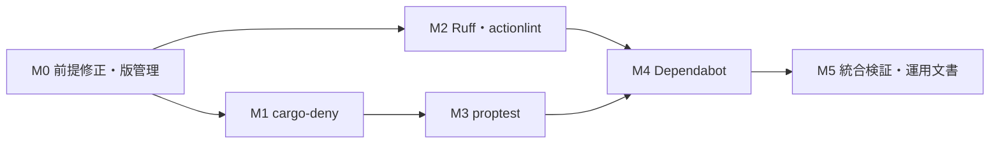

# 優先開発ツール5項目の導入計画

## メタ情報

| 項目 | 値 |
| --- | --- |
| 計画ID | `priority-development-tools-plan-2026-09-13` |
| ステータス | In Progress |
| 作成日 / 最終更新日 | 2026-09-13 |
| 作成者 | Codex |
| 関連提案 | [ライブラリ・開発ツールの導入／置換評価](../proposals/library-tooling-evaluation-proposal-2026-09-13.md) |
| 関連Issue/PR | N/A |
| 調査基準 | primary `master`、`eec38b3e6371f847da8c2a5dac7848ea6fc3b3e6`と前回作成の未commit評価書・索引 |
| 現在地 | 5項目のローカル実装・全体verify完了。GitHub受入待ちのため計画を継続 |
| 自己レビュー | 2026-09-13、6件の不足を計画へ反映。実装時の実tool負例確認を追記。Rust統合検証とGitHub受入を分離 |

## 1. 目的

- 解決したい課題: 依存監査・更新PR・Python/CI静的検査・生成入力による不変条件テストが定常gateに接続されていない。
- 到達したい状態: cargo-deny、Dependabot、Ruff、actionlint、proptestを、既存の`dev.py`とCIへ段階導入する。
- 成功指標: ローカルとCIで同じ版・同じ検査対象を使い、意図した負例を検出できる。日常の`check`とreview cacheを保ち、全体`verify`が成功する。

## 2. スコープ

### 対象

今回の「最優先・優先」は、直前の回答の表でそのラベルを付けた5項目を指す。
評価書のP1すべてを一括導入する計画ではない。

| 評価書ID | 導入対象 | 本計画の到達点 |
| --- | --- | --- |
| D01 | cargo-deny | normal/build/dev・optional依存を含む監査を`dev.py deps`と`verify`へ統合 |
| D03 | Dependabot | CargoとGitHub Actionsの更新PR、少数group、週次、自動mergeなし |
| D05 | Ruff | root所有`scripts/`へ限定ルールを適用 |
| D06 | actionlint | `.github/workflows/`の構文・式・型検査 |
| T01 | proptest | `hw_world`と`hw_infra`に合計3 propertyを追加し、失敗入力を再現可能にする |

前提整備として、既存の実行属性違反、3 CLIのversion検証、CIの固定版供給、監査対象のCargo metadataも扱う。

### 非対象

- cargo-machete、Gitleaks、bacon設定、保存先・atomic I/O・PRNG、画像最適化・backup・profilerなど、評価書にある他のP1。
- nextest、llvm-cov、sccache、uv、別task runner、新しいインストール管理framework。
- Bevy/Rust/runtime依存の一括更新、ゲーム仕様・save・入力・rendererの変更。
- Python全体のformat、Blender vendor・同梱PythonへのRuff拡張、ECS状態機械テストの全面追加。

## 3. 現状とギャップ

| 現状 | 導入時に埋める点 |
| --- | --- |
| `dev.py verify`はPythonテスト、独自契約、Rust compile/test/Clippyを集約 | 外部toolのversion確認・監査・静的検査を同じ入口へ追加 |
| `dev.py doctor`はcargo-denyを任意toolとしてPATH確認するだけ | full verify用の必要version・実行path・不足時の導入手順を表示 |
| Rust 1.96.1、Bevy 0.19.0、mold、Cargo cache・lane・activity・storage guardは既存 | これらを維持し、tool供給を理由に通常buildの設定を変更しない |
| 前回verifyは`scripts/validation_storage.py`のGit mode 100644で停止 | shebang規約の100755へmodeだけを限定修正する。規約を緩めない |
| 13 workspace cratesに`license` / `publish`指定がない | 自前コードのライセンスを勝手に付与せず、ゲーム内部crateの非公開metadataを明示 |
| Cargo外部subcommandは`CARGO_HOME/bin`とPATHの影響を受ける | versionを検証したbinaryと実行binaryを同じ正規化環境で一致させる |
| `.gitignore`は`*.txt`を除外 | proptestの失敗seedファイル2箇所だけを追跡可能にする |
| 経路探索・照明にpure入口と通常テストがある | 検索履歴・光源順・再適用という性質を生成入力で検証 |

`nextest`等の未知compile subcommandにあるguard不足は前回確認済みだが、今回それらは導入しない。
cargo-denyのmetadata監査と、cargo-deny本体のsource build/installは別操作として扱う。

## 4. 実装方針

### 4.1 固定版と導入経路

| 対象 | 初期採用候補 | versionの正本・供給 |
| --- | --- | --- |
| cargo-deny | [0.20.2](https://github.com/EmbarkStudios/cargo-deny/releases/tag/0.20.2) | 新設`scripts/dev-tools.toml`。CIは公式固定release＋checksum検証、ローカルsource installは既存Cargo guard経由 |
| Ruff | [0.16.7](https://github.com/astral-sh/ruff/releases/tag/0.16.7) | 同manifest。固定wheel/公式binaryを利用し、pipを使う場合は隔離venv。system Pythonへ強制installしない |
| actionlint | [1.7.12](https://github.com/rhysd/actionlint/releases/tag/v1.7.12) | 同manifest。公式固定release＋checksum検証 |
| proptest | [1.11.0](https://docs.rs/proptest/1.11.0/proptest/) | root workspace dependencyで版を管理し、2 crateのdev-dependencyから参照。解決結果はCargo.lockで固定 |
| Dependabot | GitHub管理 | CLIは追加せず`.github/dependabot.yml`を正本にする |

実装では表のversionを採用した。3 CLIは公式GitHub release assetのdigestを照合して導入し、
version/pathと実CLIの正常・拒否経路を確認した。URL/SHA-256の正本は`scripts/dev-tools.toml`。
既存Actionの固定commit SHAを維持し、新しい第三者Actionは追加していない。

小さい`scripts/dev_tools.py`に3 CLIのmanifest読込、version検査、実行を集約する。
doctor/verifyは自動install・自動upgradeをしない。tool不足を解消する手順を表示する。
CIと手動導入手順はmanifestの版を読み、独立したversion literalの増殖を避ける。
Ruff側の`required-version`との一致も検査する。

### 4.2 入口と失敗時の扱い

以下の入口を実装した。

| 入口 | 方針 |
| --- | --- |
| `python3 scripts/dev.py doctor` | ネットワーク・installなし。既存build環境と追加toolのpath/versionを診断。追加tool不足をfull verify readinessとして区別 |
| `python3 scripts/dev.py check` | 現在の高速gateを維持。追加CLIがないだけで通常compileを止めない |
| `python3 scripts/dev.py lint` | Ruffとactionlintを順に実行。どちらか失敗すればnon-zero |
| `python3 scripts/dev.py deps` | 同じ正規化Cargo環境・root manifestで`cargo deny --workspace --locked check`相当を実行。全featureの選択はM1のgraph設定で固定。onlineのDB更新失敗は失敗として報告 |
| `python3 scripts/dev.py deps --offline` | 明示したcached DB診断。DB欠損・鮮度不適合は失敗。online監査合格の代用にしない |
| `python3 scripts/dev.py verify` | tool preflight → 追加lint/deps → 既存全gate。既存Python・Help・storage・Rust各feature・Clippy・testを維持 |

toolの検査時と実行時に同じ環境・同じbinaryを使う。
特にCargoは外部subcommandを`CARGO_HOME/bin`から優先探索するため、PATHの`cargo-deny`だけを確認した後で
CARGO_HOMEを変更して実行しない。[Cargoの探索規則](https://doc.rust-lang.org/cargo/reference/external-tools.html#custom-subcommands)

doctorの診断では`cargo_environment(..., create_temp_dir=False)`相当で環境だけを正規化し、
version probeに`RUSTUP_AUTO_INSTALL=0`を明示する。既存doctorの`rustc -vV`も対象とする。
Rustup proxy経由の実行は、toolchain欠損時に暗黙installを起こし得るためである。
未導入・不一致は診断結果にし、rustupのglobal設定を変更しない。
CIのtoolchain供給は診断前の明示手順へ分け、`rust-toolchain.toml`のchannel/componentsを使う。
[Rustupの環境変数](https://rust-lang.github.io/rustup/environment-variables.html)

検査はsourceを自動修正しない。Ruffはcacheなし、actionlintは出力生成なしで始める。
監査DB・registryは正規化したCargo homeの既存cache寿命で管理する。
CLIの版ごとのinstall先は手動導入時にownerと共に把握し、検証jobごとの複製は作らない。
native/perf実行中の無制限なtool並列実行は加えない。

### 4.3 実装順



実装作業は主agentが行う。M1/M2の調査・レビューは並行できるが、共有driver/CIへの編集は逐次実施する。
Dependabotは優先対象だが、更新PRを受け止める検査を整えてから有効化する。

## 5. マイルストーン

### M0: 既存gate復旧とCLI版管理

変更内容:

- 開始時のdiff・並行作業を確認し、`validation_storage.py`の実行属性だけを100755へ修正する。内容を巻き込んでstageしない。gateはGit indexのmodeを見るため、filesystemのchmodだけで直ったとは判定しない。
- `dev-tools.toml` / `dev_tools.py`を追加し、doctorから使用する。未使用の将来用commandや汎用installerは作らない。
- CLIの固定版供給手順をCIとローカルで用意する。sourceからcargo-denyをinstallする場合は`dev.py cargo -- install cargo-deny --version 0.20.2 --locked`を使う。
- doctorの既存Rust probeと追加CLI probeに4.2のread-only環境を適用する。CIは診断に先立って固定Rust toolchainを明示供給する。
- missing/wrong versionを明確に報告する。想定外OSを無言skipしてfull verify成功にはしない。

変更ファイル: `scripts/validation_storage.py`（mode）、`scripts/dev-tools.toml`、`scripts/dev_tools.py`、
`scripts/dev.py`、`scripts/tests/test_dev.py`、`scripts/tests/test_dev_tools.py`、`.github/workflows/ci.yml`、
`docs/DEVELOPMENT.md`、`scripts/README.md`。

完了条件:

- [x] 既存hygiene違反を解消し、追加gate導入前の`verify`を一度通した。
- [x] 3 CLIのversion/pathを表示し、検証したbinaryと実行binaryが一致する。
- [x] doctorは未導入環境でもinstall/networkを開始しない。
- [x] toolchain欠損・追加CLI欠損のfixtureで暗黙installを開始せず、診断のためのtemp directoryも作成しない。CIの明示供給とは分けて検証する。
- [x] PATHとCARGO_HOMEに異なるcargo-denyを置くfixtureで、別binaryの取り違えを拒否できる。
- [x] version manifestとCIの不一致を検出する。Ruff要求版との照合はfixtureで検査し、実`ruff.toml`との統合はM2で確認する。

検証: driver/tool helperのunittest、`check_repo_hygiene.py`、`dev.py doctor`、既存`dev.py verify`。
RA応答不備が続く場合は未確認と記録し、compile/Clippyの代替確認を残す。M0をMCP改修全体へ拡大しない。

### M1: cargo-denyの監査対象とgate

変更内容:

- `deny.toml`と`dev.py deps [--offline]`を追加。normal/build/devとprofiling/renderdoc等のoptional依存を監査graphに含める。
  `[graph] all-features = true`、`no-default-features = false`、`targets = []`を明示する。
  driverはroot manifestと`--workspace`を固定し、`--exclude` / `--exclude-dev`は使用しない。
  target固有依存も含むmetadata上の監査であり、全feature同時buildや全OS buildの受入を追加するものではない。
  [0.20.2 graph設定](https://github.com/EmbarkStudios/cargo-deny/blob/0.20.2/deny.template.toml)
- 13 memberはゲーム内部crateとして`publish = false`を明示し、`licenses.private.ignore = true`で自前コードのlicense判定だけを除外する。
  公開用途が確認されたmemberはこの処理から外し、実際のlicense metadataを別途解決する。
- **`exclude-unpublished`は使わない。** 外部依存までgraphから消さず、除外されたIDが意図した内部memberだけであることを確認する。
- **`licenses.include-dev = true`、`include-build = true`を明示**し、後で加えるproptestの依存も対象にする。
  cargo-deny 0.20.2のlicense検査はdev-dependencyが既定で対象外である。[license設定](https://embarkstudios.github.io/cargo-deny/checks/licenses/cfg.html)

監査方針:

| 検査 | 初期方針 |
| --- | --- |
| advisories | 既知の脆弱性は失敗。`unsound = "all"`、`unmaintained = "all"`を明示し、推移依存まで検出する。未保守と脆弱性を別々に記録し、例外はexact ID/依存と根拠・解除条件を記載。`yanked = "warn"`を初期方針とし、警告を記録する |
| licenses | 初回graphのlicense式と出典を調べ、実際に採用可能なものだけallow。未許可・判定不能は失敗。自前ゲームへ架空のOSS licenseを追加しない |
| sources | `unknown-registry = "deny"`、`unknown-git = "deny"`、`required-git-spec = "rev"`を明示。許可registryはcrates.io、allow-gitは空から開始。追加取得元はexact URLと用途を確認し、gitならmanifestでrevを指定 |
| bans | 禁止依存は失敗。既存Bevy推移依存の複数versionはまずwarningとして把握し、全warningを一律errorへ昇格しない |
| DB | online更新失敗をoffline成功へ自動fallbackしない。offlineは使用DBの状態を示し、固定版の鮮度検査を維持。新しい保持台帳を作らない |

0.20.2の`unsound`既定値は`workspace`で、推移依存の該当通知を対象外にする。
また未知registry/gitの既定値はwarningである。graphへ含めることと各検査の判定範囲・失敗条件を分けて確認する。
[advisories設定実装](https://github.com/EmbarkStudios/cargo-deny/blob/0.20.2/src/advisories/cfg.rs)、
[対象選択実装](https://github.com/EmbarkStudios/cargo-deny/blob/0.20.2/src/advisories.rs)、
[sources設定実装](https://github.com/EmbarkStudios/cargo-deny/blob/0.20.2/src/sources/cfg.rs)

CLIは0.20.2のtag付き実装に合わせ、`--locked` / `--offline`を`check`の前に置く。
旧exampleの`check --disable-fetch`は使わない。[0.20.2 CLI](https://github.com/EmbarkStudios/cargo-deny/blob/0.20.2/src/cargo-deny/main.rs)

変更ファイル: `deny.toml`、`crates/*/Cargo.toml`（publish metadata）、`scripts/dev.py`、`scripts/dev_tools.py`、
`scripts/tests/test_dev.py`、`scripts/tests/test_dev_tools.py`、必要箇所だけ`test_cargo_runtime.py`、
`docs/DEVELOPMENT.md`、`docs/cargo_workspace.md`、`scripts/README.md`。

完了条件:

- [x] 全workspace由来の外部依存が残り、dev/build/optional依存の監査漏れがない。
- [x] 初回実graphの検出結果を分類し、未解決errorや理由のないignoreを残していない。
- [x] 一時policyの実tool拒否とdriverの終了code伝播、CIの失敗維持設定を確認した（GitHub実走はM4へ分離）。
- [x] 主graphを変更しない隔離fixtureで、未許可license・取得元と推移依存のunsound通知を実toolが拒否する。禁止依存だけの負例で各検査を検証済みにしない。
- [x] network失敗・offline DB欠損・版不一致の経路が成功にならない。
- [x] 通常検査でCargo.lock・source・frozen subjectを変更せず、registry/DBは既存永続領域に収まる。

検証: `dev.py deps`、明示offlineの成功/失敗条件、driver unittest、`dev.py check`、全体`verify`。
監査で大きいruntime依存更新が必要になった場合は、具体的な検出結果と別変更を計画し、検査自体を無効化しない。

### M2: Ruffとactionlint

変更内容:

- `ruff.toml`にPython 3.11、`required-version = "==0.16.7"`、初期ルール`E4/E7/E9/F`を設定する。
- `scripts/`を対象に`ruff check --no-cache --config ruff.toml scripts`相当をdriver内で実行する。
  初回違反は種類ごとに確認して修正する。意図したimport副作用等は局所理由を残し、全域ignore・一括format・自動`--fix`は使わない。
- actionlintは`.github/workflows/`全体へ適用する。初期は`-shellcheck= -pyflakes=`を明示し、PATHに任意toolがあるかどうかで検査範囲を変えない。
- `dev.py lint`を追加し、`verify`へ接続。CIのtool supplyはM0の固定版を使用する。

変更ファイル: `ruff.toml`、`scripts/dev.py`、`scripts/dev_tools.py`、違反のある`scripts/`内Pythonの限定箇所、
`scripts/tests/test_dev.py`、`scripts/tests/test_dev_tools.py`、`.github/workflows/ci.yml`、
`docs/DEVELOPMENT.md`、`scripts/README.md`。

完了条件:

- [x] 実`scripts/`の初期違反を解消し、Python 147件・Blender 151件・性能runner self-testがpassした。
- [x] 一時的な未定義名fixture、無効workflow式のfixtureをそれぞれ実toolが拒否する。
- [x] tool失敗・tool欠損をdriverがnon-zeroとして伝え、Rust buildより前に理由を示す。
- [x] Ruff cache等の新規生成物を残さず、vendorやruntime labelを一括編集していない。
- [x] ローカルとCIで同じ版・rule・actionlint連携範囲になる。

検証: `dev.py lint`、Python unittest、`dev.py verify`。
設定根拠: [Ruff設定](https://docs.astral.sh/ruff/configuration/)、[actionlint usage](https://github.com/rhysd/actionlint/blob/v1.7.12/docs/usage.md)。

### M3: proptestを2 crate・3 propertyへ限定導入

rootの`workspace.dependencies`にproptestを定義し、`hw_world` / `hw_infra`の`dev-dependencies`から使う。
初期は`default-features = false`、`features = ["std"]`を候補とし、fork/timeout用subprocessは導入しない。
Bevy/WFCとPRNG系列は維持する。初回監査の修正としてrandだけ0.8.5→0.8.6へパッチ更新した。
proptestのrand 0.9系はdev専用で、ゲームのrandを置き換えない。追加依存とlock差分はM1でも監査する。

| Property | 対象と生成入力 | 判定 |
| --- | --- | --- |
| P1: 検索履歴の非干渉＋経路合法性 | `hw_world::pathfinding::find_path` / `PathfindingContext`。2〜8×2〜8、障害物、door cost 0〜40、通行可能start/goal、RespectGoalWalkability | 同じscratchでA→B→Aを検索し、各検索の新規scratch結果と一致。成功時は始終点・範囲内・8近傍・通行可能・斜め両脇通行可能・ループなしも確認 |
| P2: 光源順の非依存 | `hw_infra::lighting::rebuild_field`。1〜8×1〜8、mask、遮蔽、0〜6光源、unique stable key、FreeStandingから開始 | 同一集合の並べ替えでinput checksum、cells、fieldの各checksum、diagnosticsが同じ |
| P3: 同じ照明入力の再適用 | P2のgeneratorを共有し、初回snapshotを前回結果として再構築 | cells/mask/checksum/revisionは保持し、changed radiance/mask/total countはすべて0。snapshot全体の等値は要求しない |

最初のpropertyは到達可能性や最短costの完全証明ではなく、scratch再利用と合法経路の回帰検査である。
アルゴリズムの複製を期待値として書かない。
既存pathfindingのTestWorldは全MAP範囲を通行可能にするため流用せず、生成width/heightの外へ出られないtest専用PathWorldを使う。
光源のradiusは0〜8、RGB/intensityは通常値に0/最大値を混ぜ、遮蔽・無効光源・飽和・mask混在を含める。

運用:

- 1 propertyあたり256 cases、縮小上限1024回から開始。入力寸法と個数を明示して処理量を制限する。
- generatorへ時刻や`thread_rng()`を混ぜない。導入時には異なる固定`PROPTEST_RNG_SEED` 2値でfocused smokeを確認する。
  環境変数はprocess起動前に指定し、並列Rust test内部から書き換えない。
- 標準の`SourceParallel("proptest-regressions")`で失敗seedを保存し、次の2ファイルだけ`.gitignore`の`*.txt`除外から外す。
  同じ狭い例外を`.cursorignore` / `.geminiignore`にも反映し、小さい回帰入力を診断ログと区別する。

```text
crates/hw_world/proptest-regressions/pathfinding/tests/properties.txt
crates/hw_infra/proptest-regressions/lighting/properties.txt
```

成功時に空corpusを作らない。実際の失敗seedは内容を確認して追跡し、縮小入力を通常`#[test]`にも昇格する。
generator変更後の再現はseedだけでは保証しない。[失敗の永続化](https://proptest-rs.github.io/proptest/proptest/failure-persistence.html)
初期の実行対象はmutable primary/laneのRust testとし、frozen native recipeへ追加しない。
失敗保存の無効化で既存seedの再生まで止めることを、凍結対応の代案にはしない。[Config](https://docs.rs/proptest/1.11.0/proptest/test_runner/struct.Config.html)

変更ファイル: root `Cargo.toml` / `Cargo.lock`、`crates/hw_world/Cargo.toml`、`crates/hw_infra/Cargo.toml`、
`crates/hw_world/src/pathfinding/tests/mod.rs`、新規同`properties.rs`、
`crates/hw_infra/src/lighting/mod.rs`（`#[cfg(test)]`で登録）、新規同`properties.rs`、3 ignore files、
`docs/DEVELOPMENT.md`、`docs/cargo_workspace.md`、`docs/crate-boundaries.md`、`docs/indoor_lighting.md`、両crate README。

完了条件:

- [x] 3 propertyを通常workspace testへ登録し、固定seed 20260913 / 42とworkspace profiling testでpassした。
- [x] 正しい中間ECS状態を不具合扱いせず、pure入口だけを検査する。
- [x] SourceParallelの両pathへの保存・cases=0での再生・Git追跡例外を確認した。診断用test/source/corpusは撤去済み。
- [x] 固定seedでtest本体時間を記録し、driver/再compile込みのpeak RSSも範囲を明記した。ゲームの速度・allocator証拠とは扱わない。
- [x] proptestはdev専用で推移依存まで監査対象。security patch更新後も既存worldgen golden値・golden seed検証2件がpassした。

検証:

```bash
python3 scripts/dev.py cargo -- test --locked -p hw_world properties
python3 scripts/dev.py cargo -- test --locked -p hw_infra properties
python3 scripts/dev.py deps
python3 scripts/dev.py check
python3 scripts/dev.py cargo -- clippy --workspace --all-targets -- -D warnings
python3 scripts/dev.py verify
```

### M4: Dependabot更新PRの段階導入

`.github/dependabot.yml`を追加し、`version: 2`、`cargo`と`github-actions`の2 ecosystem、workspace root `/`を指定する。
通常のversion更新は週次月曜、Cargoのopen PR上限3、Actions上限1を提案する。自動mergeは設定しない。
`open-pull-requests-limit`はsecurity更新を制限しないため、全更新PRが合計4件以内になるとは扱わない。

| Group | 対象・扱い |
| --- | --- |
| engine-render | Bevy群、bevy_world_serialization、wgpu群。一般依存と分け、0.x minorを含む互換性変更を人が確認 |
| worldgen | rand/rand_chacha、wfc、direction。PR作成は許すが同seed比較と保存互換の確認が必要 |
| その他Cargo | 上記を除く依存。最初は少数PRとし、proptest等のdev更新も通常verifyへ通す |
| github-actions | ActionのSHA更新。固定SHAをtag参照へ戻さず、workflow差分をactionlintとレビューで確認 |

group名のpatternは実際のdependency名に照合し、Bevy 0.19関連が複数PRに不整合分離しないか初回で確認する。
上記groupは`applies-to: version-updates`を明示する。security更新を有効にする場合は、
同じ分類の別groupへ`applies-to: security-updates`を指定し、通常更新のgroupが自動適用されると仮定しない。
GitHub側のdependency graph・alerts・security updatesの現在設定も確認し、version更新YAMLの完成と区別して記録する。
Dependabotが`scripts/dev-tools.toml`の任意version文字列まで更新すると仮定しない。3 CLIの更新は固定版を確認する手動手順を残す。

**Cargo manifest / Cargo.lockの変更はdev-dependencyだけでもHelp gateの対象**になる。
生成直後のbot commitに判断記録がなければ、Help gateの失敗は想定したレビュー待ちである。
担当者が変更内容と実際のplayer-visible経路を確認し、影響があればHelp sourceとexact snapshotを更新する。
No impactなら、全Cargo更新commitの子孫となる末尾commitへ`Help-Impact: none`と具体的な
`Help-Impact-Reason`のexact trailerを記録する。PR本文やCI環境変数では代用しない。
botの再更新・rebase後は判断が現差分全体を覆うか再確認する。squash mergeを使う場合も最終commitへ判断を保持する。
bot専用の検査免除や固定No-impact文の自動注入は行わない。Agentによるcommit/pushはその作業の依頼範囲で扱う。
根拠: `scripts/check_help_impact.py::is_production_path` / `evaluate_batch`、[Help契約](../help-screen.md)。

既存CIは`push(master)` / `pull_request`とread権限を維持する。
新しい脆弱性はcode変更なしでも公開されるため、日次の依存監査を軽量jobとして追加する案とする。
そのjobも同じtool manifestと`dev.py deps`を使い、ゲームbuild・native実行を行わない。
予定実行ではPR用のdiff baseやHelp gateを呼ばず、既存quality jobはpush/PR専用の条件にする。
同じworkflowへscheduleを追加する際は、concurrency keyを
`${{ github.workflow }}-${{ github.event_name }}-${{ github.ref }}`等へ変更する。
現keyはeventを含まないため、default branchのscheduleがmaster pushのquality実行をcancelし得る。
同じevent/refの古い実行をcancelする挙動は維持し、scheduleとpush/PRの相互cancelを防ぐ。
[schedule仕様](https://docs.github.com/en/actions/reference/workflows-and-actions/events-that-trigger-workflows#schedule)、
[concurrency仕様](https://docs.github.com/en/actions/how-tos/write-workflows/choose-when-workflows-run/control-workflow-concurrency)

変更ファイル: `.github/dependabot.yml`、`.github/workflows/ci.yml`、`docs/DEVELOPMENT.md`、`scripts/README.md`。

完了条件:

- [ ] workflowをactionlintで検査し、Dependabot設定はGitHub側の読込結果で別途確認する。actionlintをDependabot YAMLのvalidatorと誤認しない。
- [ ] default branchへ反映後、Cargo/Actionsの両ecosystemでscan成功を確認し、updateがあれば生成PRのgroup・lock差分・CIを確認する。
- [ ] 更新がなければ成功したscanのno-update結果を記録し、PRを作るためだけの不要なversion変更はしない。
- [ ] bot由来PRが秘密情報や追加write権限なしで既存quality checkを実行できる。
- [x] Cargo bot commit単独拒否、実レビュー済み末尾判断の受理、判断後のCargo再更新で再拒否をfixtureで確認した。
- [x] version/security更新のgroup・PR上限を文書化し、security updates disabledと未確認のalertsを区別した。
- [x] 日次監査の設定は同じdeps入口を使い、失敗を非表示・成功扱いにしていない（実走は反映後）。
- [x] scheduleとmaster pushのconcurrency groupが異なる設定をactionlintとevent別展開値で確認した。

設定根拠: [Dependabot options](https://docs.github.com/en/code-security/reference/supply-chain-security/dependabot-options-reference)。
設定fileのローカル完成とGitHub上の稼働確認は別の完了項目にする。
初回実装バッチはローカル設定とread-only GitHub確認まで。続くユーザーの「進めてください」によりcommit/pushとGitHub受入へ進む。remoteのsecurity設定変更・依存更新PRのmergeは別判断とする。

### M5: 統合検証と運用文書

- 新規toolを供給したCIとローカルで`doctor` / `lint` / `deps` / `verify`を確認する。
- tool不足、版不一致、lint違反、禁止依存、DB更新失敗、property失敗がそれぞれ明確な理由で停止することをまとめる。
- tool版更新手順、advisory例外の解除条件、offline結果の扱い、seedの回帰test昇格、cacheの保守範囲を既存運用文書へ集約する。
- Help impact Skillで実差分を確認する。想定は開発tool・metadata・testのみのNo impactだが、実装中にruntime不具合を直した場合はその変更経路から再判断する。
  各段階で行った判断を最終差分で再確認する工程であり、M5まで初回判断を遅らせない。
- 全項目の完了後、この一時計画を削除またはarchiveし、関連提案と索引を更新する。未完項目があれば達成扱いにしない。

完了条件:

- [x] ローカル全gateがpassし、tool・DB・propertyの検証結果とGitHub上の未実走範囲を区別して記録した。
- [x] 5項目のversion・owner・通常操作・更新方法をREADME / DEVELOPMENT / scripts READMEとcrate文書で参照できる。
- [x] 専用生成物・診断probe・一時fixtureを撤去し、製品sourceと通常開発用tool/Cargo/DB cacheだけを保持した。既存review保持は不変。

## 6. リスクと対策

| リスク | 対策 |
| --- | --- |
| version検査と実行toolの不一致 | Cargo環境を正規化してから同じbinaryを検査・実行。異なるPATH/CARGO_HOME fixtureで保証 |
| 監査graphから外部依存まで消える | licenseだけでprivateを扱い、graphのunpublished除外を禁止。dev/build依存も明示的に含める |
| 自前codeのlicense未指定で監査が止まる | 内部crateのpublish metadataと外部依存監査を分ける。ゲーム全体のlicenseを推測で追加しない |
| DB障害で日常作業が止まる | 高速checkは維持。full verifyは監査失敗を明示。offlineは限定された診断として分ける |
| 初回Ruff修正が広範になる | 限定ルールの違反だけを種類別に直し、formatや無関係なrefactorを混ぜない |
| propertyが実装の写し・偽陽性になる | 履歴非干渉・順序不変・再適用を検査。許可されたECS中間状態を即時assertしない |
| seedがignored / 凍結sourceへ書込 | exact2ファイルのignore例外、mutable実行限定、縮小入力の通常test化 |
| 自動更新でBevy/世界生成が変わる | group分離、自動mergeなし、production依存更新ごとの既存仕様・Help・必要なnative検証 |
| dev依存更新でもHelp gateで停止する | Cargo変更全体を段階ごとに実レビュー。ローカル理由とCI用末尾判断を使い分け、bot再更新後も確認 |
| 定期監査が通常CIをcancelする | concurrency keyにeventを含め、同一event/refの重複抑制と定期監査を分離 |
| 検査が増えて反復が遅くなる | 非compile検査を先行し、checkの範囲を維持。追加時間と初回準備費用を分けて記録 |

## 7. 検証計画

実装では各マイルストーンのfocused検証後に既存全gateを使う。
M1のpublish metadataやM3のdev-dependency追加もproduction path判定になるため、
**各マイルストーンの`verify`前にHelp impact Skillで実差分を判断する。**
No impactと確認できた未commit差分は、その時点の全production変更を説明する
`HELL_WORKERS_HELP_IMPACT_REASON`を当該ローカル検証にだけ渡す。
CIでは環境変数が無効なので、Help＋snapshot更新または全変更を覆うexact trailer判断を先に記録する。
実装前から使い回す定型理由や、M5での事後判断を前提にしない。
今回追加するものは開発tool・testであり、想定差分には実window・renderer/GPUの受入を要求しない。
runtimeの修正へ範囲が変わった場合は、変更に必要な検証とnative Skillをその時点で追加する。

```bash
python3 scripts/dev.py check
python3 scripts/dev.py cargo -- clippy --workspace --all-targets -- -D warnings
python3 scripts/dev.py cargo -- test --workspace --locked
python3 scripts/dev.py verify
python3 scripts/dev.py docs --check
git diff --check
python3 scripts/dev.py validation check
```

### 検証データ管理

- 正本: [validation-storage-workflow.md](../development-infra/validation-storage-workflow.md)。各開始/再開時に読む。
- 計画レビュー識別子: `priority-development-tools-planning-2026-09-13`、owner Codex、consumer 本計画の内容レビュー。primaryの文書編集のみで、coordinator batchは作成していない。新規job/clone/worktree/binary copyは0件。
- 実装開始時に各バッチのowner、consumer、対象差分、使用する通常target/lane、追加tool/cache pathと実測bytesを記入する。
- 専用の比較・診断出力を作る場合のみ、primary coordinatorへ登録してexecute、結果確定、seal/finalize/checkを行う。
- 一時policy・負例fixtureは既存の一時領域パターンで扱い、終了時に撤去する。実際の回帰seed/縮小testはsourceの正本へ残す。
- 通常Cargo/registry/DB/tool install先は継続開発用途のcacheであり、jobごとに複製・削除しない。review-active targetも保持する。
- 新規保持対象がある場合はexact path、owner、全consumer、bytes、next_action、release_whenを記録し、最後のconsumer終了で専用資源を整理する。全jobのarchive、固定日数・容量の義務は加えない。
- 計画作成時の既存台帳対象は4,881,321,984 B。今回のconsumerを既存review環境へ追加しておらず、保持・削除の判断は変更しない。
- 計画作成での削除path・専用領域の前後bytes・filesystem空き差: 対象なし。文書はprimary docsへ保存。

## 8. ロールバック方針

- M0、監査、静的検査、property、Dependabotを別のレビュー可能な単位にする。tool更新と無関係なruntime更新を混ぜない。
- 失敗した項目は接続・設定・依存をその単位で戻せるようにする。既存verifyの検査を削って成功扱いにはしない。
- proptestを撤去する場合も、発見した縮小回帰testと採用済み不具合修正は独立に保持する。
- Dependabot停止が必要な場合は該当設定だけを変更し、生成PRや履歴を無断で一括削除しない。
- Gitで戻す前には最近の履歴と捨てる全差分、並行作業の所有を確認する。tool撤去で通常targetをcleanしない。

## 9. AI引継ぎメモ

### 現在地

- 実装進捗: 5項目のsource/configを追加。CLI負例、property/persistence、Rust/Pythonの最終統合検証は完了。GitHub上のscan/CIはdefault branch反映後に確認する。
- 公開受入: ユーザー指示によりcommit/pushを実行する。日次監査jobへ手動dispatchを追加し、同じjobの実走と定刻scheduleの発火を区別して確認する。
- 作業開始時に前回評価書と関連索引の未commit変更がある。今回の差分と併せて所有を維持し、消さない。
- M0のmode修正はGit indexの100755だけstage済み。その他の変更は未commitで維持する。
- 採用版はmanifestが正本。残る検証から継続し、初回監査やbaselineを重複実行しない。
- public用途のworkspace memberが判明した場合、M1のprivate指定だけを再設計する。外部依存監査を省略しない。

### 参照必須

- [評価書](../proposals/library-tooling-evaluation-proposal-2026-09-13.md)、[DEVELOPMENT.md](../DEVELOPMENT.md)、[invariants.md](../invariants.md)、[Help契約](../help-screen.md)、[照明仕様](../indoor_lighting.md)。
- `scripts/dev.py`、`cargo_runtime.py`、`build_coordination.py`、`validation_storage.py`、`check_repo_hygiene.py`と各test。
- `crates/hw_world/src/pathfinding/`、`crates/hw_infra/src/lighting/`。

### 計画・評価時の確認ログ（実装前）

- 前回評価時の`dev.py check` / Clippy: 2026-09-13 pass。今回の計画作成でRustは変更していない。
- 前回`verify`: Python 137＋151件等はpass、既存Git実行属性違反で停止。全体pass・Rust test実行済みとは扱わない。
- 前回rust-analyzer MCP: 応答形式不備で診断確認不能。M0で再確認する。
- 計画作成時（2026-09-13）の`dev.py docs --write` / `docs --check`、`git diff --check`: pass。計画・提案の両索引と文書リンクを確認した。
- 同`check_help_impact.py`: no production changes。変更は計画・評価書・索引のみで、ゲームのHelp manifest/providerや入力・表示・操作経路へ接続されないためNo impact。
- 同`dev.py validation check`: pass、台帳対象4,881,321,984 B、未分類legacy 0。専用生成物・削除はなく、既存保持対象を変更していない。
- 同`check_repo_hygiene.py`: 前回と同じ`validation_storage.py`のGit mode違反1件を再確認。修正はM0へ計画し、文書作成ターンでは実施していない。既存の停止原因が残るためfull verifyは再実行していない。

### 実装時の確認（2026-09-13）

- M0で既存mode違反だけを修正後、追加前の`verify`がpassした。
- 実CLI: cargo-deny 0.20.2 / Ruff 0.16.7 / actionlint 1.7.12。`doctor` / `lint`はpass。
  version/PATH/CARGO_HOME取り違え、doctor暗黙install防止、終了code・activity解放、installerのchecksum/限定展開を10 unittestで確認した。
- Ruff初回160件は未使用import・型注釈import・lambda代入を限定修正。self-test facadeの実利用re-exportは明示して維持した。
  Python全体検査の初回再実行は並行Cargo testのactivity leaseと3件競合した。Rust child終了後の逐次verifyでは147件すべてpassし、検査をskipせず解消した。Blender 151件と性能runner self-testもpass。
- 初回監査は6 advisory error。bytes 1.11.0→1.11.1（RUSTSEC-2026-0007）、event-listener 5.4.1→5.4.2（RUSTSEC-2026-0221）、
  rand 0.8.5→0.8.6（RUSTSEC-2026-0097）、wayland-scanner 0.31.8→0.31.11経由でquick-xml 0.38.4→0.41.0（RUSTSEC-2026-0194/0195）へ更新。
  大規模runtime更新を避ける方針の例外として、この監査解消に必要な互換更新だけを実施した。Bevy0.19/Rust1.96.1/WFC/ゲームAPIは維持。
- 修正版のないttf-parser保守終了通知RUSTSEC-2026-0192は、winitのWayland decoration経路を確認してexact IDだけ例外化。
  根拠・owner・解除条件は`docs/DEVELOPMENT.md`と`deny.toml`に集約。yankedのspin 0.10.0が1 warning、複数versionが35 warning。
  これらは初期warn方針どおり可視化し、Clippy警告とは分ける。
- online監査はerror0。license判定は外部534件、private member13件だけ除外。
  metadata上でproptest dev依存、renderdoc-sys optional依存、wayland-scannerを確認した。
  追加allowの実graph根拠はarrayref(BSD-2)、moxcms(BSD-3 OR Apache)、clipboard-win(BSL)、hexf-parse(CC0)、
  inotify/libloading(ISC)、encase(MIT-0)、ICU(Unicode-3)、bevy_mikktspace(Zlib AND MIT/Apache)のcrates.io配布manifest/license。
- 実cargo-denyの隔離metadata/policyでdev依存ban(exit2)、license拒否(exit4)、未知registry拒否(exit8)、推移unsound通知(exit1)を確認。
  missing offline DBとonline DB fetch失敗はexit1。鮮度上限を0秒にした一時policyでも実toolがstale DBを拒否し、通常DB自体は変更していない（一時policy 4,096 B撤去）。初回fixtureの期待文字列だけ不一致だったため実エラー文に合わせて再確認した。
  Ruff未定義名(F821)、actionlint未知contextもexit1。fixture/policy/metadataはTemporaryDirectory終了時に撤去済み。
- Help bot fixture: Cargo bot単独拒否→実レビュー末尾判断で受理→Cargo再更新で再拒否を確認。
  concurrencyはpush/pull_request/scheduleで別keyとなる。read権限・自動mergeなしを維持した。
- CI quality timeoutは45→90分へ調整。依存更新後のstatic/profiling側初回compile 26分51秒に加え、defaultのdynamic_linking側も別graphを再compileする実測に対応した。compile並列数・既存全gateを維持し、日次deps jobは15分のまま。GitHub runnerの実時間は反映後の確認対象。
- GitHub read-only確認: public/master。security updatesは`enabled:false, paused:false`、repo metadataでもdisabled。
  alerts APIは404のため無効/権限不足を区別できず、dependency graph/alertsの稼働確認は未完。
  Dependabot YAML読込・両ecosystem scan・bot PR/CI・日次job実走はdefault branch反映後の未完項目。
- 続くGitHub実確認でもmasterは`eec38b3e6371f847da8c2a5dac7848ea6fc3b3e6`のままで、`.github/dependabot.yml`は存在しなかった。
  [既存CI run 34739611601](https://github.com/iaammssssstupiddddd-commits/hell-workers/actions/runs/34739611601)はPillow不足（`No module named 'PIL'`）でBlender toolingの9 moduleをimportできず失敗していた。今回の未commit実装を実行した結果ではない。
  ローカルworkflowにも供給漏れが残っていたため、quality jobへ[Ubuntu公式python3-pil](https://packages.ubuntu.com/noble/python3-pil)の導入と同じPythonでのimport確認を追加した。
  修正後の`dev.py lint`とBlender tooling 151 testはpass（ローカルPillow 12.3.0、6.653秒）。Ubuntu runnerでのinstall・全体CI成功は未検証。
  この追補はCI環境と文書だけで、画像生成処理・runtime asset・Help catalog生成経路は不変のNo impact。前回全体verify後にRust/Python実装は変更していない。
- proptestの固定seed 20260913 / 42で各3 propertyがpass（各256 cases、計1536 cases）。初回依存compileは26分51秒、test本体は照明2件+一時probeが0.02秒、経路1件が0.06秒。
  一時probeは両SourceParallel pathで意図した失敗seedを保存し、新規cases=0・別RNG seedでも各1件の再生を確認した。probeと隔離source/corpusを撤去し、2 exact pathのGit追跡可能性と無関係txtの除外を確認済み。
- seed 42の再実行は照明2件0.02秒・経路1件0.04秒。診断probe撤去後のhw_infra再compileを含むdriver全体は2.15秒・peak RSS 448,280 KiB。test単体memoryやゲーム性能の測定とは扱わない。
  rand更新後の既存worldgen golden checksum/seed 2 testもpass（2.62秒）。期待値は変更していない。
- `dev.py check`はworkspace全体でpass（初回metadata再compile 2分03秒）。最終`dev.py verify`はexit0、全体2163.79秒（約36分04秒）でpass。tool/online deps、Python147+151件、性能self-test、Help・storage・hygiene・docs・crate境界、通常構成とprofiling構成の全workspace testが成功した。default構成のcompileは24分58秒。profiling-memory(1分40秒) / profiling-tracy(2分02秒) / profiling-renderdoc(35.58秒)のcheck、全target Clippy -D warnings(1分20秒・警告0)もpass。CI timeout変更後の`dev.py lint`も再実行してpassした。
- Help Skillの実経路レビューはNo impact。production Rustの追加はcfg(test) module登録とpure testだけで、`systems::lighting::runtime`のrebuild呼出し→既存snapshot consumer、`help_content::build_help_panel_content`→静的UI tree、入力/保存schemaは変更していない。
  lock更新は配布crateのchangelogと依存経路を確認し、randはgolden値も一致。未commit差分全体に用いたexact local reason:
  `Development CLI/CI, unpublished package metadata and cfg(test)-only properties; lock updates fix bytes/event-listener/rand safety and Wayland XML generation, with unchanged worldgen golden values and no changes to player input, lighting consumer contracts, save schema or Help catalog.`
  Help source/snapshotへ空変更を加えておらず、CI判断を自動注入していない。
- rust-analyzer MCPは再度`diagnostics:null / Unexpected response format`。診断0件とは記録せず、compile/Clippyで代替確認する。
- 通常継続開発用の追加tool: `/home/satotakumi/.local/bin/cargo-deny` 8,847,360 B、`/home/satotakumi/.local/bin/ruff` 25,395,200 B、`/home/satotakumi/.local/bin/actionlint` 6,078,464 B（du allocated）。
  RustSec DB `/home/satotakumi/.cargo/advisory-dbs` 6,410,240 B。ownerは開発環境管理者、consumerはlocal/CI互換の継続verify、
  next actionは版更新・通常cache保守、release_whenは当該toolの廃止/置換。job用の複製ではない。
  download archiveはメモリ内のみ。専用job/clone/worktree/binary copyは0。既存review保持4,881,321,984 Bは維持しstorage check pass。

### 自己レビュー（2026-09-13）

初回の読み取りレビューでは下記の成立条件を見落としていた。現行driver・Help gate・CIと
固定versionの一次情報を再照合し、6件を計画へ反映した。高は導入の停止・監査対象漏れ、
中は拒否条件・副作用・運用保証の不足を表す。いずれも計画の修正済みであり、実装済みを意味しない。

| ID / 重要度 | 旧計画の不足と発生条件 | 反映先・対処 |
| --- | --- | --- |
| SR01 / 高 | Cargo manifest/lockはdev依存だけでもproduction判定。M1/M3のdirty verifyとCargo bot PRが、M5前の判断手順なしではHelp gateで停止する | 7章で段階ごとの実判断とローカル理由を必須化。M4でCI用末尾trailer、更新後の再判断、squash時の判断保持を明記 |
| SR02 / 高 | graphへ含めるだけでは推移依存のunsound通知を拾えない。optional featureの選択設定も未確定だった | M1で全workspace/feature/targetの監査graphと`unsound = "all"`を固定。unmaintained/yankedの扱いも明記 |
| SR03 / 中 | 未知のregistry/gitは既定warningであり、source方針が拒否gateにならない。bansの負例だけではこの差を検出できない | M1で未知sourceをdeny、gitをrev指定にし、license/source/推移unsoundの負例を追加 |
| SR04 / 中 | 既存CIのconcurrency keyにはeventがない。同じdefault branchでscheduleがpushのqualityをcancelし得る | M4でevent別keyと相互cancelしない完了条件を追加 |
| SR05 / 中 | doctorのread-only要件に対し、既存`rustc -vV`はRustup proxyからtoolchainを暗黙installし得る | 4.2/M0で診断環境の自動installを禁止、temp作成を避け、CIの明示供給と分離 |
| SR06 / 中 | DependabotのPR上限と既定groupをsecurity更新にも適用できるように読めた | M4でversion/securityの適用範囲と別group、GitHub側の有効設定確認を明記 |

根拠は各反映箇所の公式リンクと、`scripts/dev.py::doctor` / `verify`、
`scripts/check_help_impact.py::is_production_path` / `evaluate_batch`、`.github/workflows/ci.yml`。
Help gateは既存の`evaluate_batch`へメモリ上の6条件を渡し、bot単独拒否、CI理由変数の不受理、
末尾判断の受理、後続更新での再拒否、dirty manifestの理由必須・ローカル理由受理を確認した。
fixture file・Git commit・新規検証領域は作成していない。
修正後の`dev.py docs --write` / `docs --check`、Help impact、`git diff --check`、
`dev.py validation check`はpass。Helpは文書のみのNo impactで、台帳対象は4,881,321,984 Bのまま。
Rust・tool設定は変更しておらず、既存hygiene違反で止まるfull verifyは再実行していない。

Ruff/actionlintの限定導入範囲、cargo-denyのonline/offline方針、M3の3 propertyと回帰seed保存先には
修正必須の問題を確認しなかった。generatorの有効ケース比率・縮小品質、追加時間、実CLI互換性、
初回監査結果、GitHubのscan/CIは実装時に検証する項目として残す。

### Definition of Done（実装の完了条件）

- [ ] M0〜M5と各完了条件を満たす（GitHub受入が残る）。
- [x] ローカルでCLI固定版、監査対象、proptest再現入力を確認した。
- [ ] GitHubでDependabotの設定読込・scan・bot PR/CIと日次監査の実走を確認した。
- [x] Help impactを実差分から判断し、必要なdocsと判断記録を残した。
- [x] `dev.py check`、Clippy、全workspace test、`dev.py verify`が成功した。
- [x] 検証データの整理と最終storage checkを終えた。専用資源は残さず、既存review保持2 batch・4,881,321,984 Bを維持した。
- [x] 安定した運用を既存文書へ集約した。本計画はGitHub受入の追跡用としてIn Progressで保持し、索引に反映した。

## 10. 更新履歴

| 日付 | 変更者 | 内容 |
| --- | --- | --- |
| 2026-09-13 | Codex | 最優先・優先の5項目について、導入順・固定版・変更先・負例検証・完了条件・保存管理を計画 |
| 2026-09-13 | Codex | 自己レビュー6件を反映。段階ごとのHelp判断、監査範囲とsource拒否、CI concurrency、doctorの暗黙install防止、Dependabotの適用範囲を補強 |
| 2026-09-13 | Codex | 5項目を実装し、実toolの負例・property再現・check・全体verifyを確認。HelpはNo impact。GitHub受入はdefault branch反映後の未完項目として保持 |
