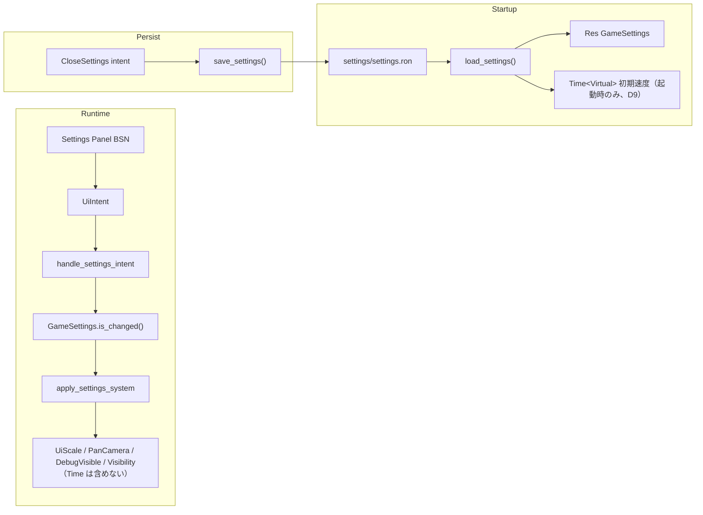

# 設定画面 — ui_widgets + UiScale/FontSize::Rem 実装計画

## メタ情報

| 項目 | 値 |
| --- | --- |
| 計画ID | `settings-screen-plan-2026-07-05` |
| ステータス | `Draft` |
| 作成日 | `2026-07-05` |
| 最終更新日 | `2026-07-06` |
| 作成者 | Claude (調査ベース) / Cursor (具体化) |
| 関連提案 | N/A |
| 関連Issue/PR | 関連: `dev-tools-debug-overlay-plan-2026-07-05.md`（デバッグ表示トグル）、`save-load-world-serialization-plan-2026-07-05.md`（`ron`/`serde`/`serialize` feature 共用） |

---

## 0. 設計判断ログ（実装前に確定済み）

| # | 論点 | 決定 | 根拠 |
| --- | --- | --- | --- |
| D1 | 永続化方式 | `GameSettings`（hw_core, Reflect）+ `GameSettingsFile`（bevy_app, serde）の二層 | hw_core は `bevy`/`rand` のみ依存可。Reflect registry 経由の汎用シリアライズより、設定専用 DTO の方が RON 差分が読みやすい |
| D2 | serde / RON 依存 | **`serde` は `derive` feature 必須**（workspace `serde = "1"` に `features = ["derive"]` を追加）。`ron` は workspace `0.12` に統一済み | `GameSettingsFile` は `Serialize` / `Deserialize` derive を使う。`ron` は `Cargo.lock` 確認済み（2026-07-06）で `0.12.0` 単一エントリ — 二重化対応は不要 |
| D3 | Slider/Checkbox 状態同期 | **`SettingsPlugin` で `add_observer(slider_self_update)` / `add_observer(checkbox_self_update)` を各 1 回**。spawn 時 `.observe(...)` は使わない | `bevy_ui_widgets` 公式パターン。二重登録で ValueChange が二重処理される。⚠️ `ValueChange` は `commands.trigger()` によるグローバルイベントのため、この observer は**アプリ内の全 Slider/Checkbox** に self-update を適用する（外部状態管理型の widget を将来作る場合は干渉に注意）。intent 発行 observer（bevy_app 側）は冪等でないので **`SettingsSliderMarker` / `SettingsCheckboxMarker` の有無で必ずフィルタ**する |
| D4 | UI スケール経路 | **`UiScale` のみをスライダーに接続**。`RemSize` は Bevy デフォルト `20.0` 固定 | M3 で `FontSize::Rem` 化後、目視 QA でテキスト追従不足なら `RemSize = 20.0 * ui_scale` を apply.rs に追加（第 2 段階） |
| D5 | 設定画面 UX | **中央モーダルオーバーレイ**（`dialogs.rs` 系）。Architect 等のボトムサブメニューとは別物。入口は **ボトムバー Settings ボタン + ポーズメニュー Settings 行の 2 系統** | 設定項目数が多く、ボトムバー横 120px サブメニューでは窮屈。ポーズメニュー（Save/Load、`hw_ui/src/setup/pause_menu.rs`）が 2026-07-06 時点で実装済みのため、そこにも行を追加する |
| D6 | `MenuState::Settings` | モーダル表示制御用。開くと他サブメニューは `Hidden` に落とす | `menu_visibility_system`（`hw_ui/src/panels/menu.rs`）への Settings 分岐追加 |
| D7 | BSN 初採用 | 本計画が **リポジトリ初の `bsn!` 採用**。save-load M4 より先に実装 | 設定 UI は自己完結で小さく、BSN 制約の実地検証に適する |
| D8 | F12 デバッグ同期 | 既存 `debug_toggle_system` を settings-aware に拡張し、別 system の順序依存同期にしない | 現行 F12 は `DebugVisible` と `GizmoConfigStore` を直接変更するため、設定値更新も同じ入力処理内に集約する |
| D9 | `default_time_speed` の適用タイミング | **起動時（Startup）のみ `Time<Virtual>` に適用**。`apply_settings_system` では適用しない | `GameSettings.is_changed()` は Resource 単位のため、apply 内で時間速度を書くと **UI Scale 変更だけで速度がデフォルトに巻き戻る**。特にポーズメニューは `Time<Virtual>.is_paused()` 連動なので、ポーズ中の設定変更で unpause →メニュー消失のバグになる。設定 UI の Speed ボタンは既存 `SetTimeSpeed` intent で即時反映し、`GameSettings` には「次回起動時の値」としてだけ保存する |
| D10 | ポーズメニュー連携 | Settings 入口をポーズメニューに 1 行追加（D5）。Esc 処理は `systems.rs` の既存 Escape チェーンに **「load confirm → Settings close → PlayMode キャンセル」の優先順**で統合 | ポーズメニュー（Save/Load）は本計画作成後に実装済み。数字キー 1〜4 は `time.unpause()` する（`systems.rs:115-124`）ため、設定モーダル表示中は `UiInputBlocker` 相当でゲーム入力を抑止するか、モーダル中のホットキー素通りを許容するかを M2 実装時に決めて追記する |

---

## 1. 目的

- **解決したい課題**: ゲーム内設定が一切なく、UI スケール・カメラ操作感・デフォルトゲーム速度等がコード定数固定。画面サイズ/DPI が違う環境で調整手段がない
- **到達したい状態**: 設定画面から主要項目を変更でき、`settings/settings.ron` に永続化され次回起動時に復元される
- **成功指標**:
  - 設定変更が即時反映 + 再起動後も維持
  - デフォルト値で導入前と挙動・見た目が一致（回帰なし）
  - `cargo check` + `cargo clippy --workspace`（警告 0）成功

---

## 2. スコープ

### 対象（In Scope）

| MS | 内容 |
| --- | --- |
| **M1** | `GameSettings` Resource + RON 永続化 + 反映システム |
| **M2** | 設定画面 UI（**BSN + ui_widgets Slider/Checkbox**）+ 開閉導線 |
| **M3** | 主要パネルの `FontSize::Rem` 化 + UI スケール目視 QA |

### 非対象（Out of Scope）

- 音量（`audio` feature 未使用・音未実装）
- キーバインド変更（別計画。データ量・UI とも別物）
- ウィンドウモード/解像度（M1 の struct 拡張で将来追加可能な形にしておく）
- 既存 UI **全**テキストの Rem 化（M3 は §6.3 の対象ファイルのみ）
- DevPanel 内 RTT トグル群の設定化（開発専用。`DebugVisible` / FPS 表示のみ設定対象）
- `FpsOverlayPlugin` 導入（`dev-tools-debug-overlay-plan` §0 で却下済み）

---

## 3. 現状とギャップ

### 3.1 コードベース調査結果（2026-07-05）

| 項目 | 現状 | 参照 |
| --- | --- | --- |
| 設定 Resource | **なし** | — |
| UI スケール | `UiScale` デフォルト `1.0`、`RemSize` デフォルト `20.0`（Bevy 0.19） | `bevy_ui` / `bevy_text` registry |
| カメラ | `PanCamera::default()` — `pan_speed: 500.0`, `mouse_pan_settings.enabled: true` | `startup_systems.rs:88`, `pan_camera.rs:105-126` |
| UI 上での pan 無効化 | `pan_camera_ui_guard_system` が毎フレーム `pan_camera.enabled = !pointer_over_ui` | `plugins/input.rs:39-47` |
| ゲーム速度 | `TimeSpeed` + `SetTimeSpeed` intent。起動時デフォルトは Bevy `Time<Virtual>` 依存（未永続化） | `time_control.rs:72-77`, `handlers/general.rs:41-55` |
| デバッグ gizmo | `DebugVisible` Resource（デフォルト `false`）。F12 でトグル | `main.rs:39-41`, `input.rs:135-147` |
| FPS 表示 | DevPanel 内 `UiSlot::FpsText`、常時更新（表示/非表示トグルなし） | `dev_panel.rs:273-285`, `status_display/runtime.rs:7-33` |
| 設定 UI 導線 | ボトムバー 4 ボタンのみ（Architect/Zones/Orders/Dream）。**ポーズメニュー（Save/Load）実装済み** — `Time<Virtual>.is_paused()` 連動で表示 | `bottom_bar.rs:52-72`, `hw_ui/src/setup/pause_menu.rs`, `hw_ui/src/interaction/pause_menu.rs` |
| BSN | **未使用**（全 `.rs` grep 0 件） | — |
| `ron`/`serde` | workspace + `bevy_app` 依存済み。`ron = "0.12"`（`Cargo.lock` は 0.12.0 単一エントリ、確認済み 2026-07-06）。**`serde = "1"` に derive feature なし** — M1 で追加 | ルート `Cargo.toml:19-20`, `bevy_app/Cargo.toml:9-10` |

### 3.2 Bevy 0.19 に SettingsPlugin は存在しない

registry 全クレート grep で確認済み。永続化は自前 RON（本計画）。

### 3.3 本計画で埋めるギャップ

最小の設定基盤（Resource + RON + モーダル UI）を確立し、以後の項目追加を **「フィールド 1 つ + UI 行 1 つ + apply 1 行」** に抑える。

---

## 4. データモデル

### 4.1 `GameSettings`（`crates/hw_core/src/settings.rs` 新規）

```rust
use bevy::prelude::*;
use crate::game_state::TimeSpeed;

/// 永続化対象のゲーム設定（型定義のみ。ロード/保存は bevy_app）
#[derive(Resource, Reflect, Debug, Clone, PartialEq)]
#[reflect(Resource)]
pub struct GameSettings {
    /// UI 全体スケール（UiScale.0）
    pub ui_scale: f32,
    /// カメラ WASD パン速度（PanCamera.pan_speed）
    pub camera_pan_speed: f32,
    /// マウスドラッグパン（PanCamera.mouse_pan_settings.enabled）
    pub camera_mouse_pan_enabled: bool,
    /// 起動時のゲーム速度
    pub default_time_speed: TimeSpeed,
    /// gizmo デバッグ表示（DebugVisible.0）。F12 と双方向同期
    pub debug_gizmos_enabled: bool,
    /// DevPanel 内 FPS テキスト表示
    pub fps_display_enabled: bool,
}

impl Default for GameSettings {
    fn default() -> Self {
        Self {
            ui_scale: 1.0,
            camera_pan_speed: 500.0,
            camera_mouse_pan_enabled: true,
            default_time_speed: TimeSpeed::Normal,
            debug_gizmos_enabled: false,
            fps_display_enabled: true,
        }
    }
}
```

**`hw_core/src/lib.rs`**: `pub mod settings;` + `pub use settings::GameSettings;`

**`TimeSpeed`**: 既存 enum（`hw_core/src/game_state.rs:45-51`）は現状 `Reflect` 未導出。`GameSettings: Reflect` のフィールドにするため、M1 で `TimeSpeed` に `Reflect` を追加する。serde は hw_core に持ち込まず、`GameSettingsFile` 側の DTO で変換する。

### 4.2 スライダー/トグル仕様

| UI ラベル | フィールド | コントロール | 範囲 / 刻み | 反映先 |
| --- | --- | --- | --- | --- |
| UI Scale | `ui_scale` | Slider | `0.85 … 1.25`, step `0.05` | `ResMut<UiScale>` |
| Camera Pan Speed | `camera_pan_speed` | Slider | `200 … 1000`, step `50` | `PanCamera.pan_speed` on `MainCamera` |
| Mouse Drag Pan | `camera_mouse_pan_enabled` | Checkbox | — | `PanCamera.mouse_pan_settings.enabled` |
| Default Game Speed | `default_time_speed` | 4 ボタン行（既存 `TimeSpeed` パターン流用） | Paused/Normal/Fast/Super | **起動時のみ** `Time<Virtual>`（§0 D9。UI ボタン押下時の即時反映は既存 `SetTimeSpeed` intent 経由） |
| Debug Gizmos | `debug_gizmos_enabled` | Checkbox | — | `DebugVisible` + `GizmoConfigStore` |
| Show FPS | `fps_display_enabled` | Checkbox | — | `UiSlot::FpsText` entity の `Visibility` |

**注意（カメラ guard）**: `pan_camera_ui_guard_system` は `PanCamera.enabled` を UI ホバーで上書きする。設定で触るのは **`mouse_pan_settings.enabled` と `pan_speed` のみ**。`enabled` は guard 専用。

### 4.3 RON ファイル

| 項目 | 値 |
| --- | --- |
| パス | `{CWD}/settings/settings.ron`（save-load の `saves/` と同階層の慣習） |
| 書込 | 設定モーダルを **Close** した時 + `AppExit` 検知時のみ。`Last` schedule は毎フレーム走るため、無条件保存に使わない |
| 読込 | `Startup`（`GameSettings` insert 前） |
| 破損/不在 | `warn!` + `GameSettings::default()` |
| スキーマ | `GameSettingsFile`（bevy_app 内 serde struct、`GameSettings` と 1:1） |

**RON 例**:

```ron
(
    ui_scale: 1.0,
    camera_pan_speed: 500.0,
    camera_mouse_pan_enabled: true,
    default_time_speed: Normal,
    debug_gizmos_enabled: false,
    fps_display_enabled: true,
)
```

**DTO 方針**:

- `GameSettingsFile` / `TimeSpeedFile` は `bevy_app` 内で `#[derive(Serialize, Deserialize)]` する
- `TimeSpeedFile::{Paused, Normal, Fast, Super}` と `hw_core::game_state::TimeSpeed` の `From`/`TryFrom` を実装し、hw_core に `serde` 依存を追加しない
- `serde` workspace dependency は `features = ["derive"]` を有効化する

### 4.4 save-load 計画との依存関係

| 共有物 | 方針 |
| --- | --- |
| workspace `ron` / `serde` | 両計画で同じ dependency。`serde` は `derive` feature 必須。`ron` は `0.12` 統一済み（`Cargo.lock` 確認 2026-07-06、追加作業不要） |
| workspace `bevy/serialize` | save-load の `DynamicWorld` 用。設定は **serde DTO のみ**で reflect serialize は使わない |
| 保存ディレクトリ | `settings/` vs `saves/` — 用途別で分離。混在しない |

---

## 5. アーキテクチャ

### 5.1 データフロー



### 5.2 crate 境界（厳守）

| 処理 | 置き場所 |
| --- | --- |
| `GameSettings` 型 | `hw_core` |
| ロード/保存/apply/intent 処理 | `bevy_app` |
| 設定 UI spawn（BSN） | `hw_ui` |
| `GameSettings` への直接 write | **bevy_app のみ**（hw_ui 禁止、`hw_ui/_rules.md`） |

### 5.3 Plugin 配線

```rust
// crates/bevy_app/src/systems/settings/mod.rs
pub struct SettingsPlugin;

impl Plugin for SettingsPlugin {
    fn build(&self, app: &mut App) {
        app.register_type::<GameSettings>()
            .init_resource::<GameSettings>()
            .add_observer(slider_self_update)   // bevy::ui_widgets
            .add_observer(checkbox_self_update)
            .add_systems(Startup, load_settings_system) // RON 読込 + default_time_speed を Time<Virtual> に適用（起動時のみ、D9）
            .add_systems(Update, (
                apply_settings_system,
                save_settings_on_close_settings,
            ).chain())
            .add_systems(Last, save_settings_on_app_exit); // AppExit を読んだ時だけ保存
    }
}
```

**登録場所**: `crates/bevy_app/src/plugins/startup/mod.rs` または `interface.rs`（Startup 系と同じ Plugin 内）

**F12 注意**: `debug_toggle_system` は既存の入力 system なので、`GameSettings.debug_gizmos_enabled` 更新は `debug_toggle_system` 自体に追加する。別の `sync_debug_hotkey_to_settings` system を後段に置く場合は、`GameSystemSet::Input` との ordering を明示しない限り採用しない。

---

## 6. 検証済み 0.19 API

| API | 場所 | 要点 |
| --- | --- | --- |
| `Slider` / `SliderValue` / `SliderRange` / `SliderStep` | `bevy_ui_widgets/src/slider.rs:105+` | headless。外部更新は `SetSliderValue` EntityEvent |
| `slider_self_update` | `slider.rs:717+` | `add_observer` で 1 回登録 |
| `Checkbox` / `Checked` | `checkbox.rs:38+` | headless |
| `checkbox_self_update` | `checkbox.rs` | 同上 |
| `ValueChange<T>` | `bevy_ui_widgets/src/lib.rs:90` | Slider=`f32`, Checkbox=`bool` |
| `FontSize::Rem(f32)` | `bevy_text/src/text.rs:487+` | `RemSize(20.0)` 基準 |
| `UiScale(f32)` | `bevy_ui/src/lib.rs:120+` | `Val::Px` 等の倍率。デフォルト `1.0` |
| `PanCamera` | `bevy_camera_controller` | `pan_speed`, `mouse_pan_settings.enabled` |
| `UiWidgetsPlugins` | DefaultPlugins 経由 | **個別 add 禁止**（二重登録 panic 前例） |
| `bsn!` / `spawn_scene` | `bevy_scene` | `.bsn` アセット未リリース — マクロのみ |

### 6.1 BSN 制約（save-load §4.8 と共通）

- `bsn!` 内コンポーネントは `Default + Clone` 必須
- enum は variant ごと `default_{variant}` が必要な場合あり（`SliderOrientation` 等）
- カスタム Component marker（`SettingsSliderMarker(SettingsField)` 等）は **`#[derive(Component, Default, Clone)]`**

---

## 7. マイルストーン（実装手順）

### M1: GameSettings + 永続化 + 反映

#### 手順

1. **依存確認**: workspace `serde` を `features = ["derive"]` 付きにする（`ron` は `0.12` 統一確認済み、作業不要）
2. **`hw_core`**: §4.1 の `settings.rs` 追加、`lib.rs` export。`TimeSpeed` に `Reflect` derive を追加する（serde derive は追加しない）
3. **`bevy_app/systems/settings/`** 新規:
   - `persistence.rs` — `load_settings()`, `save_settings()`, `GameSettingsFile` serde
   - `file_model.rs`（または `persistence.rs` 内）— `GameSettingsFile` / `TimeSpeedFile` と `From`/`TryFrom` 変換
   - `apply.rs` — `apply_settings_system`（`GameSettings.is_changed()` ガード）
   - `mod.rs` — `SettingsPlugin`
4. **`apply_settings_system` 反映内容**:

   ```rust
   // 疑似コード
   ui_scale.0 = settings.ui_scale;
   if let Ok(mut pan) = q_pan_camera.single_mut() {
       pan.pan_speed = settings.camera_pan_speed;
       pan.mouse_pan_settings.enabled = settings.camera_mouse_pan_enabled;
   }
   debug_visible.0 = settings.debug_gizmos_enabled;
   // GizmoConfigStore 全 entry の enabled も同期（debug_toggle_system と同ロジック共通化）
   set_fps_visibility(&mut commands, &ui_nodes, settings.fps_display_enabled);
   // ⚠️ Time<Virtual> はここで触らない（D9）。is_changed() は Resource 単位なので、
   // ここで速度を書くと UI Scale 変更だけで速度がリセットされ、ポーズ中なら unpause
   // されてポーズメニューが消える
   ```

5. **`default_time_speed` の起動時適用**: `load_settings_system`（Startup）内で `Time<Virtual>` に一度だけ適用する（D9）
6. **F12 双方向同期**: 既存 `debug_toggle_system` の引数に `Option<ResMut<GameSettings>>` を追加し、F12 押下時に `DebugVisible` / `GizmoConfigStore` / `GameSettings.debug_gizmos_enabled` を同じ system で更新する
7. **保存タイミング**: Close は即保存。アプリ終了時保存は `AppExit` を検知した時だけ行い、`Last` に無条件保存 system を置かない
8. **Plugin 登録** + `cargo check`

#### 変更ファイル

| ファイル | 操作 |
| --- | --- |
| `crates/hw_core/src/settings.rs` | 新規 |
| `crates/hw_core/src/game_state.rs` | `TimeSpeed` に `Reflect` derive 追加 |
| `crates/hw_core/src/lib.rs` | `mod settings` |
| `crates/bevy_app/src/systems/settings/{mod,persistence,apply}.rs` | 新規 |
| `crates/bevy_app/src/systems/mod.rs` | `pub mod settings` |
| `crates/bevy_app/src/plugins/input.rs` | `debug_toggle_system` を settings-aware に拡張 |
| `crates/bevy_app/src/plugins/startup/mod.rs` | `add_plugins(SettingsPlugin)` |

#### 完了条件

- [ ] 手書き `settings/settings.ron` が起動時に反映される
- [ ] ファイル不在・パース失敗でデフォルト起動（`warn` ログ）
- [ ] `PanCamera.pan_speed` / `mouse_pan_settings.enabled` が RON 値どおり
- [ ] `UiScale` が RON 値どおり
- [ ] F12 で `DebugVisible` と `GameSettings.debug_gizmos_enabled` が同時に変わる
- [ ] `Last` schedule による毎フレーム保存が発生しない
- [ ] **`GameSettings` の他フィールド変更で `Time<Virtual>` の速度・pause 状態が変化しない**（ポーズ中に RON 手書き値を reload しても pause 維持）

#### 検証

```bash
CARGO_HOME=/home/satotakumi/.cargo CARGO_TARGET_DIR=target cargo check
# 手書き RON で ui_scale: 1.15, camera_pan_speed: 800.0 を確認
```

---

### M2: 設定画面 UI（BSN + ui_widgets）

#### UI レイアウト

```
[Settings Modal — 中央、dialog_bg 系スタイル、UiInputBlocker]
├── Title: "Settings"
├── ScrollArea（項目が増えてもスクロール可能）
│   ├── Row: UI Scale          [━━━━●━━━━] 1.00
│   ├── Row: Camera Pan Speed  [━━━━●━━━━] 500
│   ├── Row: Mouse Drag Pan    [✓] Checkbox
│   ├── Row: Default Speed     [||] [>] [>>] [>>>]  ← TimeSpeed ボタン行
│   ├── Row: Debug Gizmos      [ ] Checkbox
│   └── Row: Show FPS          [✓] Checkbox
└── Footer: [Close] → UiIntent::CloseSettings → save
```

**配置**: `UiMountSlot::Overlay` または `Center` スロット（`root.rs` の overlay 系。`dialogs.rs` 参照）

#### 手順

1. **`hw_ui/src/intents.rs`**: 以下を追加

   ```rust
   ToggleSettings,
   CloseSettings,
   SetUiScale(f32),
   SetCameraPanSpeed(f32),
   SetCameraMousePanEnabled(bool),
   SetDefaultTimeSpeed(TimeSpeed),
   SetDebugGizmosEnabled(bool),
   SetFpsDisplayEnabled(bool),
   ```

2. **`hw_ui/src/components.rs`**:
   - `MenuState::Settings` 追加
   - `SettingsPanel` marker
   - `SettingsField` enum（どの Slider/Checkbox か識別）
   - `SettingsSliderMarker(SettingsField)` / `SettingsCheckboxMarker(SettingsField)`

3. **`hw_ui/src/setup/settings_panel.rs`**（新規、BSN）:
   - `spawn_settings_panel(commands, game_assets, theme, parent, initial: &GameSettingsView)` — **initial 値は bevy_app spawn 側から渡す**（hw_ui は GameSettings 型を import しない。プリミティブ引数 or 専用 `SettingsPanelInitial` struct を hw_ui に定義）
   - `setting_row_slider` / `setting_row_checkbox` ヘルパー
   - Slider 行: `Slider` + `SliderValue(v)` + `SliderRange` + `SliderStep` + `SettingsSliderMarker`
   - Checkbox 行: `Checkbox` + 必要なら `Checked` + `SettingsCheckboxMarker`
   - `.observe()` on ValueChange → `MessageWriter<UiIntent>` は **spawn 後に bevy_app 側 observer で接続**（hw_ui に intent write システムを置かない場合）  
     **または** hw_ui 内で `UiIntent` MessageWriter を持つ system を `HwUiPlugin` 登録 — 既存 `MenuButton` パターンに合わせ **spawn 時に `MenuButton` 相当の marker + bevy_app intent_handler で処理**が無難

   **推奨**: Slider/Checkbox の `ValueChange` observer は **`bevy_app/src/interface/ui/interaction/handlers/settings.rs`** に集約（entity marker 経由でフィールド判別）

4. **`hw_ui/src/setup/mod.rs`**: `mod settings_panel;` + `setup_ui` から spawn 呼び出し（初期 `display: None`）

5. **bevy_app 側**:
   - `handlers/settings.rs` — intent 処理 → `GameSettings` 更新
   - `intent_handler.rs` — 新 intent 分岐追加
   - `handlers/mode_toggle.rs` — `ToggleSettings` → `MenuState::Settings`（他メニュー Close）
   - `hw_ui/panels/menu.rs` — Settings panel visibility
   - `bottom_bar.rs` — 5 番目ボタン `"Settings"` + `ToggleSettings`
   - `hw_ui/src/setup/pause_menu.rs` — Save/Load の下に `"Settings"` 行追加（`MenuAction::ToggleSettings`、D10）

6. **開閉**:
   - Open: ボトムバー Settings / ポーズメニュー Settings 行 / `UiIntent::ToggleSettings`
   - Close: フッタ Close ボタン / Esc（`MenuState::Settings` 時）→ `CloseSettings` → **save**
   - **Esc 優先順位**: `systems.rs` の既存 Escape チェーン（`interaction/systems.rs:127` 付近）に **「load confirm → Settings close → PlayMode キャンセル」** の順で分岐を挿入する（D10）
   - **数字キー 1〜4**: `time.unpause()` を伴う速度ホットキー（`systems.rs:115-124`）。設定モーダル表示中の扱い（ブロックするか素通しか）を実装時に決めて本計画に追記する

7. **`hw_ui/_rules.md`**: Slider/Checkbox/BSN 知見 + 設定項目追加手順（§8）

#### Slider thumb 位置同期（最小スタイル）

headless Slider は見た目なし。M2 では以下の最小構成:

```
Slider entity (horizontal flex)
├── Track (Node, flex_grow, height 4px, bg)
└── Thumb (Node, absolute left %, 12x12px)
```

`SettingsSliderThumbSync` system（Update）: `SliderValue` + `SliderRange` から thumb `left: Val::Percent` を計算。スタイルは `UiTheme.colors.accent_ember` 系。

#### 変更ファイル

| ファイル | 操作 |
| --- | --- |
| `crates/hw_ui/src/setup/settings_panel.rs` | 新規（BSN） |
| `crates/hw_ui/src/setup/mod.rs` | spawn 統合 |
| `crates/hw_ui/src/intents.rs` | intent 追加 |
| `crates/hw_ui/src/components.rs` | MenuState, markers |
| `crates/hw_ui/src/panels/menu.rs` | Settings visibility |
| `crates/hw_ui/src/setup/bottom_bar.rs` | Settings ボタン |
| `crates/hw_ui/src/setup/pause_menu.rs` | Settings 行追加（D10） |
| `crates/hw_ui/src/interaction/tooltip/layout.rs` | `ToggleSettings` を menu toggle 扱いにするか検討（tooltip span 計算） |
| `crates/bevy_app/src/interface/ui/interaction/handlers/settings.rs` | 新規 |
| `crates/bevy_app/src/interface/ui/interaction/intent_handler.rs` | 分岐 |
| `crates/bevy_app/src/interface/ui/interaction/handlers/mod.rs` | export |
| `docs/state.md` | MenuState::Settings 追記（完了時） |

#### 完了条件

- [ ] 各 Slider/Checkbox 操作で `SliderValue` / `Checked` が即時更新される
- [ ] Close で `settings/settings.ron` が書き出される
- [ ] 再起動で UI 上のコントロール初期値が RON と一致
- [ ] `MenuState::Settings` 中は Architect 等サブメニューが非表示
- [ ] ポーズメニューの Settings 行から開ける。**ポーズ中に設定を変更してもポーズが維持され、ポーズメニューが消えない**（D9/D10）
- [ ] Esc が「load confirm → Settings close → PlayMode キャンセル」の優先順で動く

---

### M3: FontSize::Rem 段階適用 + スケール QA

#### 方針

- `ThemeTypography` の px 定数は **基準値として維持**
- 各 spawn で `FontSize::Px(theme.typography.font_size_*)` → `FontSize::Rem(px / 20.0)` に置換
- **Rem 基準**: Bevy `RemSize` デフォルト `20.0`（`font_size_xs: 9.0` → `FontSize::Rem(0.45)`）

#### 対象ファイル（優先順）

| ファイル | 主な用途 |
| --- | --- |
| `setup/entity_list.rs` | 左パネル |
| `panels/info_panel/layout.rs` | Info Panel |
| `panels/task_list/render.rs` | タスクリスト |
| `setup/bottom_bar.rs` | ボトムメニュー |
| `setup/time_control.rs` | 時計・速度ボタン |
| `setup/submenus.rs` | サブメニュー |
| `setup/panels.rs` | 共通パネル |

**対象外（M3）**: `dev_panel.rs`, `tooltip_builder/*`, `dialogs.rs`（モーダル・Dev 系は後続）

#### 完了条件

- [ ] デフォルト `ui_scale: 1.0` で M3 前と目視同等
- [ ] `ui_scale` 0.85〜1.25 で主要パネルが破綻しない
- [ ] テキスト追従不足があれば §0 D4 の第 2 段階（`RemSize` 同期）を適用し、本計画に追記

---

## 8. 設定項目追加チェックリスト（`_rules.md` にも転記）

新項目 `{name}` 追加時:

1. [ ] `GameSettings` にフィールド + `Default` 値（現行挙動と一致）
2. [ ] `GameSettingsFile` + `From`/`Into` 更新
3. [ ] `apply_settings_system` に反映 1 行
4. [ ] `settings_panel.rs` に UI 行 1 つ
5. [ ] `SettingsField` enum + marker
6. [ ] `handlers/settings.rs` に intent 処理
7. [ ] `intents.rs` に variant（必要なら）
8. [ ] 手動 QA + RON 再起動確認

---

## 9. リスクと対策

| リスク | 影響 | 対策 |
| --- | --- | --- |
| `UiScale` + `RemSize` 二重適用 | テキストだけ過剰スケール | §0 D4。M3 QA で判定。必要時のみ RemSize 同期 |
| `apply_settings_system` で時間速度が巻き戻る | UI Scale 等の変更だけで速度リセット。ポーズ中なら unpause →ポーズメニュー消失 | §0 D9。`Time<Virtual>` は Startup のみ適用し、apply からは除外 |
| Slider/Checkbox 状態ずれ | 操作と表示不一致 | `slider_self_update` / `checkbox_self_update` を Plugin で 1 回のみ |
| intent 発行 observer が他 widget の `ValueChange` を拾う | 無関係な Slider 操作で設定が書き換わる | §0 D3。observer 内で `SettingsSliderMarker` / `SettingsCheckboxMarker` を必ずフィルタ |
| BSN 初採用コンパイルエラー | M2 停滞 | 最初は Close ボタンだけの最小 BSN シーンで `cargo check` を通してから Slider 追加 |
| `pan_camera_ui_guard` と設定競合 | マウスパン設定が効かない | `mouse_pan_settings.enabled` のみ永続化。`enabled` は guard 専用 |
| F12 と設定 Checkbox 不整合 | 表示状態と設定値がずれる | 既存 `debug_toggle_system` を settings-aware にし、`DebugVisible` / `GizmoConfigStore` / `GameSettings` を同じ入力処理内で更新する |
| DevPanel FPS 非表示時も更新 | 無駄な text 更新 | 非表示時は `Visibility::Hidden` のみ。更新 system は維持（コスト小） |
| `dev-tools-debug-overlay` との競合 | AI ラベル用 Debug Resource 増加 | 本計画は `DebugVisible`（gizmo）のみ。AI ラベル用 Resource は overlay 計画側 |
| `Last` schedule 無条件保存 | 毎フレーム `settings.ron` を書き続ける | Close 時保存を主経路にし、終了時保存は `AppExit` を検知した時だけ実行する |
| `TimeSpeed` / serde derive 不足 | `GameSettings: Reflect` または `GameSettingsFile` serde derive で compile error | `TimeSpeed` には `Reflect` だけ追加。serde は bevy_app の `TimeSpeedFile` DTO に閉じ、workspace `serde` は `derive` feature を有効化する |

---

## 10. 検証計画

### 自動

```bash
CARGO_HOME=/home/satotakumi/.cargo CARGO_TARGET_DIR=target cargo check
CARGO_HOME=/home/satotakumi/.cargo CARGO_TARGET_DIR=target cargo clippy --workspace 2>&1 | grep "^warning:" | grep -v generated
```

### 手動シナリオ

1. 初回起動 → `settings/settings.ron` 自動生成（Close 後）または不在でデフォルト
2. Settings 開く → UI Scale `1.15` → 即座にパネル拡大
3. Camera Pan Speed `800` → WASD パンが速くなる
4. Mouse Drag Pan OFF → 左ドラッグパン不可（キーボードは可）
5. Default Speed `Fast` → Close → 再起動 → 速度 `x2` で開始（**変更直後は現在速度を変えない** — D9。即時変更は既存速度ボタン/1〜4 キー）
6. Debug Gizmos ON → gizmo 表示。F12 OFF → 設定値も OFF 同期
7. Show FPS OFF → DevPanel 内 FPS 行非表示
8. Close → 再起動 → 全項目復元
9. ポーズ（`TogglePause`）→ポーズメニューの Settings 行から開く → UI Scale 変更 → **ポーズ維持・ポーズメニュー表示継続** → Close → 再開

---

## 11. ロールバック方針

| 単位 | 依存 |
| --- | --- |
| M1 revert | 設定ファイル削除でデフォルト復帰 |
| M2 revert | M1 残せば RON 編集可能 |
| M3 revert | Rem 化のみ revert。M1+M2 設定機能は維持 |

`settings/settings.ron` を削除すれば全設定デフォルト。

---

## 12. AI引継ぎメモ

### 現在地

- 進捗: **0%**（計画具体化済み、実装未着手）
- M1〜M3 すべて未着手

### 次の AI が最初にやること（M1 から順）

1. workspace `serde` に `features = ["derive"]` を追加（`ron` は 0.12 統一確認済み・作業不要）
2. `TimeSpeed` に `Reflect` を追加し、`crates/hw_core/src/settings.rs` を §4.1 どおり作成
3. `bevy_app/systems/settings/persistence.rs` — `settings/` ディレクトリ create + RON 読み書き。`TimeSpeedFile` DTO で hw_core serde 依存を避ける
4. `apply.rs` — `UiScale` / `PanCamera` / `DebugVisible` 反映のみ実装（**`Time<Virtual>` は入れない — D9**。UI なしで RON 手書き検証）。`default_time_speed` は `load_settings_system`（Startup）で一度だけ適用
5. 既存 `debug_toggle_system` を settings-aware にして F12 同期を同じ system 内に集約
6. `SettingsPlugin` 登録 → **`cargo check` 緑**
7. M2: 最小 BSN モーダル（Title + Close のみ）→ Slider 1 行追加 → Checkbox 1 行…と段階追加。導線はボトムバー + ポーズメニュー行（D10）

### ブロッカー/注意点

- **BSN はリポジトリ初**。コンパイルエラー時は `save-load-world-serialization-plan-2026-07-05.md` §4.8 と Bevy 0.19 `bsn!` 例を参照
- **`UiWidgetsPlugins` 個別 add 禁止**
- **hw_ui から `GameSettings` を ResMut しない**
- **`TimeSpeed` は現状 Reflect 未導出**。M1 で `Reflect` を追加する。serde は追加しない
- **serde derive feature は必須**。`GameSettingsFile` / `TimeSpeedFile` を derive するため、`serde = { version = "1", features = ["derive"] }` 相当へ揃える
- **`apply_settings_system` で `Time<Virtual>` を絶対に触らない**（D9）。ポーズメニュー消失バグの原因になる
- **ポーズメニュー（Save/Load）は実装済み**。Settings 行追加と Esc 優先順位は D10 参照
- **`Last` は毎フレーム走る**。終了時保存は `AppExit` 検知時だけにする

### 参照必須ファイル

| 用途 | パス |
| --- | --- |
| PanCamera デフォルト | `~/.cargo/registry/.../bevy_camera_controller-0.19.0/src/pan_camera.rs:105-126` |
| Slider self-update | `~/.cargo/registry/.../bevy_ui_widgets-0.19.0/src/slider.rs:717+` |
| UiScale / RemSize | `bevy_ui/src/lib.rs`, `bevy_text/src/text.rs:573-578` |
| 既存 intent 処理 | `bevy_app/src/interface/ui/interaction/intent_handler.rs` |
| メニュー toggle | `bevy_app/src/interface/ui/interaction/handlers/mode_toggle.rs` |
| F12 debug toggle | `bevy_app/src/plugins/input.rs:135-147` |
| ダイアログ UI 参考 | `hw_ui/src/setup/dialogs.rs` |
| ScrollArea 参考 | `hw_ui/src/setup/entity_list.rs` |
| crate 境界 | `hw_ui/_rules.md`, `docs/crate-boundaries.md` |
| MenuState 仕様 | `docs/state.md` §MenuState |

### Definition of Done

- [ ] M1〜M3 完了
- [ ] `cargo check` / `cargo clippy --workspace`（警告 0）
- [ ] `docs/` に設定仕様を恒久化（`docs/state.md` + 新規 `docs/settings.md` または `docs/architecture.md` 節）
- [ ] 本計画を archive 可能

### 最終確認ログ

| 項目 | 状態 |
| --- | --- |
| 最終 `cargo check` | 未実施 |
| 未解決エラー | なし |

---

## 13. 更新履歴

| 日付 | 変更者 | 内容 |
| --- | --- | --- |
| `2026-07-05` | Claude | 初版（ui_widgets / FontSize::Rem registry 検証） |
| `2026-07-05` | Codex | UiScale 主経路、RON 直接依存、PanCamera 反映、MenuState 明記 |
| `2026-07-05` | Cursor | 具体化: GameSettings スキーマ、ファイルパス、既存コード参照、BSN レイアウト、M1〜M3 手順、設計判断ログ、save-load 依存整理、設定項目追加チェックリスト |
| `2026-07-05` | Codex | 実装前レビュー修正: `TimeSpeed` Reflect 追加方針、serde derive feature、`AppExit` 保存、F12 同期 ordering、ron version 統一を明記 |
| `2026-07-06` | Claude | コードベース突き合わせレビュー修正: D9（`default_time_speed` は起動時のみ適用 — apply 経由の時間速度リセット/ポーズ解除バグ防止）、D10（実装済みポーズメニューとの連携・Esc 優先順位）、ron 0.12 統一済み確認で D2 簡略化、D3 にグローバル observer 注意と intent observer の marker フィルタ必須を追記 |
