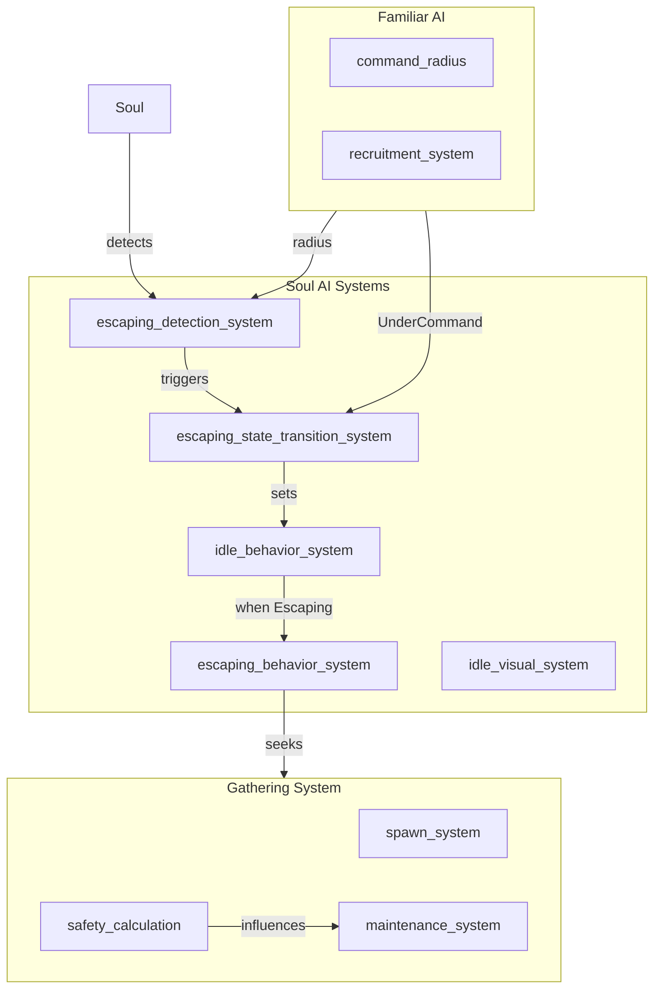

# Soul Escape from Familiar Influence - Design Document

## 概要

使役されていない魂（Damned Soul）は、使い魔（Familiar）の影響圏から積極的に離れようとする行動を取る。
これは魂の「怠惰」な性質を表現し、集会システムとの統合により「安全地帯」としての集会スポットを形成する。

---

## 現在のシステム分析

### IdleBehavior（現在）
```rust
pub enum IdleBehavior {
    Wandering,          // うろうろ
    Sitting,            // 座り込み
    Sleeping,           // 寝ている
    Gathering,          // 集会中
    ExhaustedGathering, // 疲労による集会移動中
}
```

### Familiar影響圏
- `command_radius`: デフォルト TILE_SIZE * 7.0 = 112 units
- `UnderCommand` リレーションシップで管理下を示す
- 影響圏内では motivation回復、stress増加

### 集会システム
- 5.0タイル以内のSoulが自動参加
- 7.5タイル以上離れると離脱
- 最大8人、最低2人で維持

---

## 設計

### 1. 新しいIdleBehavior追加

```rust
pub enum IdleBehavior {
    Wandering,          // うろうろ
    Sitting,            // 座り込み
    Sleeping,           // 寝ている
    Gathering,          // 集会中
    ExhaustedGathering, // 疲労による集会移動中
    Escaping,           // 【NEW】使い魔から逃走中
}
```

### 2. EscapeDesireコンポーネント

```rust
#[derive(Component, Reflect)]
pub struct EscapeDesire {
    pub intensity: f32,           // 逃走欲望の強度 (0.0-1.0)
    pub nearest_familiar: Option<Entity>, // 最も近い使い魔
    pub distance_to_familiar: f32, // 使い魔までの距離
    pub escape_direction: Vec2,   // 逃走方向
}
```

### 3. 状態遷移フロー

```
[Wandering] --(使い魔検出)--> [Escaping] --(安全圏到達)--> [Gathering/Wandering]
                  ↑                                    |
                  └──────(使い魔再検出)──────────────┘
```

### 4. 逃走判定ロジック

**Escaping状態に移行する条件:**
1. `AssignedTask::None`（タスク未割当）
2. `UnderCommand` なし（使役されていない）
3. 最も近い使い魔までの距離 < `command_radius * 1.5`（警戒圏内）
4. `stress > 0.3`（ストレスが高い）

**Escaping状態を解除する条件:**
1. 全ての使い魔から `command_radius * 2.0` 以上離れた
2. 集会スポットに到着した
3. タスクが割り当てられた
4. 使役された（UnderCommand付与）

### 5. 移動挙動

**Escaping時の移動:**
```rust
// 逃走方向の計算
fn calculate_escape_direction(
    soul_pos: Vec2,
    familiar_pos: Vec2,
    gathering_spots: &[(Vec2, f32)] // (位置, 安全度)
) -> Vec2 {
    // 1. 使い魔から離れるベクトル
    let away_from_familiar = (soul_pos - familiar_pos).normalize();
    
    // 2. 安全な集会スポットへ向かうベクトル
    let to_safe_gathering = find_safest_gathering_spot(soul_pos, gathering_spots);
    
    // 3. 合成（使い魔から離れること優先、集会スポットが近ければそちらへ）
    away_from_familiar * 0.7 + to_safe_gathering * 0.3
}
```

### 6. 集会システムとの統合

#### 集会スポットの安全度計算
```rust
impl GatheringSpot {
    /// この集会スポットが使い魔から十分離れているか
    pub fn is_safe_from_familiar(&self, familiars: &[&Familiar]) -> bool {
        familiars.iter().all(|f| {
            self.position.distance(f.position) > f.command_radius * 1.5
        })
    }
    
    /// 安全度スコア（高いほど安全）
    pub fn safety_score(&self, familiars: &[&Familiar]) -> f32 {
        familiars.iter()
            .map(|f| {
                let dist = self.position.distance(f.position);
                (dist / f.command_radius).min(3.0) // 最大3倍までスコア化
            })
            .sum()
    }
}
```

#### 参加優先度
- `Escaping` 状態のSoulは、通常の5.0タイル参加圏よりも遠く（7.5タイル）から参加を試みる
- 安全な集会スポットを優先的に選択

### 7. 視覚フィードバック

**Escaping状態の見た目:**
- スプライト: 通常色だが、時々「💦」や「🏃」の絵文字を頭上に表示
- アニメーション: 歩行アニメーションを速く（1.5倍速）
- パーティクル: 背後に小さな埃エフェクト

**実装:**
```rust
// idle/visual.rs に追加
fn escaping_visual_system(
    mut query: Query<(&mut Sprite, &IdleState, &mut Transform), With<DamnedSoul>>,
) {
    for (mut sprite, idle, mut transform) in query.iter_mut() {
        if idle.behavior == IdleBehavior::Escaping {
            // 色を少し青白く（パニック感）
            sprite.color = Color::srgba(0.8, 0.9, 1.0, 1.0);
            // 少し傾ける（走っている感じ）
            transform.rotation = Quat::from_rotation_z(-0.1);
        }
    }
}
```

### 8. 定数定義

```rust
// constants.rs に追加

// ===== 逃走システム =====
/// 逃走を開始する距離（command_radiusの何倍か）
pub const ESCAPE_TRIGGER_DISTANCE_MULTIPLIER: f32 = 1.5;
/// 逃走を終了する距離（command_radiusの何倍か）
pub const ESCAPE_SAFE_DISTANCE_MULTIPLIER: f32 = 2.0;
/// 逃走時のスピード倍率
pub const ESCAPE_SPEED_MULTIPLIER: f32 = 1.3;
/// 逃走を開始するストレス閾値
pub const ESCAPE_STRESS_THRESHOLD: f32 = 0.3;
/// 逃走中の絵文字表示間隔
pub const ESCAPE_EMOJI_INTERVAL: f32 = 2.0;
/// Escaping状態のSoulの集会参加距離
pub const ESCAPE_GATHERING_JOIN_RADIUS: f32 = TILE_SIZE * 7.5;
```

---

## 実装TODO

### Phase 1: 基本構造
1. `IdleBehavior::Escaping` を追加
2. `EscapeDesire` コンポーネントを作成
3. 定数を `constants.rs` に追加

### Phase 2: 逃走システム
4. `escaping_detection_system` - 使い魔検出とEscapeDesire更新
5. `escaping_behavior_system` - Escaping状態の移動制御
6. `escaping_state_transition_system` - 状態遷移管理

### Phase 3: 集会システム統合
7. `GatheringSpot::is_safe_from_familiar` を実装
8. 集会参加ロジックを更新（Escaping Soul優先）
9. 安全な集会スポット探索機能

### Phase 4: 視覚効果
10. `escaping_visual_system` - 見た目の変更
11. 絵文字表示システム（💦、🏃）
12. パーティクルエフェクト

### Phase 5: ドキュメント
13. `docs/soul_ai.md` を更新
14. `docs/gathering.md` を更新

---

## システム構成図



---

## 関連ファイル

- `src/entities/damned_soul/mod.rs` - IdleBehavior enum追加
- `src/constants.rs` - 逃走システム定数追加
- `src/systems/soul_ai/idle/behavior.rs` - 逃走行動実装
- `src/systems/soul_ai/idle/visual.rs` - 視覚効果実装
- `src/systems/soul_ai/gathering/` - 集会システム統合
- `src/systems/soul_ai/mod.rs` - システム登録

---

## 考慮事項

1. **パフォーマンス**: 逃走判定は毎フレーム行わない（0.5秒間隔）
2. **バランス**: 全員が逃走するとゲームが進まないため、stressによるフィルタリングが重要
3. **可視性**: プレイヤーが「なぜこの魂は逃げているのか」理解できるようにUIフィードバックを提供
