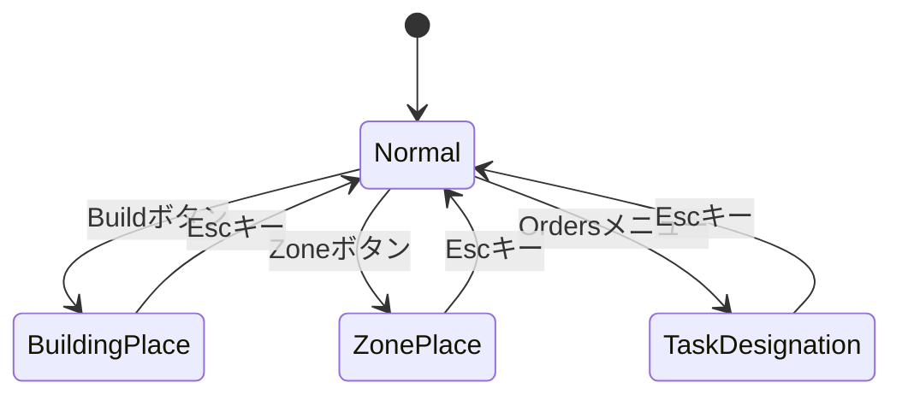

# State管理システム

ゲームの操作モードをBevyのStatesシステムで一元管理します。

## PlayMode

プレイ中の操作モードを表すState。

| モード | 説明 | 遷移条件 |
|--------|------|----------|
| `Normal` | 通常操作（選択・移動） | デフォルト / Escキー |
| `BuildingPlace` | 建物配置中 | Buildボタンクリック |
| `ZonePlace` | ゾーン配置中 | Zoneボタンクリック |
| `TaskDesignation` | タスク指定中（伐採/採掘など） | Ordersメニュー選択 |

## 状態遷移図



## コンテキストリソース

各モードの詳細情報を保持するリソース。

| リソース | 型 | 用途 |
|----------|-----|------|
| `BuildContext` | `Option<BuildingType>` | 配置する建物の種類 |
| `ZoneContext` | `Option<ZoneType>` | 配置するゾーンの種類 |
| `TaskContext` | `TaskMode` | タスクの詳細（伐採/採掘/運搬など） |

## 共通仕様

### Escキーによるキャンセル

- 全モードでEscキーを押すと`Normal`に戻る
- **メニュー展開も同時に閉じる**（`MenuState::Hidden`）

### run_if条件

```rust
// 例: BuildingPlaceモード時のみ実行
.run_if(in_state(PlayMode::BuildingPlace))
```

### OnEnter / OnExit

各モードの開始・終了時にログを出力。

```rust
.add_systems(OnEnter(PlayMode::BuildingPlace), log_enter_building_mode)
.add_systems(OnExit(PlayMode::BuildingPlace), log_exit_building_mode)
```

## 旧リソースの削除状況

| 旧リソース | 状態 |
|------------|------|
| `BuildMode` | ✅ 削除済み |
| `ZoneMode` | ✅ 削除済み |
| `TaskMode` (enum) | 📌 TaskContext内で使用中 |

## 関連ファイル

- `src/game_state.rs` - PlayMode、Context定義
- `src/main.rs` - State登録、OnEnter/OnExit
- `src/interface/selection.rs` - Escキーによるキャンセル処理
- `src/interface/ui_interaction.rs` - ボタンによる状態遷移
- `src/systems/logistics.rs` - zone_placement（ZoneContext使用）
